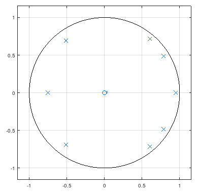
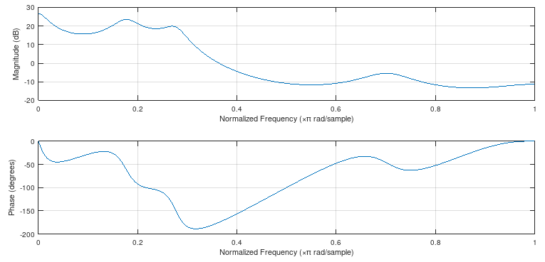

```{r, echo = FALSE, results = "hide"}
include_supplement(c("zplane.png","freqz.png"),
  dir = "/home/leoca/ee/ufsj/lectures/aev/exams/lpc/", recursive = TRUE)
```
Question
========

Veja o código abaixo utilizado para gerar a gráfico de pólo-zero 
de um filtro LPC para uma determinada vogal.

```Octave
> filename = 'vogal.wav'
> audioinfo (filename)
ans =

  scalar structure containing the fields:

    Filename = vogal.wav
    NumChannels = 1
    SampleRate = 8000
    TotalSamples = 2275
    Duration = 0.2844
    BitsPerSample = 16

> [a, g] = lpc (x, 8);
> zplane(1,a);
```

\


Determine a frequência (em Hz) dos 3 primeiros formantes.

Answerlist
---------------
* $F_1$
* $F_2$
* $F_3$


Solution
========

```Octave
> 0.18*4000
ans = 720
> 0.27*4000
ans = 1080
> 0.7*4000
ans = 2800
> freqz(1,a)
```

\



Answerlist
----------
* $F_1 \approx 0.18 \pi \widehat{=} 720$ Hz.
* $F_2 \approx 0.27 \pi \widehat{=} 1080$ Hz.
* $F_3 \approx 0.7 \pi \widehat{=} 2800$ Hz.


Meta-information
================
extype: cloze
exclozetype: num|num|num
exsolution: 720|1080|2800
exname: reamostagem
extol: 180|180|180
expoints: 1|1|1

