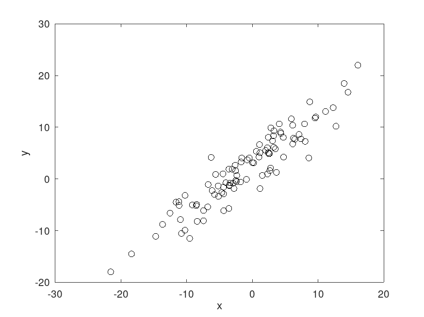

```{r, echo = FALSE, results = "hide"}
include_supplement(c("expca.png"),
  dir = "/home/leoca/ee/ufsj/lectures/aev/exams/pca/", recursive = TRUE)
```
Question
========

O gráfico a seguir apresenta um conjunto de dados em $\mathbb{R}^2$. 

\


As componentes principais deste conjunto de dados são:

Answerlist
---------------
* $(\sqrt{2}/2, \sqrt{2}/2)$ e $(-\sqrt{2}/2, \sqrt{2}/2)$
* $(1,0)$ e $(0,1)$ 
* $(0,0)$, $(10,10)$ e $(-10,-10)$
* $(1,1/3)$, $(1/3,1)$ e $(1/3,1/3)$
* $(\sqrt{3}/3, \sqrt{3}/3, \sqrt{3}/3)$
* $(\sqrt{3}/3, \sqrt{3}/3)$ e $(-\sqrt{3}/3, -\sqrt{3}/3)$
* $(1/2,1)$ e $(1/3,-1)$
* $(\sqrt{2}/2, \sqrt{2}/2)$ e $(-\sqrt{2}/2, -\sqrt{2}/2)$
* $(1,0)$ e $(-1,0)$


Solution
========


Answerlist
----------
* True
* False
* False
* False
* False
* False
* False
* False
* False

Meta-information
================
extype: schoice
exsolution: 100000000
exname: pca3
expoints: 1

