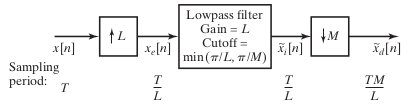
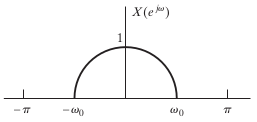

```{r, echo = FALSE, results = "hide"}
include_supplement("fig429.png",
  dir = "/home/leoca/ee/ufsj/lectures/aev/exams/sampling/", recursive = TRUE)

include_supplement("fig418.png",
  dir = "/home/leoca/ee/ufsj/lectures/aev/exams/sampling/", recursive = TRUE)
```


Question
========
Considere o sistema de reamostragem apresentado na Figura abaixo.

\
 

Seja $x[n]$ o sinal de entrada, com transformada de Fourier dada por $X(e^{j\omega})$ apresentado na Figura a seguir:

\
 

Para cada uma dos valores de $L$ e $M$, especifique (em radianos) qual é o maior valor possível para $\omega_0$ de forma
que $\tilde{X}_d(e^{j\omega}) = aX(e^{j M \omega /L})$ para alguma constante $a$.

Answerlist
---------------
* $M=3$ e $L=2$
* $M=5$ e $L=2$
* $M=2$ e $L=3$

Solution
========
Para que a condição $\tilde{X}_d(e^{j\omega}) = aX(e^{j M \omega /L})$ seja satisfeita, não deve ocorrer 
nenhuma perda de informação na reamostragem. Para que isto ocorra, devemos escolher $\omega_0$ para que a frequência 
máxima de $x_e[n]$ seja menor do que do que a frequência de corte do filtro passa-baixas: $\omega_0/L \leq \min(\pi/L,\pi/M)$.
Com esta escolha, o filtro passa-baixas não cortará nenhuma parte do espectro. 

a. Para $M=3$ e $L=2$, teremos $\omega_0/2 \leq \min(\pi/2, \pi/3)$, e assim $\omega_0 \leq 2 \pi/3$.
b. Para $M=5$ e $L=2$, $\omega_0 \leq 2 \pi/5$.
c. Com $L > M$, não ocorrerá aliasing. Assim não é necessário impor limite sobre $\omega_0$, ou seja, $\omega_0 \leq \pi$.

Answerlist
----------
* $\omega_0 = 2\pi/3$.
* $\omega_0 = 2\pi/5$.
* $\omega_0 = \pi$.


Meta-information
================
extype: cloze
exclozetype: num|num|num
exsolution: 2.094395|1.2566|3.141593
exname: reamostagem
extol: 0.01|0.01|0.01
expoints: 1|1|1
