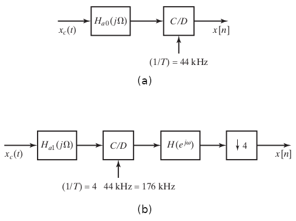

```{r, echo = FALSE, results = "hide"}
include_supplement("ex-oversampling.png",
  dir = "/home/leoca/ee/ufsj/lectures/aev/exams/sampling/", recursive = TRUE)

include_supplement("ex-oversampling-sol.png",
  dir = "/home/leoca/ee/ufsj/lectures/aev/exams/sampling/", recursive = TRUE)
```


Question
========
Em muitas aplicações de áudio, é necessário amostrar um sinal contínuo $x_c(t)$ à
uma frequência de amostragem de $1/T = 44$kHz. A Figura (a) apresenta um sistema para amostragem simples e direto,
em que há um filtro anti-aliasing $H_{a0}(j\Omega)$. Em muitas aplicações utiliza-se o sistema com fator
$4\times$ de sobre-amostragem (oversampling), ilustrado na Figura (b), ao invés do sistema mais simples.

No sistema da Figura (b) temos
$$
H(e^{j\omega}) = 
\begin{cases} 
1, & |\omega| \leq \pi/4, \\
0, & \text{c.c.},
\end{cases}
$$
um filtro passa-baixas ideal, e
$$
H_{a1}(j\Omega) = 
\begin{cases}
1, & |\Omega| \leq \Omega_p, \\
0, & |\Omega| \geq \Omega_s,
\end{cases}
$$
para $0 \leq \Omega_p \leq \Omega_s \leq \infty$.

Assumindo que $H_{a0}(j\Omega)$ seja um filtro ideal, encontre as especificações mínimas para o filtro
anti-aliasing $H_{a1}(j\Omega)$, ou seja, determine (em kHz) o menor valor de $\Omega_p$ e o maior valor de $\Omega_s$,
de tal forma que todo o sistema na Figura (b) seja equivalente ao sistema na Figura (a).


\


Answerlist
---------------
* (kHz) $\Omega_p=$
* (kHz) $\Omega_s=$

Solution
========
Para que toda a informação do sinal seja preservada, devemos mapear $\Omega_p$ em $\pi/4$, ou seja,
$$
\Omega_p T = \frac{pi}{4} \Rightarrow 44\pi k rad/s = 22 kHz,
$$
uma vez que $1/T = 176kHz$ e $\Omega = 2\pi f$.

\


Para que não ocorra aliasing, devemos ter, no limite,  
$$
\Omega_p = \frac{2 \pi}{T} - \Omega_s \Rightarrow \Omega_s = (2\pi \times 176 - 44 \pi) k rad/s = 308 \pi k rad/s =  154 kHz.
$$

Answerlist
----------
* $22$.
* $154$

Meta-information
================
extype: cloze
exclozetype: num|num
exsolution: 22|154
exname: oversampling
extol: 0.1
expoints: 1


