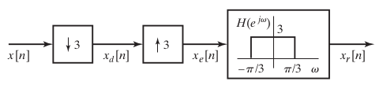
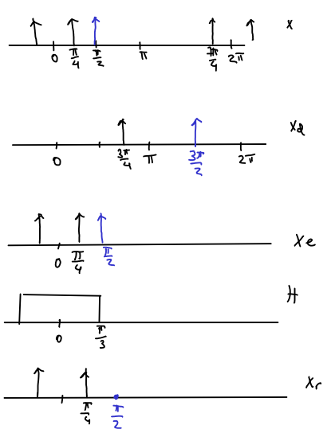

```{r, echo = FALSE, results = "hide"}
include_supplement("figP415.png",
  dir = "/home/leoca/ee/ufsj/lectures/aev/exams/sampling/", recursive = TRUE)

include_supplement("figP415r.png",
  dir = "/home/leoca/ee/ufsj/lectures/aev/exams/sampling/", recursive = TRUE)
```


Question
========
Considere o sistema de reamostragem apresentado na Figura abaixo.

\
 

Verifique para os sinais de entrada $x[n] = x_1[n]$, $x[n] = x_2[n]$ e $x[n] = x_1[n] + x_2[n]$ se a saída $x_r[n]$ é igual à entrada.
Considere $x_1[n] = \cos(\pi n/4)$ e $x_2[n] = \cos(\pi n/2)$.
Em quais situações teremos $x_r[n] = x[n]$?

Answerlist
---------------
* Apenas $x_1[n]$.
* Apenas $x_2[n]$.
* Apenas $x_1[n] + x_2[n]$.
* Apenas $x_1[n]$ e $x_2[n]$.
* $x_1[n]$, $x_2[n]$ e $x_1[n] + x_2[n]$.
* Em nenhum dos casos.

Solution
========
\
  

Na resolução utilizamos a cor preta para representar $x_1$ e azul para representar $x_2$.


Answerlist
----------
* True.
* False.
* False.
* False.
* False.
* False.

Meta-information
================
extype: schoice
exsolution: 100000
exname: reamostagem 3
expoints: 1
