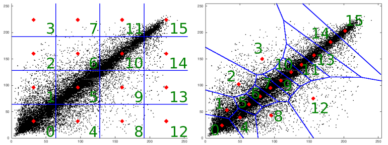

```{r, echo = FALSE, results = "hide"}
include_supplement("fig-vec-quantz-01.png",
  dir = "/home/leoca/ee/ufsj/lectures/aev/exams/vectorquantization/", recursive = TRUE)
```

Question
========

Considere o exemplo visto em aula (notebook) em que tomaremos a cada
dois pixels de uma imagem e consideraremos cada par como um vetor em $\mathbb{R}^2$.
Cada par de pixel $x = (x_1, x_2)$ será representado por um ponto no plano $x_1 \times x_2$ 
onde $x_1$ é o eixo das abscissas e $x_2$ o eixo das ordenadas. Os números
associados a cada região representam o índice da saída do quantizador associado a 
cada uma delas. Os pontos em preto representam pares de pixels da foto da Lena.

\


Podemos afirmar que:

Answerlist
---------------
* Ambos quantizadores vetoriais utilizam o mesmo número de bits.
* O quantizador uniforme possui menor distorção.
* A sequência de pixels `[100, 25, 225, 230]` terá como saída do quantizador uniforme os índices `[4,15]`.
* A sequência de pixels `[100, 25, 225, 230]` terá como saída do quantizador não-uniforme os índices  `[8,15]`.
* Podemos afirmar que o quantizador não-uniforme, obtido pelo algoritmo de Lloyds, e apresentado na figura, é o quantizador ótimo (com menor distorção).

Solution
========

Answerlist
----------
* True.
* False.
* True.
* True.
* False.

Meta-information
================
extype: mchoice
exsolution: 10110
exname: quantizador vetorial
expoints: 1


