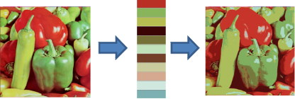

```{r, echo = FALSE, results = "hide"}
include_supplement("colorquantization.png",
  dir = "/home/leoca/ee/ufsj/lectures/aev/exams/vectorquantization/", recursive = TRUE)
```

Question
========

A figura abaixo ilustra o processo de quantização de cores de uma imagem.
À esquerda temos a imagem original, no meio uma palheta de cores e à direita
a imagem resultante da quantização de cores.

\


Com relação a este processo de quantização, podemos afirmar que:

Answerlist
---------------
* É possível reduzir o número de bits necessários para representar uma imagem utilizando uma quantização de cores.
* A quantização de cores é uma quantização escalar.
* A palheta de cores é única, ou seja, só existe uma forma de se obter/criar uma palheta de cores.
* O dithering pode ser utilizado conjuntamente com a quantização para obtermos uma imagem com menos regiões de cores chapadas, 
criando a sensação de uma imagem mais realista. 
* A palheta de cores deve ter menos do que 256 cores para ser possível obter uma taxa de compressão maior do que 1 (um).
* A palheta de cores deve ter mais do que 256 cores para criar uma representação natural de imagens reais (fotos).
* O algoritmo de corte de mediana é utilizado para criar uma palheta de cores com tamanho $2^n$.
* A melhor forma (menor distorção e maior taxa de compressão) de se obter uma palheta de cores é dividir uniformemente 
o espaço de cores, atribuindo o mesmo número de bits para as componentes R, G e B.
* O dithering pode ser utilizado na quantização cores conjuntamente com qualquer método para obter a palheta de cores.

Solution
========

Answerlist
----------
* True.
* False.
* False.
* True.
* False.
* False.
* True.
* False.
* True.


Meta-information
================
extype: mchoice
exsolution: 100100101
exname: quantização de cores
expoints: 1


