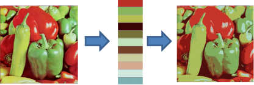

```{r, echo = FALSE, results = "hide"}
include_supplement("colorquantization.png",
  dir = "/home/leoca/ee/ufsj/lectures/aev/exams/vectorquantization/", recursive = TRUE)
```

Question
========

A figura abaixo ilustra o processo de quantização de cores de uma imagem.
À esquerda temos a imagem original, no meio uma palheta de cores e à direita
a imagem resultante da quantização de cores.

\


Neste exemplo, considere $X$ a imagem original, $P$ a palheta de cores e $Xq$ a imagem quantizada.
Podemos afirmar que:

Answerlist
---------------
* $X$ e $Xq$ terão o mesmo número de pixels.
* É necessária a mesma quantidade de bits para representar $X$ e $Xq$.
* Podemos obter $Xq$ fazendo no GNU Octave: ```Xq = round(X./P)```.
* A palheta de cores também é chamada de codebook.
* A partir de $Xq$ podemos recuperar a imagem original $X$.
* Utilizando o método do corte mediano podemos criar uma palheta para obter distorção mínima.
* O formato de compressão GIF utiliza quantização de cores.
* Para obter a imagem $Xq$ basta conhecer a palheta $P$ e os índices da palheta associados a cada pixel.

Solution
========

Answerlist
----------
* True.
* False.
* False.
* True.
* False.
* False.
* True.
* True.


Meta-information
================
extype: mchoice
exsolution: 10010011
exname: quantização de cores 2
expoints: 1


