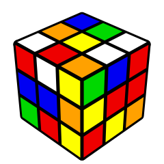
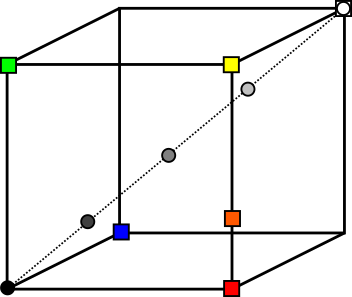

```{r, echo = FALSE, results = "hide"}
include_supplement(c("rubiks.png","vqrubik.png"),
  dir = "/home/leoca/ee/ufsj/lectures/aev/exams/vectorquantization/", recursive = TRUE)
```

Question
========

O cubo de Rubik possui as seguintes cores: branco ([255,255,255]), vermelho ([255,0,0]), 
azul ([0,0,255]), laranja ([255,88,0]), verde ([0,255,0]) e amarelo ([255,255,0]).
Utiliza-se uma palheta com 5 tons de cinza: [0,0,0], [64,64,64], [128,128,128], [192,192,192], [255,255,255].
Estas cores são indexadas por 0, 1, 2, 3 e 4, respectivamente.
É aplicada uma quantização vetorial à imagem colorida, produzindo uma imagem em tons de cinza.
Foi utiliza a palheta de 5 tons de cinza proposta. Qual será os índices que o quantizador produzirá
em sua saída para cada uma das cores do cubo de Rubik (na ordem em que foram apresentadas acima).

\



Answerlist
---------------
* 4, 2, 2, 2, 2, 3
* 4, 1, 1, 1, 2, 2
* 1, 3, 3, 3, 2, 0
* 4, 4, 4, 4, 2, 2
* 4, 2, 2, 2, 1, 2
* 1, 2, 2, 3, 3, 4

Solution
========
A figura abaixo ilustra as cores do codebook (círculos) e as cores do cubo de Rubik (quadrados).
Cada cor, ao ser quantizada, será aproximada pela palavra mais próxima do codebook,
desta forma teremos a seguinte associação:

branco ([255,255,255]): 4 
vermelho ([255,0,0]): 2
azul ([0,0,255]): 2
laranja ([255,88,0]): 2
verde ([0,255,0]): 2
amarelo ([255,255,0]): 3

\



Answerlist
----------
* True.
* False.
* False.
* False.
* False.
* False.

Meta-information
================
extype: schoice
exsolution: 100000
exname: quantização de cores
expoints: 1

