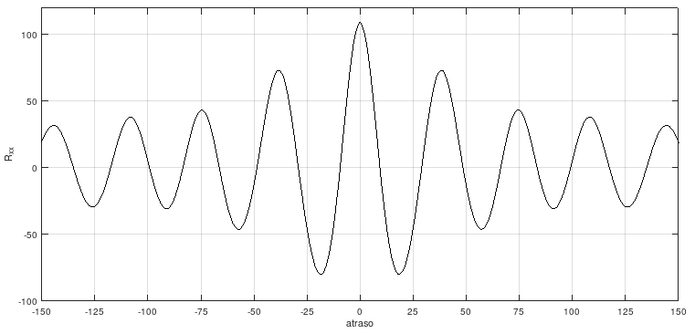

```{r, echo = FALSE, results = "hide"}
include_supplement(c("autocorrelacao.png"),
  dir = "/home/leoca/ee/ufsj/lectures/aev/exams/voice/", recursive = TRUE)
```
Question
========

O gráfico a seguir apresenta a autocorrelação de uma amostra de uma vogal. 

\


O código abaixo apresenta as informações de gravação da amostra de áudio apresenta.

```Octave
> filename = 'vogal.wav'
> audioinfo (filename)
ans =

  scalar structure containing the fields:

    Filename = vogal.wav
    CompressionMethod = 
    NumChannels = 1
    SampleRate = 8000
    TotalSamples = 2291
    Duration = 0.2864
    BitsPerSample = 16
    BitRate = -1
```

A seguir apresenta-se o código utilizado para gerar o gráfico.

```Octave
> pkg load signal
> [r,l] = xcorr(x);
> plot(l,r,'k-'); xlabel('atraso'); ylabel('R_{xx}'); title('autocorrelação'); 
> xlim ([-150,150]); ylim ([-100 120]); set(gca,'xtick',[-150:25:150]); grid on;
```

Analisando os dados apresentados, qual é a frequência fundamental do sinal dado?

Answerlist
---------------
* 23 Hz
* 55 Hz
* 73 Hz
* 82 Hz
* 123 Hz
* 174 Hz
* 208 Hz
* 332 Hz
* 485 Hz


Solution
========

```Octave
> 8000/38.5
ans = 207.79
```

Answerlist
----------
* False
* False
* False
* False
* False
* False
* True
* False
* False

Meta-information
================
extype: schoice
exsolution: 000000100
exname: f0
expoints: 1

