# URL

---

# Elements of Acoustic Phonetics

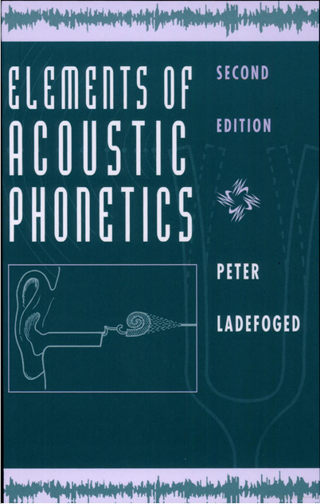{ height=75% }

---

# Acoustic wave

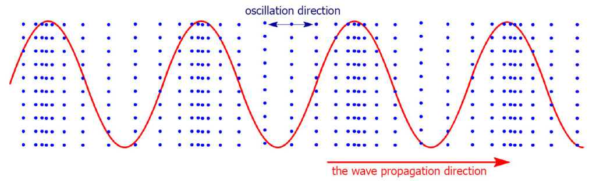

<!-- Source: novotest.biz -->

---

# Analog > Digital / Digital > Analog

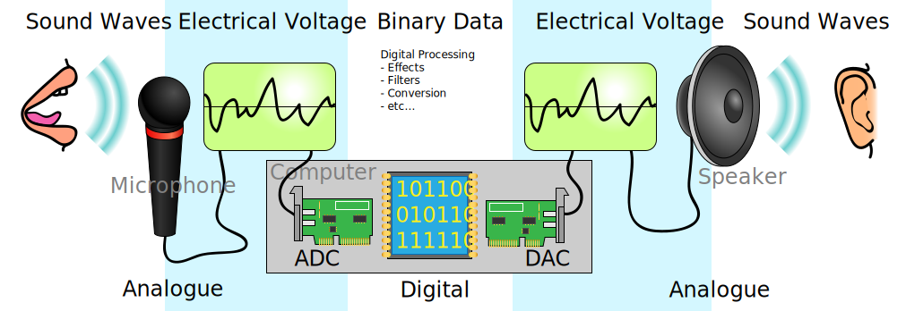

<!-- Source: Wikimedia. -->

---

# Microphone

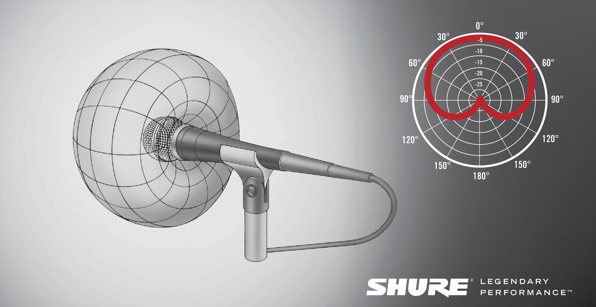{ height=50% }

---

# Microphone

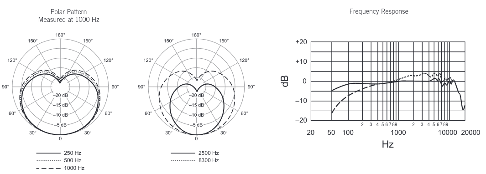{ height=50% }

---

# Headphone

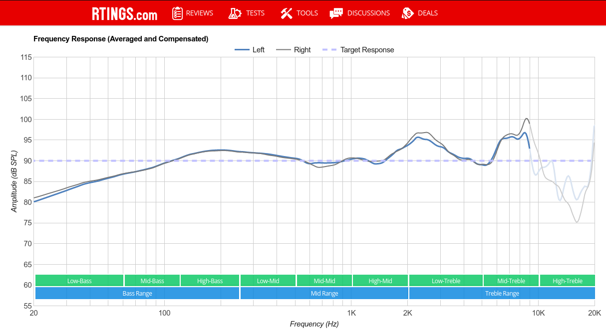{ height=75% }

---

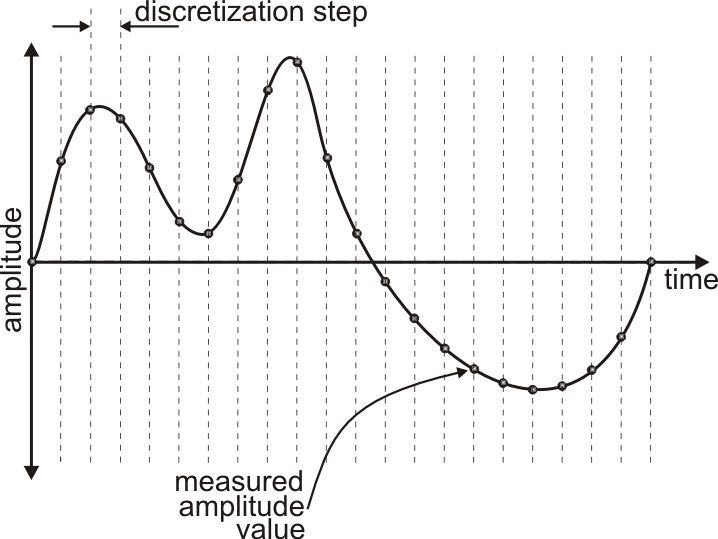

---

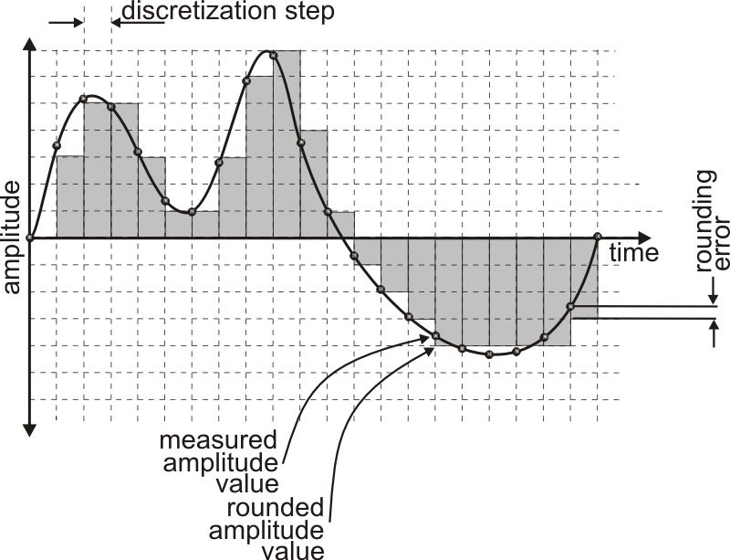

---

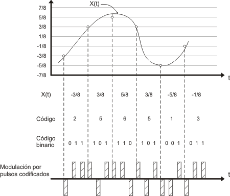{ height=80% }

---

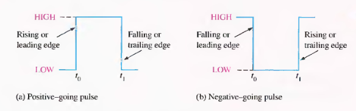

---

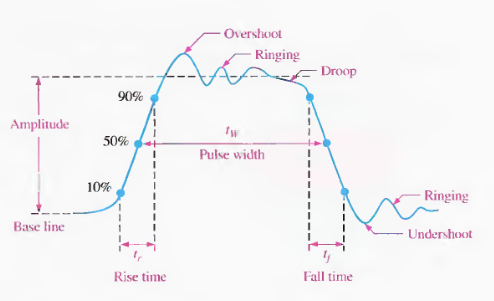{ height=50% }

---

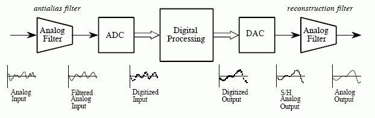

---

# Quantizer

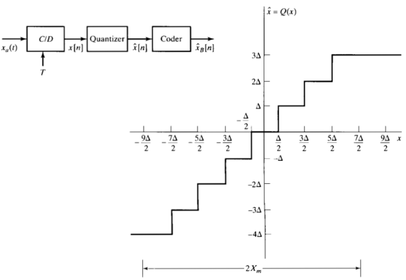{ height=80% }

---

# Quantization examples

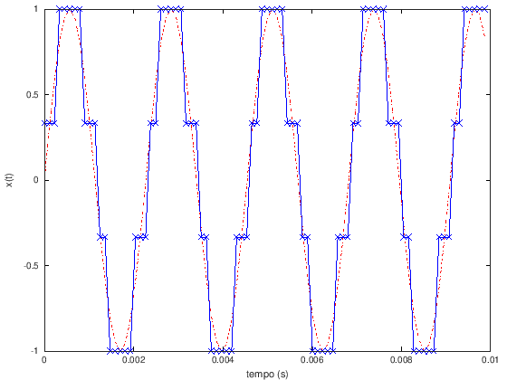{ height=80% }

<!--
pkg load signal
pkg load communications
fs = 8820; % Hz
f0 = 440; % Hz  (A4)
t = [0:1/fs:3]'; % vetor tempo (s)
x = sin(2*pi*f0*t);
nbits = 2;
M = 2^nbits;
xmax = 1; xmin = -1;
u_codebook = [0:M-1]' / (M - 1) * (xmax - xmin) + xmin;
u_partition = (u_codebook(1:M-1) + u_codebook(2:M))/2;
[idx, xq, d] = quantiz(x, u_partition, u_codebook);
player = audioplayer (xq, fs, 8);
play (player);

[x, fs] = audioread ('/home/leoca/ee/ufsj/aulas/audioevideo/quantization/EAgoraJose.ogg');
nbits = 1;
M = 2^nbits;
xmax = 1; xmin = -1;
u_codebook = [0:M-1]' / (M - 1) * (xmax - xmin) + xmin;
u_partition = (u_codebook(1:M-1) + u_codebook(2:M))/2;
[idx, xq, d] = quantiz(x, u_partition, u_codebook);
player = audioplayer (xq, fs, 8);
play (player);
pause (5);
stop (player);
-->

---

# Clipping

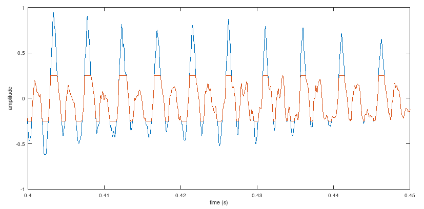

<!--
% clipping
fs = 8820; % Hz
f0 = 440; % Hz  (A4)
t = [0:1/fs:3]'; % vetor tempo (s)
x = sin(2*pi*f0*t);
player = audioplayer (x, fs, 8);
play (player);
for m=0.8:-0.2:0.2,
  pause(3);
  xc = sign(x).*min(abs(x),m)./m;
  player = audioplayer (xc, fs, 8);
  play (player);
endfor

cmd = 'wget -q https://www.macmillandictionary.com/media/british/uk_pron/w/wor/word_/word_British_English_pronunciation_106225.mp3 -O /tmp/word.mp3';
system (cmd);
cmd = 'ffmpeg -i /tmp/word.mp3 -c:a libvorbis -q:a 4 -loglevel quiet -y /tmp/word.ogg';
system (cmd);
[x, fs] = audioread ('/tmp/word.ogg');
x = x./max(abs(x));
player = audioplayer (x, fs, 8);
play (player);
for m=0.8:-0.25:0.05,
  pause(3);
  xc = sign(x).*min(abs(x),m)./m;
  player = audioplayer (xc, fs, 8);
  plot(xc);
  play (player);
endfor
-->

---

# Praat clipping example

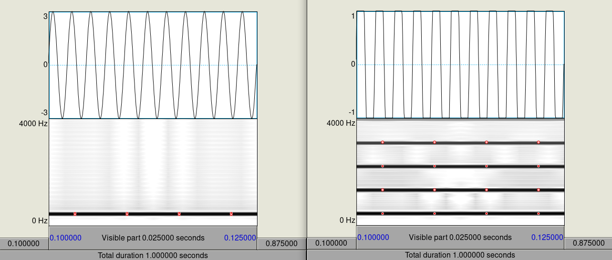{ height=80% }

---

# Praat clipping example - recording

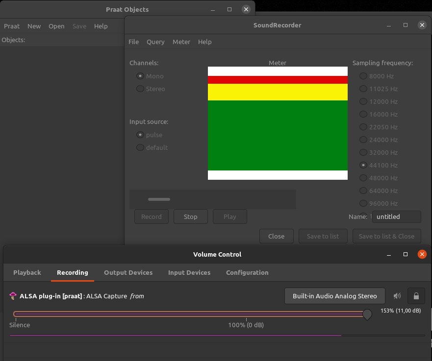{ height=75% }

---

# Fourier Series

[Simulation](https://www.compadre.org/osp/EJSS/4487/272.htm)

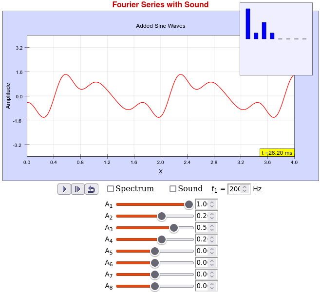{ height=80% }

---

# Signals and Systems

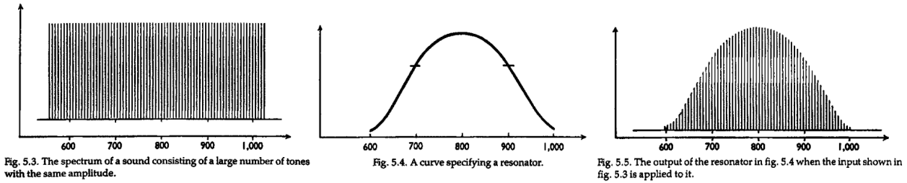

<!--
pkg load signal
pkg load communications
file = '/home/leoca/ee/ufsj/aulas/audioevideo/quantization/BeethovensSymphonyNo.9Scherzo.ogg';
% file = '/home/leoca/ee/ufsj/aulas/audioevideo/quantization/Goldberg_Variations_32_Aria_da_Capo_è_Fine.ogg';
% file = '/home/leoca/ee/ufsj/aulas/audioevideo/quantization/Liberdade.ogg';
[x, fs] = audioread (file);
x = x(:,1);
[b, a] = butter (8, 1/40); %1/5: fc=4410     1/10: fc=2205     1/20: fc=1102.5     1/40: fc=551 
y = filtfilt (b, a, x);
player = audioplayer (y, fs, 16);
play (player);
stop (player);
-->

---

# Vowel

[open_front_unrounded.mp3](https://web.uvic.ca/ling/resources/ipa/charts/IPAlab/IPAsounds/open_front_unrounded.mp3)

![Vowel sound (open front unrounded [a]).](imgs/sound-ex01.png){ height=80% }

---

# Pitch

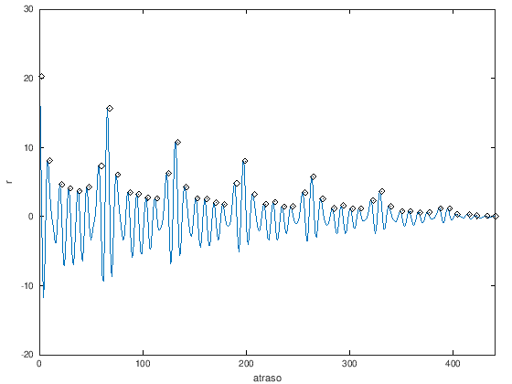{ height=80% }

<!--
wget -q https://web.uvic.ca/ling/resources/ipa/charts/IPAlab/IPAsounds/open_front_unrounded.mp3 -O /tmp/ah.mp3
ffmpeg -i /tmp/ah.mp3 /tmp/ah.ogg 

pkg load signal
pkg load communications
[x, fs] = audioread ('/tmp/ah.ogg');
x = x(9E3:29E3); % remover silencio
x = decimate(x,5);
fs = fs/5;
t = [0:1/fs:(length(x)-1)/fs]; 
start=round(0.15*fs);
wl = round(50E-3 * fs); % 40 ms
xa = x(start:start+wl);

gconv(xa,flipud(xa),[],0)

-->

---

# LPC model

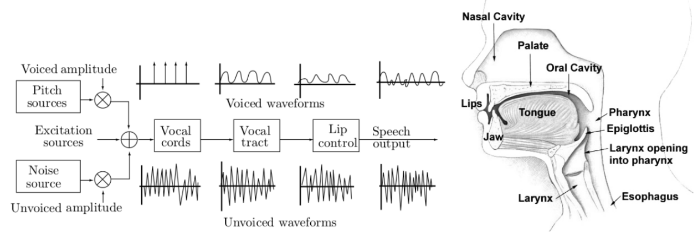{ width=100% }

---

# Vocal apparatus 

](imgs/sawada.jpg){ height=50% }

[vocal cord stroboscopy examination](https://www.youtube.com/watch?v=t13ftpM4rPw)

[History of Speech Synthesis](https://www.youtube.com/watch?v=G7Y3BRxQGVw)

[four people sing Kyrie eleison during laryngoscopy](https://www.youtube.com/watch?v=-XGds2GAvGQ)

---

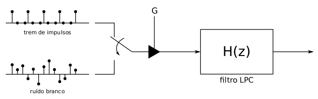{ width=75% }

synthesized example
<!-- 
play /home/leoca/ee/ufsj/aulas/audioevideo/lpc/synthesized-jose.ogg
play /home/leoca/ee/ufsj/aulas/audioevideo/lpc/synthesized-daisy.ogg
play /home/leoca/ee/ufsj/aulas/audioevideo/lpc/synthesized-liberdade.ogg

play -v 0.1 snds/ah.ogg 
play -v 0.1 snds/pulsetrain.ogg 
play -v 0.1 snds/ah_r.ogg 

wget -q https://web.uvic.ca/ling/resources/ipa/charts/IPAlab/IPAsounds/open_front_unrounded.mp3 -O /tmp/ah.mp3
ffmpeg -i /tmp/ah.mp3 /tmp/ah.ogg
wget -q http://savannah.gnu.org/support/download.php?file_id=49063 -O lpc.m

./flowgen_shimmer -r 44100 -d 3 -j 1 -s 1 -o glottalpulse.pcm
sox -t raw -c 1 -e signed-integer -b 16 -r 44100 glottalpulse.pcm glottalpulse.wav

==== Octave ====
pkg load signal
pkg load communications
[x, fs] = audioread ('/tmp/ah.ogg');
x = x(9E3:29E3); % remover silencio
x = decimate(x,5);
fs = fs/5;
t = [0:1/fs:(length(x)-1)/fs]; 
start=round(0.15*fs);
wl = round(50E-3 * fs); % 40 ms

function [pks,locs] = findpeaks(data)
% [pks,locs] = findpeaks(data)
%   find the peaks values on vector data
  n = length(data);
  locs = find([data(2:n,1) - data(1:n-1,1) < 0; 1] & [1; data(1:n-1,1) - data(2:n,1) < 0]);
  pks = data(locs);
endfunction 

[r,l] = xcorr(x(start:start+wl));
[pks,locs] = findpeaks(r(wl:end));

[_,id] = sort(pks,"descend");
T0 = locs(id(2))/fs;
f0 = 1/T0;

p = 12; % ordem do modelo
[a, g] = lpc (x, p);

function x = createpulsetrain(fs,d,f0,jit,shim)
  if jit < 0 || jit > 1, error('jitter must be in ther inverval [0,1]'); endif;
  if shim < 0 || shim > 1, error('shimmer must be in ther inverval [0,1]'); endif;
  if f0 > fs/2, error('are you crazy?'); endif;
  L = d * fs; % desired length (samples)
  i = 0; x = [];
  while(length(x) < L),
     f0r = (jit*f0)*rand + f0;
     lag = round(fs / f0r);
     x = [x  zeros(1,lag-1) (1-shim*rand)];
  endwhile
  if(length(x) > L), x = x(1:L); endif;
endfunction

sig = createpulsetrain(fs,length(x)/fs,f0,0.05,0.1);
xr = filter(1,a,sig);

audiowrite ('ah_r.ogg', xr, fs);
audiowrite ('pulsetrain.ogg', sig, fs);

-->

---

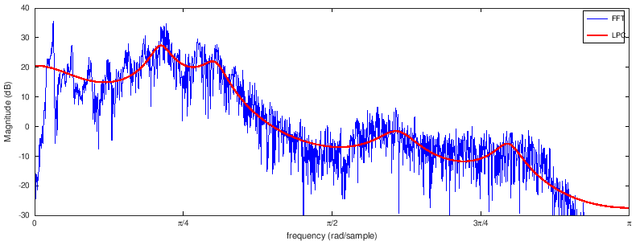

---

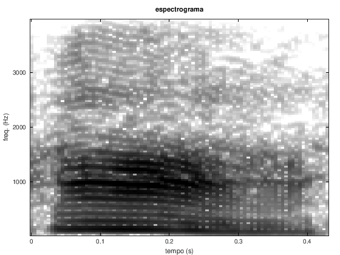{ height=80% }

---

# Spectrogram 

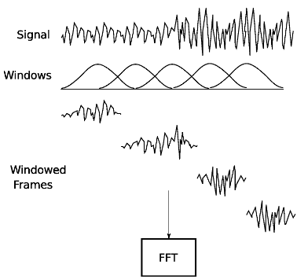{ height=80% }

---

# Time vs Frequency

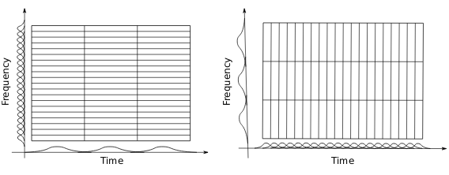{ height=60% }

---

# The Uncertainty Principle

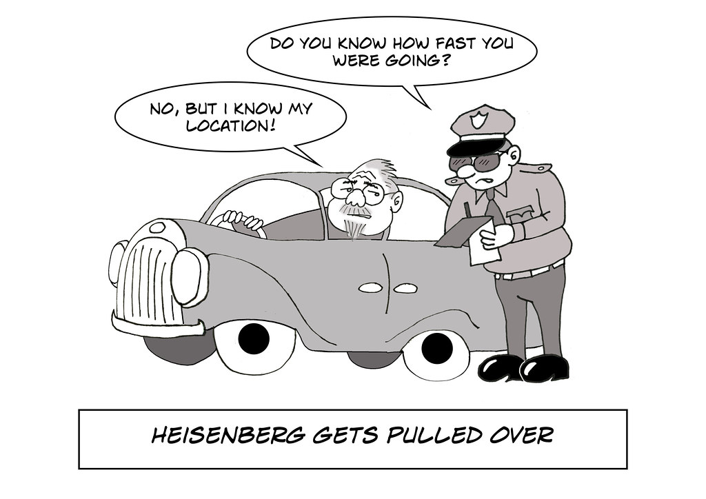{ height=60% }

---

# Spectrogram

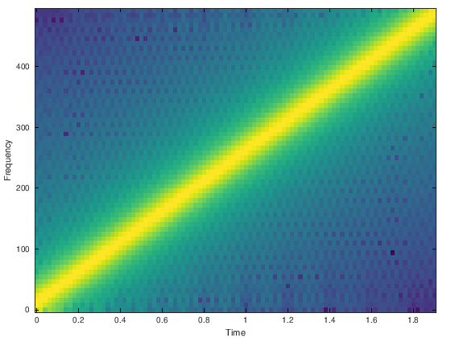{ height=80% }

<!--
Fs=1000;
x = chirp([0:1/Fs:2],0,2,500);  # freq. sweep from 0-500 over 2 sec.
player = audioplayer (x, Fs, 16);
play (player);

step=ceil(20*Fs/1000);    # one spectral slice every 20 ms
window=ceil(100*Fs/1000); # 100 ms data window

## test of automatic plot
[S, f, t] = specgram(x);
specgram(x, 2^nextpow2(window), Fs, window, window-step);
-->

---

# Shepard Tone

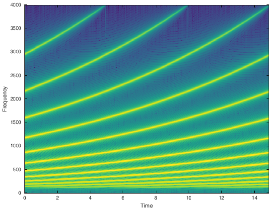{ height=80% }

---

## Downsampling

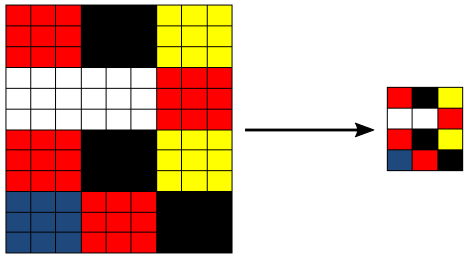{ height=50% }

---

# Downsample / Decimate

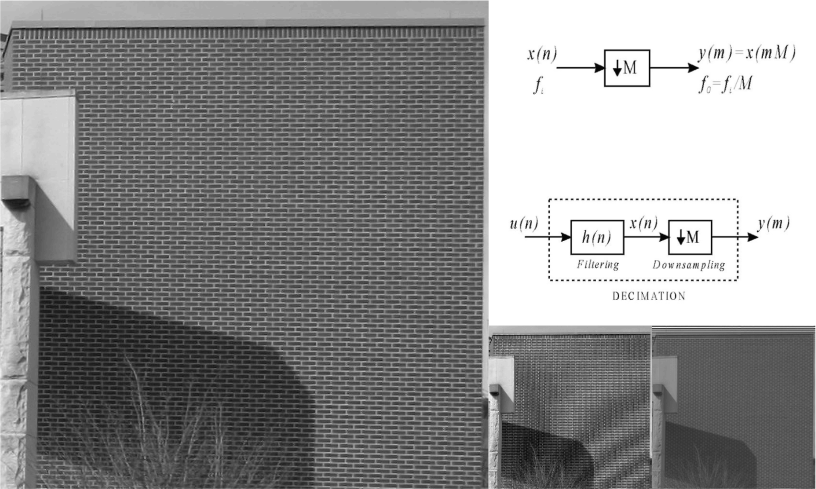{ height=80% }

---

# Downsample / Decimate (audio example)

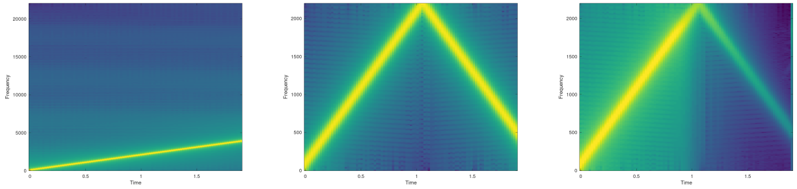{ width=100% }

<!--
Fs=44100;
x = chirp([0:1/Fs:2],0,2,4000);  # freq. sweep from 0-500 over 2 sec.
player = audioplayer (x, Fs, 16);
play (player);
step=ceil(20*(Fs)/1000);    # one spectral slice every 20 ms
window=ceil(100*(Fs)/1000); # 100 ms data window
figure; specgram(x, 2^nextpow2(window), Fs, window, window-step);

xd = downsample (x,10);
player = audioplayer (xd, Fs/10, 16);
play (player);
step=ceil(20*(Fs/10)/1000);    # one spectral slice every 20 ms
window=ceil(100*(Fs/10)/1000); # 100 ms data window
figure; specgram(xd, 2^nextpow2(window), Fs/10, window, window-step);

xd = decimate (x,10);
player = audioplayer (xd, Fs/10, 16);
play (player);
step=ceil(20*(Fs/10)/1000);    # one spectral slice every 20 ms
window=ceil(100*(Fs/10)/1000); # 100 ms data window
figure; specgram(xd, 2^nextpow2(window), Fs/10, window, window-step);
-->

---

# Hearing

* Intensity
* Pitch
* Duration
* Quality/timber

---

# Pitch metamery

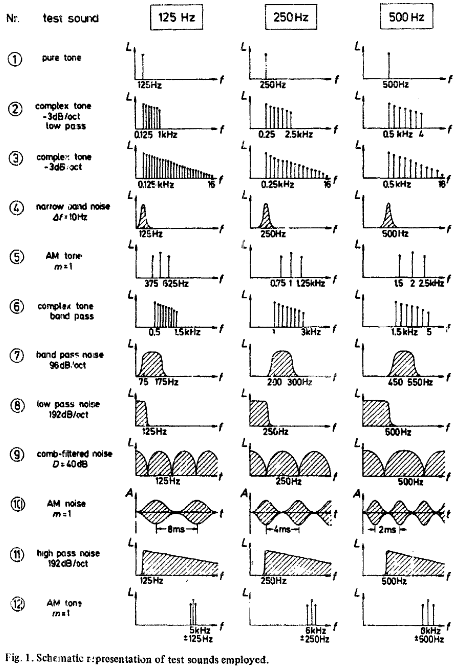{ height=80% }

<!--
% https://www.szynalski.com/tone-generator/

pkg load signal
pkg load communications
fs = 44100; % Hz
t = [0:1/fs:3]'; % vetor tempo (s)

f1=440; f2=660; f3=880; x1=sin(2*pi*f1*t); x2=sin(2*pi*f2*t); x3=sin(2*pi*f3*t); x=0.8*x1+x2+0.8*x3; x=0.5*x./max(abs(x)); player = audioplayer (x, fs, 8); play (player);
x=0.5*sin(2*pi*220*t); player = audioplayer (x, fs, 8); play (player);

-->

---

# Pitch JND

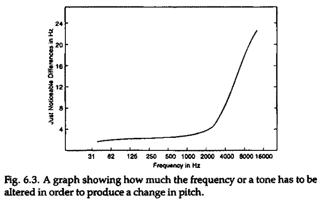{ height=80% }

---

# Pitch scales

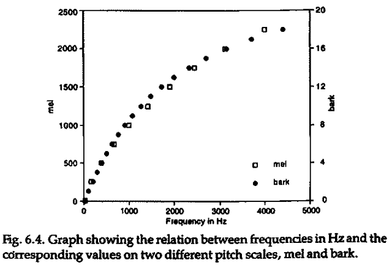{ height=80% }

---

# Tonal languages

<!--
play snds/mandarin-ma.ogg
# https://www.youtube.com/watch?v=9XRXYaHOlpo
-->

---

# Duration

* Staat /ʃtaːt/ - country; state 
* Stadt /ʃtat/ - city; town 

<!--
play snds/staat_state_country.ogg
play snds/stadt_city.ogg
-->
---

# Hearing range

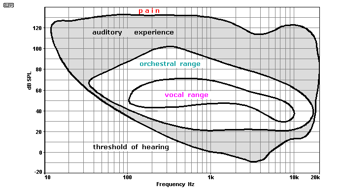{ height=80% }

---

# Fletcher-Munson curves

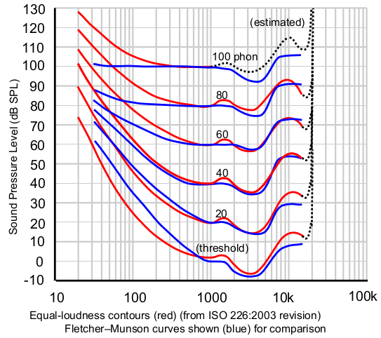{ height=80% }

---

# Masking

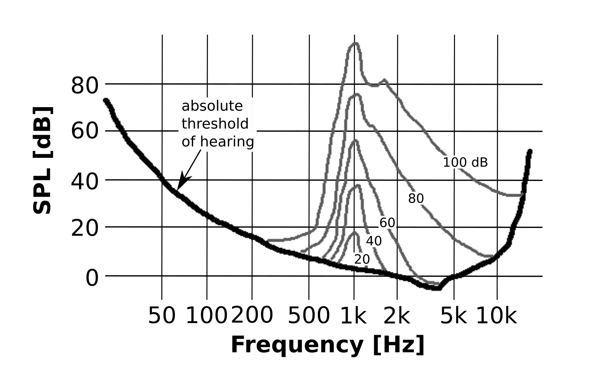{ height=60% }

---

# Masking

{ height=60% }

---

# Musical instruments

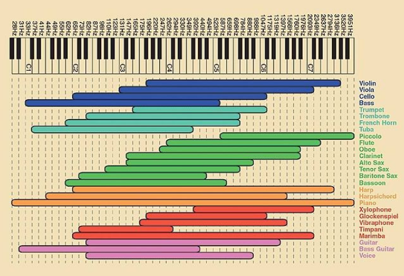{ height=80% }

---

# Ear

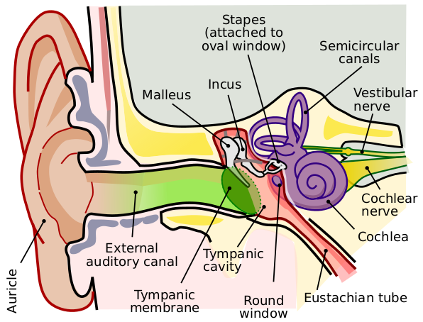{ height=80% }

---

# Middle ear

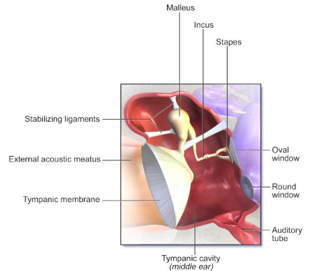{ height=80% }

---

# Cochlea

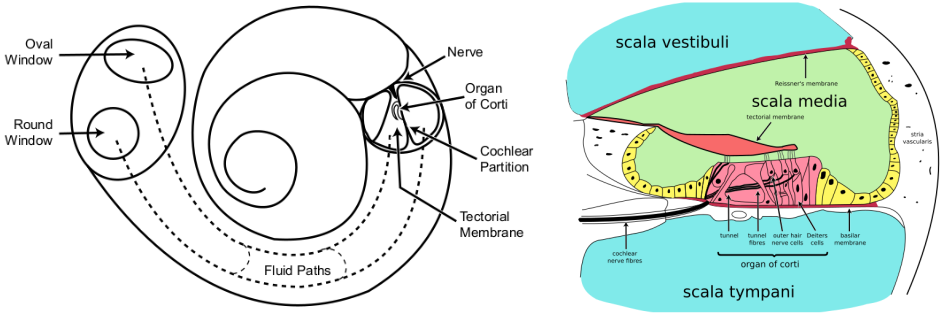{ height=80% }

---

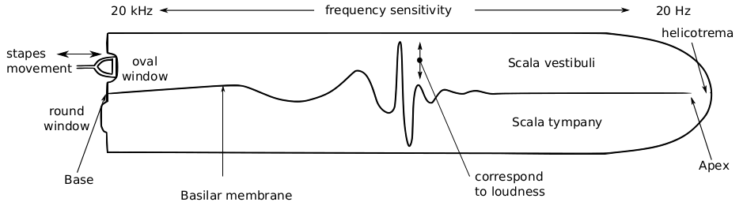{ height=80% }

---

# Hair cells

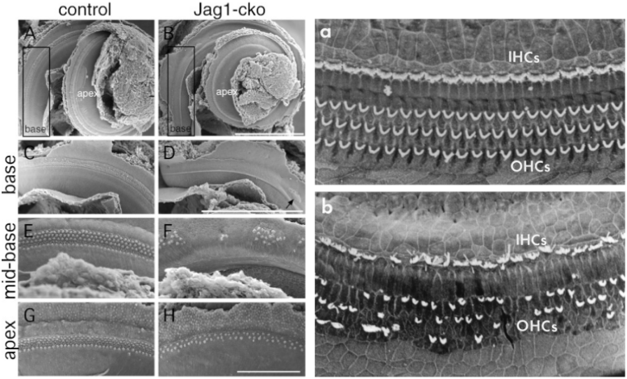{ height=80% }

---

# Auditory Scene Analysis - Albert Bregman

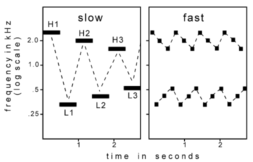{ height=70% }

<!-- /ms/downloads/lectures/Bregman_ASA/Track01.mp3 -->

---

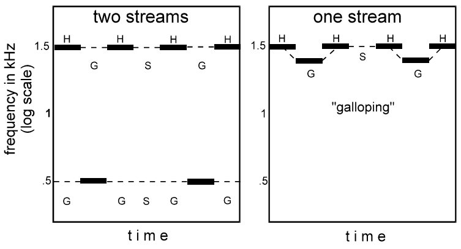{ height=70% }

<!-- /ms/downloads/lectures/Bregman_ASA/Track03.mp3 -->

---

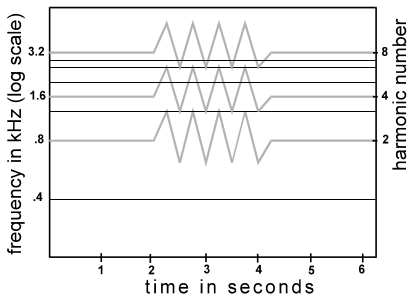{ height=70% }

<!-- /ms/downloads/lectures/Bregman_ASA/Track11.mp3 -->

---

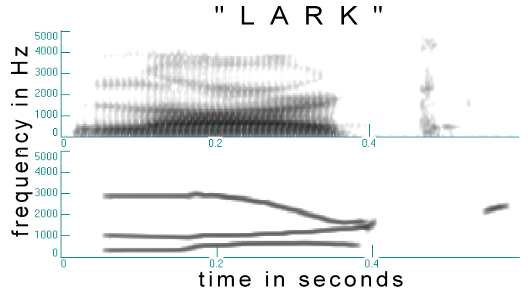{ height=70% }

<!-- /ms/downloads/lectures/Bregman_ASA/Track23.mp3 -->

---

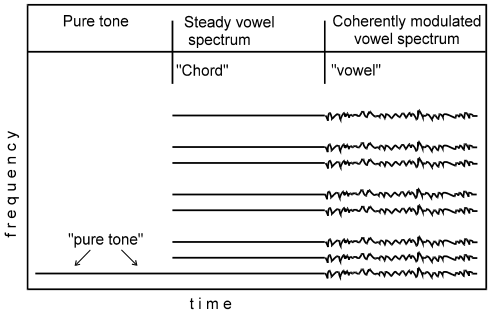{ height=70% }

<!-- /ms/downloads/lectures/Bregman_ASA/Track24.mp3 -->

---

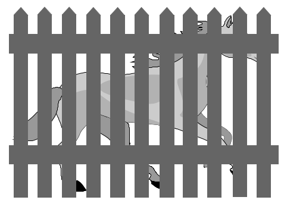{ height=70% }

<!-- /ms/downloads/lectures/Bregman_ASA/Track31.mp3 -->

---

# Audio file formats

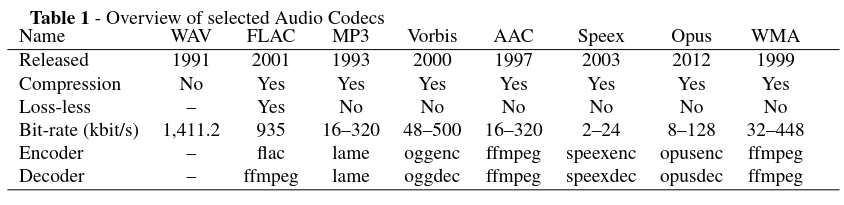

---

# Compression ratio

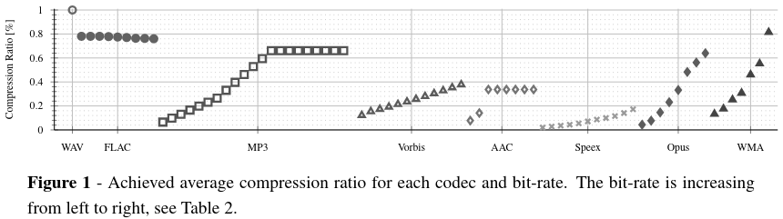

---

# Compresstion error

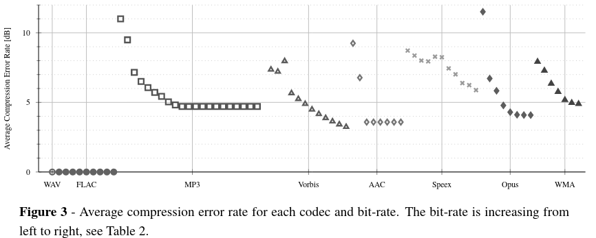

---

# Compression ratio vs compression error

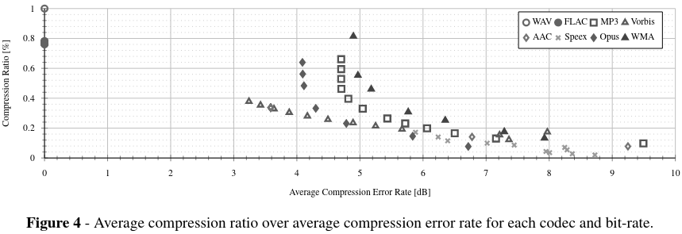

--- 

# Conclusion

``we recommend to use FLAC for all cases where
the accuracy matters. In cases where a slight error is acceptable, we recommend Vorbis at
500 kbit/s'' (Siegert et al 2016)

<!-- http://www.essv.de/pdf/2016_229_236.pdf -->

---

# Praat

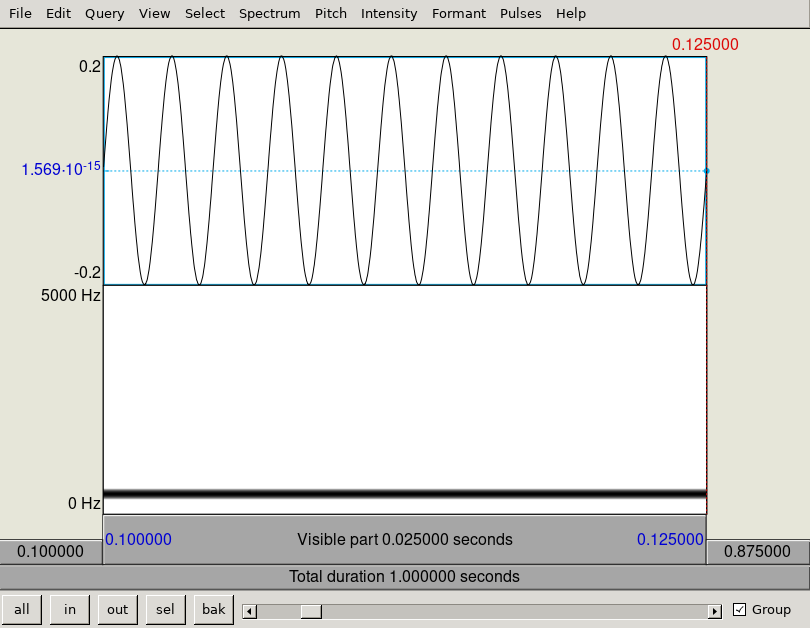{ height=70% }

<!-- record a 440Hz sin wave 
New > Sound > Pure tone 
   check parameters
   use 44.1kHz sampling frequency

View & Edit 
   Spectrogram - settings - window length - dynamic range (from peak)

-->

---

# Praat

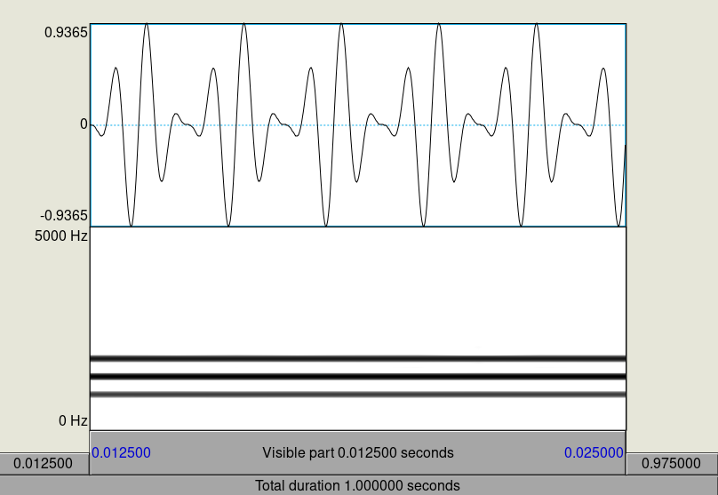{ height=70% }

<!--
new > sound > from formula
    1/4 * sin(2*pi*880*x) + 1/2 * sin(2*pi*1320*x) + 1/4 * sin(2*pi*1760*x) 

view from 0.0125 to 0.025 and spectrogram with 0.02 window length and 40dB dynamic range
  change window length and observe the effects
-->

---

# Praat

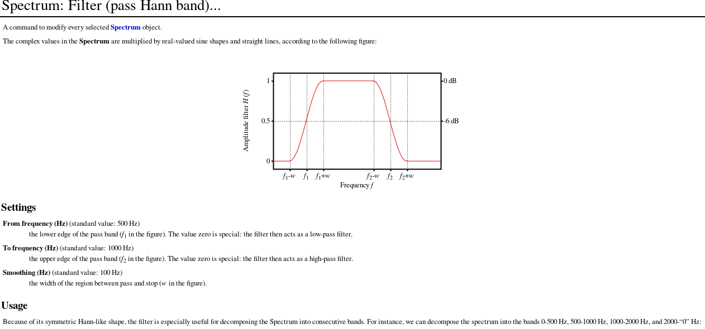{ height=80% }

---

# Praat

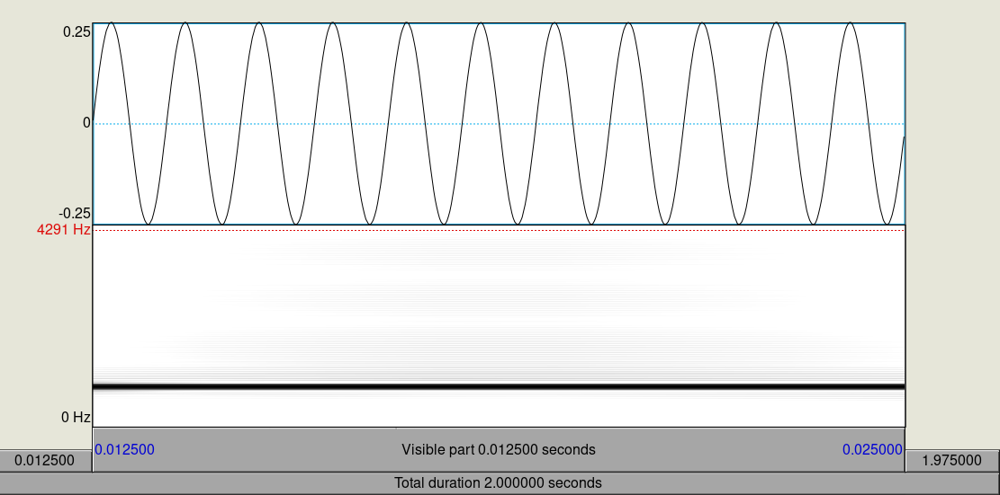{ height=70% }

---

# Praat

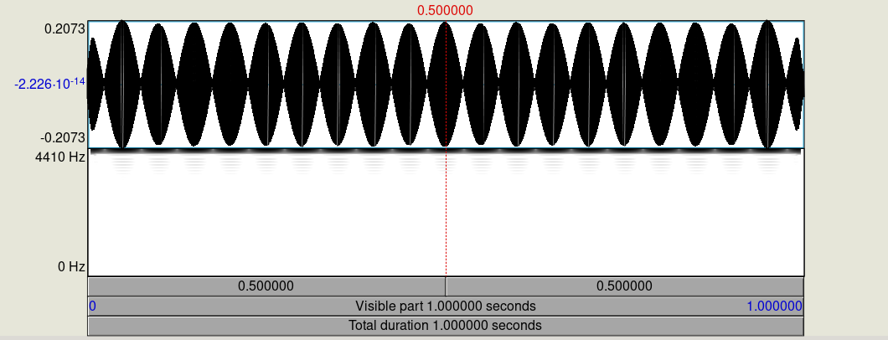{ height=70% }

<!--
record 4400 Hz sin wave with 44.1kHz sampling freq
resample to 8000Hz > result null
resample to 8820Hz > result with small modulating aliasing (see image)
Praat uses anti-asing filter
--> 

---

# Praat

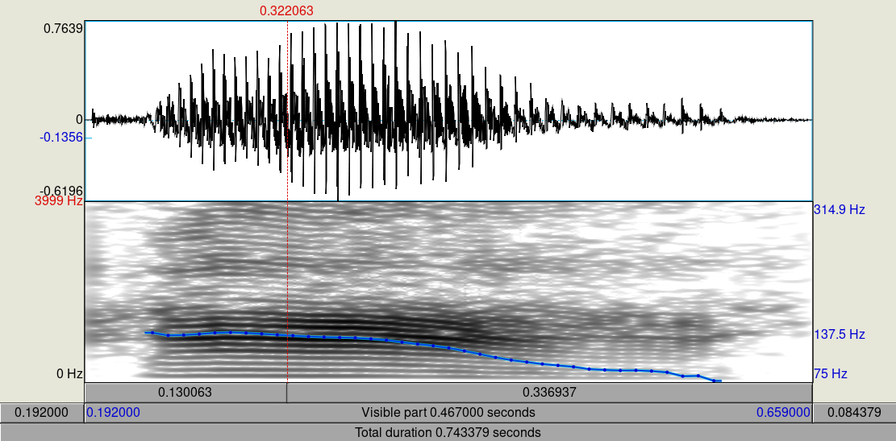{ height=70% }

<!--
load ah.mp3 file
open > read from file
change spectrogram settings - window length 0.025 (better frequency resolution)
-->

---

# Praat

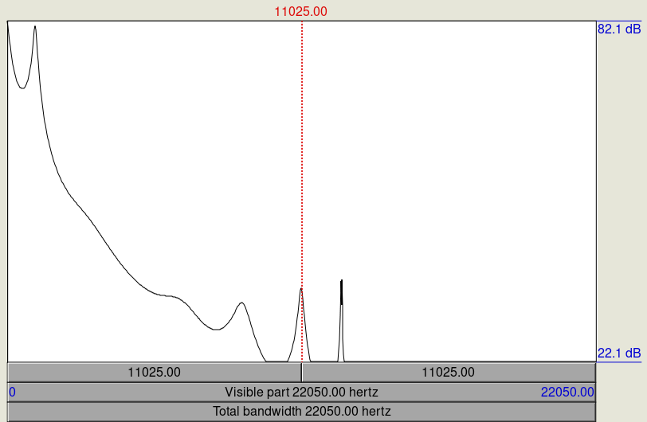{ height=70% }

<!--
analyze spectrum > LPC autocorrelation
  > to expectrum slice > time  0.322

-->

---

# Praat

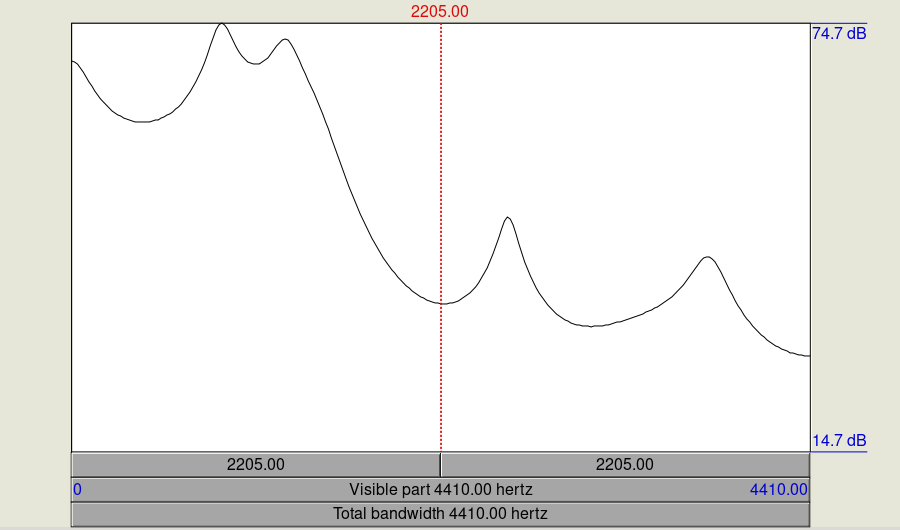{ height=70% }

<!--
back to original ah
convert > resample to 8820
analyze spectrum > LPC autocorrelation
  > to expectrum slice > time  0.322
   to expectrum slice > time  0.322
-->

---

# THE END

