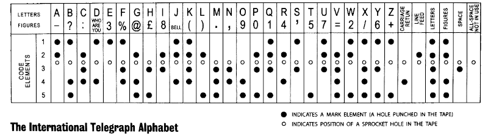

# Introduction to Text Encoding

- **Why Encoding Matters:**
  - Human-Readable Format: Text encoding allows computers to store and exchange text in a format that is both human-readable and machine-processable.\pause
  - Standardization: Encodings like UTF-8 provide a standard way for computers and systems to interpret text, avoiding confusion that could arise from regional or proprietary encodings.\pause
  - Ensures data integrity across different systems.\pause
    - Proper encoding preserves the accuracy of text when shared across different platforms, preventing data corruption and ensuring consistent display of characters.\pause

- **Overview:**
  - Evolution from simple to complex encoding systems.

---

# Character vs. Glyph vs. Font

- **Character:** Abstract unit in encoding (e.g., 'A' in Unicode).
- **Glyph:** Visual form of a character (how 'A' looks in Arial vs. Times).
- **Font:** Collection of glyphs sharing a design style.

{ width=80% }

---

# Jacquard

- Joseph Marie Jacquard in Lyon in 1801.

{ width=38% }

---

# Night Writing and Braille: Evolution in Tactile Encoding


- **Night Writing:**
  - Inventor: Charles Barbier, 1815, for silent military communication.
  - Structure: 12-dot cells for phonetic sounds, complex for practical use.
\pause

- **Braille:**
  - Creator: Louis Braille, 1824 (first published 1829), adapted from Night Writing.
  - Innovation: 6-dot cell, simpler, and more accessible for the blind.
  - Binary Encoding: Each cell represents binary combinations.
  - Universal Adoption: Braille became the standard for blind communication worldwide.
  - Expansion: Adapted for various languages, math, music, and more.

---

{ width=90% }

---

# Morse Code

- **History:** Developed by Samuel Morse and Alfred Vail in the early 1840s.
- **Mechanism:** Uses dots, dashes, and spaces for letters, numbers, and punctuation.
- **Usage:** Primarily telegraphy, but also in radio communication.

{ width=35% }

---

# Baudot and Murray Code

- **Baudot Code:**
  - Invented by Émile Baudot, 5-bit code for telegraphy.
  - Limited characters, used shift for numbers/letters.

- **Murray Code (ITA2):**
  - Extension of Baudot, improved by Donald Murray.
  - Added lower case, more symbols.

{ width=80% }

---

{ width=80% }

---

# EBCDIC (Extended Binary Coded Decimal Interchange Code)

- **History:** Developed by IBM for mainframe computers.
- **Characteristics:** the first character encodings created for data processing on large-scale systems.
  - Used in legacy systems (IBM 1401, 7090, System/360).
- EBCD, a subset of EBCDIC.

---

{ width=75% }

---

# ASCII and Extended ASCII

- **ASCII (American Standard Code for Information Interchange):**
  - 7-bit code, 128 characters including 33 non-printing control codes.
  - Standardized in 1963 (ANSI).
  - Backward Compatibility: Despite its age, ASCII remains widely used today for compatibility reasons.

\pause
- **Extended ASCII:**
  - 8-bit code, 256 characters, allowing for additional symbols and characters.

---

{ width=70% }

---

| Character | Binary (Uppercase) | Binary (Lowercase) | Character |
|-----------|--------------------|--------------------|-----------|
| A         | 01000001           | 01100001           | a         |
| B         | 01000010           | 01100010           | b         |
| C         | 01000011           | 01100011           | c         |
| ...       | ...                | ...                | ...       |
| Z         | 01011010           | 01111010           | z         |
| 1         | 00110001           | 00100001           | !         |
| 2         | 00110010           | 01000000           | "         |
| 3         | 00110011           | 00100011           | #         |
| 4         | 00110100           | 00100100           | $         |
| ...       | ...                | ...                | ...       |

---

# ASCII Art

\scriptsize
```
________________________
|.----------------------.|
||       ______         ||
||     .;;;;;;;;.       ||
||    /;;;;;;;;;;;\     ||
||   /;/`    `-;;;;; . .||
||   |;|__  __  \;;;|   ||
||.-.|;| e`/e`  |;;;|   ||
||   |;|  |     |;;;|'--||
||   |;|  '-    |;;;|   ||
||   |;;\ --'  /|;;;|   ||
||   |;;;;;---'\|;;;|   ||
||   |;;;;|     |;;;|   ||
||   |;;.-'     |;;;|   ||
||'--|/`        |;;;|--.||
||;;;;    .     ;;;;.\;;||
||;;;;;-.;_    /.-;;;;;;||
||;;;;;;;;;;;;;;;;;;;;;;||
'------------------------'
```
---

# BTC Genesis Block

{ width=90% }

---

Hidden messages in Bitcoin transactions are often embedded using the `OP_RETURN` opcode, which allows up to 80 bytes of data (typically ASCII text) to be stored in the transaction output. 
This method is commonly used for non-financial purposes, like embedding small text or proof data.

---

# Base64

Base64 is a binary-to-text encoding scheme that represents binary data in an ASCII string format. Each Base64 digit represents exactly 6 bits of data, providing a way to encode binary data as text.

\pause
Base64 is used in:

- email attachments,
- embedding binary data in XML, JSON, or HTML, and
- data exchange in APIs.

---


---

# Keys and Addresses Encoding in Bitcoin

- All keys and addresses are encoded using appropriate methods:
  - **Base58Check**: For legacy addresses and private keys.
  - **Bech32**: For SegWit addresses.

## Prefix Summary Table

| Data Type          | Prefix       | Example                |
|--------------------|--------------|------------------------|
| Legacy Address     | `0x00`       | `1PMycacnJa...UAs`     |
| SegWit Address     | `bc1`        | `bc1qw508d6q...`       |
| Testnet Address    | `0x6F`       | `mhPo5P2RVu5...rEo`    |
| Private Key (WIF)  | `0x80`       | `5J76fRXQYWk...U6q`    |

---

## Base58Check

- Char set: 1 2 3 4 5 6 7 8 9 A B C D E F G H J K L M N P Q R S T U V W X Y Z a b c d e f g h i j k m n o p q r s t u v w x y z.
  - a-z, A-Z, and 0-9, with visually ambiguous characters (0, O, I, l) removed.

\pause
### example
- 3 bytes: 0xFFFFFF
- Base 58: 2UzHL
- Steps:
  - 0xFFFFFF = 16 777 215
  - 16 777 215 mod 58 = 19 = L
  - 289 262 mod 58 = 16 = H
  - 4987 mod 58 = 57 = z
  - 85 mod 58 = 27 = U
  - 1 mod 58 = 1 = 2

---

## Bech32

- Char set: q p z r y 9 x 8 g f 2 t v d w 0 s 3 j n 5 4 k h c e 6 m u a 7 l.
  - a-z, and 0-9, without the following characters: 1, b, i, and, o (b, i, and o can easily be confused with 8, 1, and 0, especially in handwriting or certain fonts).\pause
  - Commonly mistaken characters (e.g. 5 vs S, 2 vs Z, p vs q vs g, etc.) are always one bit different -- the BCH code is optimized for detecting and correcting single-bit errors.\pause
  - BCH codes, GF(32), polynomial $g(x) = x^6 + 29x^5 + 22x^4 + 20x^3 + 21x^2 + 29x + 18$.\pause
  - Error detection of 4 errors in up to 89 characters.
    - P2WPKH (Pay to Witness Public Key Hash): These addresses start with `bc1q` and are typically 42 characters long for the mainnet (including the `bc1` prefix).
    - P2WSH (Pay to Witness Script Hash): These start with `bc1q` as well but are longer, typically 62 characters for the mainnet, due to the script hash being larger.

\vspace{3em}

[Talk - Pieter Wuille: New Address Type for SegWit Addresses](https://youtu.be/NqiN9VFE4CU)

[(Some of) the math behind Bech32 addresses](https://medium.com/@meshcollider/some-of-the-math-behind-bech32-addresses-cf03c7496285)

---

# ASCII Smuggling

ASCII smuggling is a technique that leverages Unicode characters, which are invisible in user interfaces but can be interpreted by large language models (LLMs), to embed hidden instructions or data within text. This method allows attackers to manipulate AI responses or exfiltrate sensitive information without the user's awareness, by embedding these hidden Unicode tags within clickable hyperlinks or documents shared in chats.

---

{ width=70% }

---

{ width=50% }

---

# ISO/IEC Standards

- **ISO/IEC 8859:**
  - Series for 8-bit character encoding supporting multiple languages.
  - ISO-8859-1 (Western Europe), also known as ISO Latin 1. 
    - The first 128 characters are identical to ASCII.
    - `0x00` to `1F` and `0x80` to `0x9F` (hex) used for C0 and C1 control codes.
    - C0 set was originally defined in ISO 646 (ASCII) (e.g., Start of Heading, Start of Text, End of Text, End of Transmission, ...).
    - C1 are additional control codes (e.g., Padding Character, High Octet Preset, Break Permitted Here, No Break Here, ...).

- **ISO/IEC 10646:**
  - Universal character set (UCS) for multilingual text.

---

{ width=50% }

---

# Windows Code Pages

- **Overview:**
  - Multiple code pages for different regions and languages.
  - Used in Microsoft Windows from the 1980s and 1990s.

- **Examples:**
  - CP1252 (Western Europe), CP932 (Japan)

- **Issues:**
  - Inconsistencies across different systems.

---

## Windows Encoding Transition to Unicode

- **UCS-2 (Unicode Character Set - 2 bytes):**
  - **Introduction:** Windows NT 3.1 (1993)
  - **Details:** 16-bit fixed-width encoding for the first 65,536 Unicode characters, used internally for Windows APIs.
\pause

- **UTF-16:**
  - **Adoption:** Windows 2000 (2000)
  - **Details:** An extension of UCS-2, accommodating all Unicode characters by using surrogate pairs for characters beyond the Basic Multilingual Plane (BMP).
    - Surrogate Pair Example: The emoji \Symbola 😊 (Unicode U+1F60A) would be represented as: U+D83D (High Surrogate) + U+DE0A (Low Surrogate).
\pause

- **UTF-8:**
  - **Support Added:** Windows 10 version 1803 (April 2018 Update)
  - **Details:** Variable-width encoding, backward compatible with ASCII. Became more prominently supported for developers with the introduction of the `ActiveCodePage` property in Windows 10 1903 (May 2019 Update).

---

# Unicode

  - Universal character set covering all scripts, supporting over 143,000 characters.\pause
  - It assigns a unique number (called a "code point") to each character, regardless of platform, program, or language.\pause
  - 1.112.064 valid code points within the codespace.\pause
  - As of Unicode 16.0, released in September 2024, 299,056 (27%) of these code points are allocated, 155,063 (14%) have been assigned characters, 137,468 (12%) are reserved for private use, 2,048 are used to enable the mechanism of surrogates, and 66 are designated as noncharacters, leaving the remaining 815,056 (73%) unallocated.\pause
  - Unicode has different encoding forms: UTF-8, UTF-16, and UTF-32.

---

# UTF

- **UTF-8:**
  - Variable-length encoding, backward compatible with ASCII, byte-order independent.\pause 
- **UTF-16:**
  - Variable-length encoding (2 or 4 bytes per character).
  - Latin and most commonly used CJK\footnote{Chinese, Japanese, and Korean.} characters are encoded in 2 bytes.\pause
- **UTF-32**:
  - Fixed-length encoding (4 bytes per character).

---


---

# UTF-8 takes over

{ width=65% }

---

# Endianness

- **Big Endian vs. Little Endian:**
  - Byte order in memory representation.
  - Impacts how multi-byte characters are read.

{ width=80% }

---

{ width=55% }

---

- **Example:**
  - UTF-16 and UTF-32 can be big or little endian.
  - Byte Order Mark (BOM) to indicate the endianness being used.
  - The BOM is the code point `U+FEFF` (BOM, ZWNBSP\footnote{zero width no-break space}).
    - Big-endian (UTF-16BE): `FE FF`
    - Little-endian (UTF-16LE): `FF FE`
    - Big-endian (UTF-32BE): `00 00 FE FF`
    - Little-endian (UTF-32LE): `FF FE 00 00`
    - BOM in UTF-8: `EF BB BF`, serves more as a signature to indicate that the file is encoded in UTF-8 rather than specifying byte order.

---

# Text File Formats

- **.txt:** Usually ASCII or UTF-8.
- **.csv:** Can use various encodings; important for data exchange.
- **.json:** JavaScript Object Notation, for data interchange. 
- **.yml:** YAML Ain't Markup Language, for data serialization.
- **.log:** Log files for recording events, errors, and system activities.
- **.ini:** Initialization files for configuration settings.
- **.conf:** Configuration files, similar to .ini, used by many applications.

---

# Markup Files

\footnotesize

- **Markdown:**
  - Lightweight markup language for formatting text.
  - Markdown itself doesn't have a built-in mechanism for declaring encoding in the file header.
\pause

- **TeX:**
  - Typesetting language for high-quality typography.
  - Encoding: Often UTF-8, but can be sensitive to non-ASCII characters without proper preamble setup.
  - `\usepackage[utf8]{inputenc}`

---

\footnotesize

- **XML (eXtensible Markup Language):**
  - Used for structured data storage and transmission.
  - Encoding: Declared in XML declaration, typically UTF-8 or UTF-16. Encoding declaration is crucial for correct parsing.
  - `<?xml version="1.0" encoding="UTF-8"?>`
\pause

- **HTML (HyperText Markup Language):**
  - Standard markup language for documents designed to be displayed in a web browser.
  - Encoding: Default is often UTF-8, but can be specified with the `charset` attribute in the `<meta>` tag. Incorrect encoding can lead to garbled text.
  - `<head><meta charset="UTF-8"></head>`
  - HTTP Content-Type header: `Content-Type: text/html; charset=UTF-8`

---

# Linux Tools for Text Encoding

- **iconv:** Converts text from one encoding to another.
  - Example: `iconv -f ISO-8859-1 -t UTF-8 input.txt > output.txt`
\pause
- **file:** Identifies file types and encodings.
  - Example: `file -i example.txt`
\pause
- **uconv (from ICU):** More advanced conversion with Unicode support.
  - Example: `uconv -f UTF-8 -t UTF-16 input.txt -o output.txt`
\pause
- **dos2unix / unix2dos:** Converts between Windows and Unix line endings.
  - Example: `dos2unix file.txt` (converts CRLF to LF)
  - Example: `unix2dos file.txt` (converts LF to CRLF)

---

- **base64:**
  - Example: Used for encoding e-mail attachemets.
  - Usage: `echo "test" | base64` to encode, `echo "dGVzdA==" | base64 -d` to decode.
\pause
- **base58:**
  - Example: Useful for encoding addresses in cryptocurrencies (e.g., Bitcoin).
  - Usage: `echo "test" | base58` to encode, `echo "E8f4pE5" | base58 -d` to decode.
\pause
- **base32:**
  - Example: Used to encode addresses in Bitcoin's Segregated Witness (SegWit) protocol.
  - Usage: `echo "test" | base32` for encoding, `echo "ORSXG5A=" | base32 -d` for decoding.

---

- **recode:**
  - Function: Similar to iconv but with additional capabilities.
  - Usage: `recode latin1..utf-8 file.txt`
\pause
- **xxd:**
  - Function: Create a hex dump of a binary file, useful for understanding byte-level data.
  - Usage: `xxd -p file.bin` for plain hex, `xxd -r -p hex.txt` to revert.
\pause
- **Use Cases:**
  - Data migration, cleaning, and internationalization.

---

# File Extensions

- **Just a Name:** Extensions don't define file content.\pause
- **Content Matters:** True type determined by data inside.\pause
- **Beware:** Misleading extensions can be risky.\pause
- **Purpose:** Created to indicate file type for ease of use.

---

# How `file` Detects Encoding

## Magic Numbers / File Signatures

  - `file` looks for specific byte sequences at the start of files that uniquely identify file formats or types.\pause
    - For text in UTF-8, looks for the BOM marker `EF BB BF`.
    - For JPEG images, it looks for `FF D8 FF`.
    - A PDF file starts with `%PDF`.
    - PNG images start with the bytes `89 50 4E 47 0D 0A 1A 0A`.
    - WAV files start with `52 49 46 46`.
    - MP3 files might begin with `49 44 33`.

---

## Text Files - Encoding Detection
  - **Heuristics:** When magic numbers aren't conclusive, `file` uses heuristics.\pause
    - **Character Analysis:** Examines byte sequences for patterns typical of specific encodings.\pause
    - **Frequency Analysis:** Looks at the frequency and distribution of characters to guess language and thus encoding.\pause
    - **Control Characters:** Presence or absence of certain control characters can hint at encoding.

---

## MIME (Multipurpose Internet Mail Extension) Database
  - Maps file content to MIME types and encodings.\pause
  - Location: `/usr/share/file/magic.mgc` or similar (compiled database).
    - The `magic.mgc` database is generated from a set of "magic" text files (e.g., /etc/magic) which define the rules for recognizing various file formats.
    - The rules consist of:
      - Byte offsets
      - Byte patterns
      - Regular expressions
      - Human-readable descriptions
    \pause
    - Example:
      ```
      0   string  \x89PNG\r\n\x1a\n  PNG image data
      0   string  %PDF-              PDF document
      ```

\vspace{2ex}
[List of file signatures (Wikipedia)](https://en.wikipedia.org/wiki/List_of_file_signatures)

---

## False Recognition/Confusion

- **Ambiguity:** Some files can be interpreted as multiple encodings, especially if they contain only ASCII characters.
  - Example: A file with only ASCII might be reported as `us-ascii`, but could be `UTF-8` or `ISO-8859-1`.
\pause

- **Incomplete Information:** Short files or files with limited character set might not provide enough data for accurate detection.
\pause

- **Encoding Overlap:** Encodings that share a subset of characters (like ASCII in UTF-8) can lead to confusion.
\pause

- **Binary in Text:** Files with embedded binary data might confuse the tool into thinking it's a binary file rather than text with encoding.
\pause

- **False Positives:** Sometimes, `file` might guess wrong due to patterns that mimic another encoding or due to an updated but not comprehensive magic database.

---

# Conclusion

- **Key Points:**
  - **Journey Through Encoding:** From historical codes like Morse, Baudot to modern standards like UTF-8 and Unicode.
  - **Evolution:** Text encoding has moved from simple to complex systems.
  - **Universal Solution:** Unicode provides a global text representation.
  - **Concepts, Challenges, Solutions, Applications, and Mindfulness:** Understanding these is crucial.

- **Future:**
  - Continued evolution of encoding standards to accommodate new scripts and symbols.

{ width=20% }

