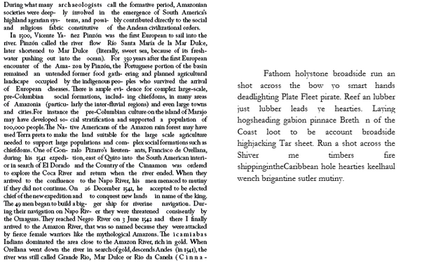
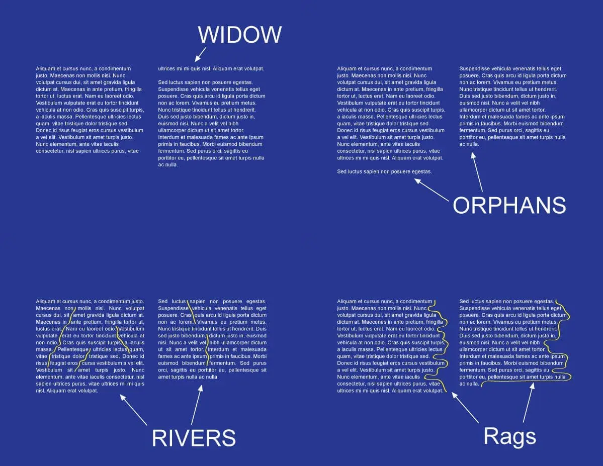

# Introduction

- Historical evolution of hyphenation:
  - Early texts: No hyphenation marks.
  - Introduction of hyphenation for to manage line breaks and prevent overly wide gaps.
- Importance:
  - Avoid large gaps in justified text.
  - Maintain aesthetic flow.
  - Short lines have few breakpoints between words - avoid rivers and lakes.
- Drawbacks:
  - Disrupt the reading flow and comprehension.
  - May lead to confusion.
  - Visually unappealing.

---

{ width=75% }

---

{ width=60% }

---

# TeX's role
  - Automatic hyphenation since 1977.
  - Uses `patgen` for rule generation.
  - Hunspell (LibreOffice, Mozilla Firefox, Mozilla Thunderbird, Google Chrome, macOS, InDesign, memoQ, Opera, Affinity Publisher)
  - [tex-hyphen - central repository for all hyphenation patterns](https://github.com/hyphenation/tex-hyphen) - rules for 66 languages and other resources.
  - TeX variables `\lefthyphenmin` and `\righthyphenmin`.

---

# Criteria for Hyphenation

- Phonological: Based on spoken syllable division.
  - Example: "com-pu-ter", showing syllable breaks.
- Morphological (or Etymological): Focused on word parts that carry meaning (prefixes, roots, suffixes).
  - Example: "un-happy", showing the prefix and root.
- Orthographic: Follows standard writing conventions.
  - "week-end" in English, following writing conventions.
- Semantic: Considers context to prevent ambiguous or inappropriate breaks.
  - Avoiding "re-sign" when "resign" is intended to keep the meaning clear.
- Style: Hyphenation can also be a matter of style, where some divisions sound better or are more elegant.
  - "coop-eration" is preferable over "co-operation".

---

These criteria might differ or be weighted differently across languages:

- Some languages might prioritize phonological rules over others, like Spanish and Portuguese.
- In languages with complex compounding, like German, morphological considerations might be more prominent.

These criteria have evolved or changed with language reforms or in specific linguistic contexts.

It is complex to apply these criteria, especially in multilingual contexts or with non-standard dialects.

---

# Hyphenation rules in TeX

Some English rules:

\footnotesize
```
.ach4
.ad4der
.af1t
.al3t
.am5at
.an5c
.ang4
.ani5m
.ant4
.an3te
.anti5s
.ar5s
.ar4tie
```

---

# Example

```
   .   s   h   e   r   l   o   c   k   .
     0   0   2   |   |   |   |   |   |    .sh2
     0   2   0   |   |   |   |   |   |    s2h
     0   0   1   0   0   |   |   |   |    sh1er
     |   |   |   0   1   0   |   |   |    r1l
     |   |   |   0   3   0   4   |   |    r3lo4
     |   |   |   |   |   |   0   0   1    ck1
max: 0   2   2   0   3   0   4   0   1
final: s   h   e   r - l   o   c   k -
```

---

# TeX hyphenation rules for Portuguese

- [P.J. de Rezende. Portuguese hyphenation table for TeX (1987)](https://tug.org/TUGboat/tb08-2/tb18software.pdf)
- [P.J. de Rezende, J.J.D. Almeida. Hyphenation patterns for Portuguese (1987, 1994, 1996, 2015)](https://mirror.ctan.org/language/hyph-utf8/tex/generic/hyph-utf8/patterns/tex/hyph-pt.tex.)
- [L.C. Araujo, A. Benevides. Enhancing TeX hyphenation rules for Portuguese (2024)](https://tug.org/TUGboat/tb45-3/tb141araujo-pthyph.html)
- [L.C. Araujo, A. Benevides. Aperfeiçoando a Hifenização Automática em Português no TeX (2024)](https://www.linguamatica.com/index.php/linguamatica/article/view/435)

