# Spelling Correction

Spelling correction is an integral part of modern writing, ranging from **texting** and
**emailing** to document creation and **web searches**. Despite their ubiquity, modern
spell correctors aren't perfect, as evidenced by "autocorrect-gone-wrong"
scenarios.

---

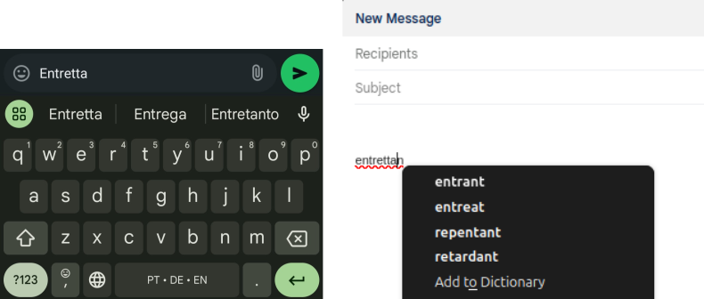{ width=80% }

---

## Applications of Spell Checking

- Text Writing\pause
- Automated and Information Systems
  - Data Entry Systems
  - Search and Information Retrieval
  - Optical Character Recognition (OCR)
  - Chatbots
  - Translation Systems

---

## Automatic Spelling Correction Task

1. detection of an error;\pause
2. generation of correction candidates;\pause
3. ranking of candidate corrections;\pause
4. perform automatic correction.

---

## Perspectives in Spelling Correction

### 1. Non-Word Spelling Correction
- Detects and corrects errors where the **word does not exist** in the dictionary.
  Example:
  - Input: `speling`
  - Correction: `spelling`

\pause
### 2. Real-Word Spelling Correction
- Detects and corrects errors where the **word exists** but is contextually wrong.
  Example:
  - Input: `I no what to do.`
  - Correction: `I know what to do.`

--- 

# Error Sources in Spelling

1. Typographical Errors:
   - May change with input devices (physical or virtual keyboard, or OCR system) and environment conditions.
   - Insertion: `speeling` → `spelling`  
   - Deletion: `spelng` → `spelling`  
   - Substitution: `spolling` → `spelling`  
   - Transposition: `spelilng` → `spelling`
   - Diacritical marking: `naive` → `naïve`
\pause

2. Homophone Errors:  
   - Homophones: `their` / `there`  
   - Near-homophones: `accept` / `except`
\pause

3. Grammatical Errors:
   - among / between
\pause

4. Cross Word Boundary Errors:
   - maybe / may be

---

# Notable Algorithms and Tools

- **Soundex** (1918): Phonetic algorithm that maps similar-sounding names.
```
Stephen → S315, Perez  → P620, Juice  → J200, Robert → R163
Steven  → S315, Powers → P620, Juicy  → J200, Rupert → R163
Stefan  → S315, Price  → P620, Juiced → J230, Rubin  → R150
```

---

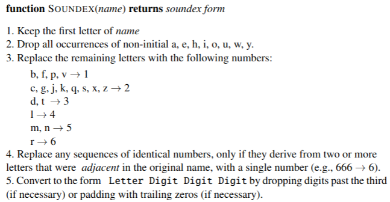{ width=80% }

---

- **Shannon (1948)**: A Mathematical Theory of Communication.

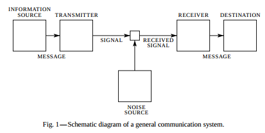{ width=60% }

---

- **Shannon (1950)**: Introduction of n-gram models in text analysis.

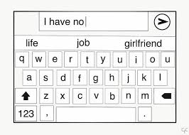{ width=30% }

---

- **Blair (1960)**: Early algorithm for spelling error correction.
  - Blair introduced the concept of similarity keys to group words based on their likelihood of being confused with one another.\pause
  - r-letter abbreviation of an n-letter word
    - Information theory assumes that the information conveyed is inversely proportional to its a priori probability of occurrence.\pause
    - 1st proposal: eliminate $n-r$ letters in the order of their expected frequency\pause
    - 2nd proposal: eliminate by their frequency of their occurrence as errors (best approach)\pause
    - weight must also be given to the position of the letter in the word

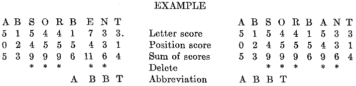{ width=70% }

---

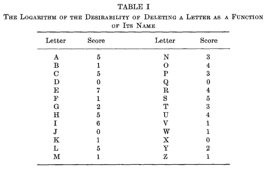{ width=70% }

---

{ width=70% }

---

- **Damerau–Levenshtein** distance (1964, 1966): A string metric for measuring the edit distance between two sequences.

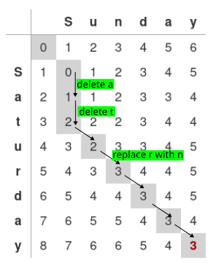{ width=30% }

---

Levenshtein Distance Calculator

[https://phiresky.github.io/levenshtein-demo/](https://phiresky.github.io/levenshtein-demo/)

---

The Levenshtein distance between two strings $a, b$ (of length $|a|$ and $|b|$ respectively) is given by 

$$
\operatorname{lev}(a, b) = \begin{cases}
  |a| & \text{ if } |b| = 0, \\
  |b| & \text{ if } |a| = 0, \\
  \operatorname{lev}\big(\operatorname{tail}(a),\operatorname{tail}(b)\big) & \text{ if } \operatorname{head}(a)= \operatorname{head}(b), \\
  1 + \min \begin{cases}
          \operatorname{lev}\big(\operatorname{tail}(a), b\big) \quad \text{\footnotesize deletion} \\
          \operatorname{lev}\big(a, \operatorname{tail}(b)\big) \quad \text{\footnotesize insertion} \\
          \operatorname{lev}\big(\operatorname{tail}(a), \operatorname{tail}(b)\big) \quad \text{\footnotesize replacement} \\
       \end{cases} & \text{ otherwise}
\end{cases}
$$

\pause
Damerau-Levenshtein distance: also allows transposition of adjacent symbols.

\pause
Operations are expensive and language dependent: e.g. as of version 16.0, Unicode defines a total of 98682 Chinese characters.

---

- **BK-Trees** (1973): Efficient search for near matches using Levenshtein distance.
  - An arbitrary element $a$ is selected as root node.
  - The k-th subtree is recursively built of all elements $b$ such that $d(a,b)=k$.
  - Search idea: restrict the exploration of the tree to nodes that can only improve the best candidate found so far (use triangle inequality).

{ width=50% }

---

### Search for $w=\text{'cool'}$

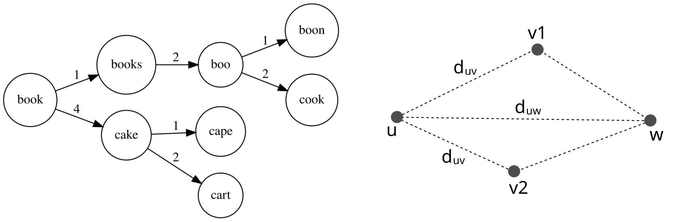{ width=50% }

\small
1. $d_u=d(w,u)=d(\text{'cool'},\text{'book'})=2$, set $d_{\text{best}} = 2$;
2. $v=\text{'books'}$, $|d_{uv} - d_u| = |1 - 2| = 1 < d_{\text{best}}$, then select $v$;
3. $v=\text{'cake'}$, $|d_{uv} - d_u| = |4 - 2| = 2 \nless d_{\text{best}}$, do not select $v$;
4. $d_u=d(w,u)=d(\text{'cool'},\text{'books'})=3$, $d_u \nless d_{\text{best}}$;
5. $d_u=d(w,u)=d(\text{'cool'},\text{'boo'})=2$, $d_u \nless d_{\text{best}}$;
6. $v=\text{'boon'}$, $|d_{uv} - d_u| = |2 - 1| = 1 < d_{\text{best}}$, then select $v$;
7. $v=\text{'cook'}$, $|d_{uv} - d_u| = |2 - 2| = 0 < d_{\text{best}}$, then select $v$;
8. $d_u=d(w,u)=d(\text{'cool'},\text{'cook'})=1$, $d_u < d_{\text{best}}$, set $d_{\text{best}} = 1$;
9. $d_u=d(w,u)=d(\text{'cool'},\text{'boon'})=2$, $d_u \nless d_{\text{best}}$;
10. 'cook' is returned as the answer with $d_{\text{best}}=1$.

---

- **SPELL** (Unix, 1975)
  - Error detection only.\pause 
  - Prefix and suffix removal (reduces the list below 1/3); 
    - `buzzed` → `buzz`, `mapping` → `map`, `possibly` → `possible`, `antisocial` → `social`, `metaphysics` → `physics`.\pause
  - Hashing (discarding 60% of the remaining bits); \newline
    Examples of hashing functions:
    1. Shift-and-Add: $h = ( h << 1) + \text{char} \% m$
    2. Multiplicative Hashing: $h = (a \cdot h + \text{char}) \% m$ (with a typically 31 or 33)
    3. XOR-based Hashing: $h = h \oplus (\text{char} << k)$\pause
  - Words were represented by 16-bit machine words;\pause
  - Bloom filter;\pause
  - False positives.

---

- **Jaro similarity** (1989)

\small
The Jaro similarity $sim_j$ of two given strings $s_1$ and $s_2$ is

$$
sim_j = \left\{
\begin{array}{l l}
  0 & \text{if }m = 0\\
  \frac{1}{3}\left(\frac{m}{|s_1|} + \frac{m}{|s_2|} + \frac{m-t}{m}\right) & \text{otherwise} \end{array} \right.
$$

where:

  - $|s_i|$ is the length of the string $s_i$;
  - $m$ is the number of ''matching characters'' (see below);
  - $t$ is the number of ''transpositions'' (see below).

\pause
Jaro similarity score is 0 if the strings do not match at all, and 1 if they
are an exact match. In the first step, each character of $s_1$ is
compared with all its matching characters in $s_2$. Two characters
from $s_1$ and $s_2$ respectively, are considered
**matching** only if they are the same and not farther than
$\left\lfloor\frac{\max(|s_1|,|s_2|)}{2}\right\rfloor-1$ characters
apart.
**Transposition** is the number of matching characters that are not in the right order divided by two.

---

- **Jaro-Winkler similarity** (1990)

  - Introduces Winkler modification.\pause
  - Prefix length $\ell$: if two strings share a common prefix, they are likely to be more similar.\pause
  - Scale factor $p$: enhances the Jaro similarity score based on the length of the common prefix (usually set to 0.1 and should not exceed 0.25).

$$
sim_w = sim_j + \ell p (1 - sim_j)
$$

\pause
$1-sim_j$: This component adjusts the contribution of the prefix similarity term relative to the base Jaro similarity score ($sim_j$).
If $sim_j$ already high, the impact of the prefix adjustment diminishes, but when $sim_j$ lower, the prefix similarity can significantly boost the final similarity score.

---

- **Metaphone** (1990), Double Metaphone (2000), Metaphone 3 (2009): Extracts phonetic information for better matching.
  - Set of rules to improves on the Soundex algorithm.
  - `Smith → SM0, [SM0, XMT]`, `Schmidt → SXMTT, [XMT, SMT]`,
  - `Taylor → TLR, [TLR]`, `Taylor → EFNS, [AFNS]`,
  - `Roberts → RBRTS, [RPRTS]`
  - `spelling → SPLNK, [SPLNK]`, `speling → SPLNK, [SPLNK]`, `speeling → SPLNK, [SPLNK]`, `sprlling → SPRLNK, [SPRLNK]`

--- 

- **Noisy Channel Model (Kernighan et al., 1990 and Mays et al., 1991)**: Combined prior and likelihood models.

\small
*In the noisy channel model, we imagine that the surface form we see is actually
a “distorted” form of an original word passed through a noisy channel. The decoder passes
each hypothesis through a model of this channel and picks the word that best matches the
surface noisy word.* (Jurafsky and Martin, 2024)

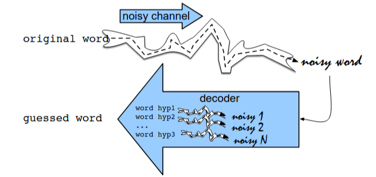{ width=55% }

---

This noisy channel model is a kind of **Bayesian inference**.

Out of all possible words in the vocabulary $V$ we want to find the word $\hat{w}$ such that $P(w|x)$ is highest for a given observed string $x$.

$$
\hat{w} = \argmax_{w \in V} P(w|x)
$$

Using Bayes: $P(x,w) = P(w|x) P(x) = P(x|w) P(w)$,
$$
\hat{w} = \argmax_{w \in V} \frac{P(x|w) P(w)}{P(x)} = \argmax_{w \in V} \underset{\stackrel{\text{channel model}}{\text{or likelihood}}}{\underbrace{P(x \mid w)}} \underset{\text{prior}}{\underbrace{P(w)}}
$$

$$
\hat{w} = \argmax_{w \in V} \left( \log P(x \mid w) + \log P(w) \right)
$$


---

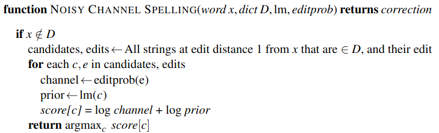

---

### Example


---

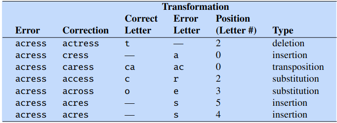

---

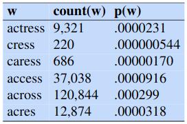{ width=40% }

---

### Error model
  - A perfect model would need all sorts of factors: who the typist was, whether the typist was left-handed or right-handed, and so on.\pause
  - We can get a pretty reasonable estimate of $P(x|w)$ just by looking at **local context**: the identity of the correct letter itself, the misspelling, and the surrounding letters.\pause
  - Confusion Matrices:
    - `del[x, y]: count(xy typed as x)`
    - `ins[x, y]: count(x typed as xy)`
    - `sub[x, y]: count(x typed as y)`
    - `trans[x, y]: count(xy typed as yx)`

---

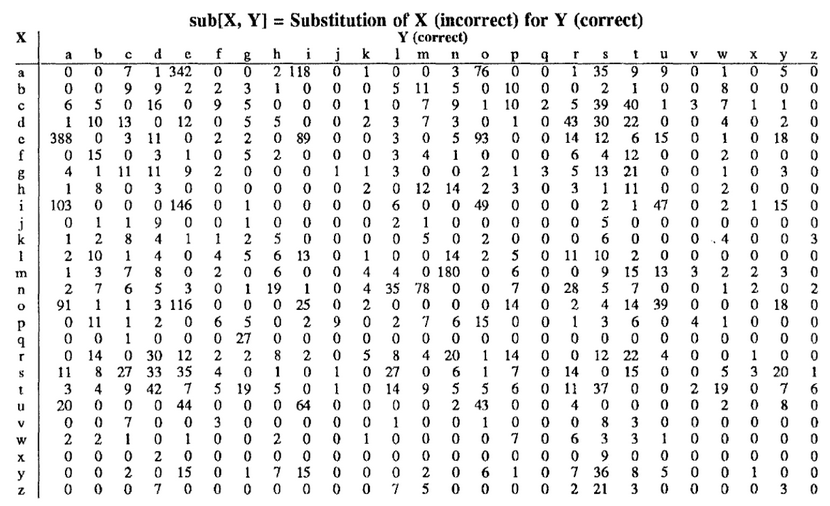{ width=80% }

---

### Estimating the channel model

$$
P(x|w) = 
\begin{cases} 
\frac{\text{del}[x_{i-1}, w_i]}{\text{count}[x_{i-1} w_i]}, & \text{if deletion} \\
\frac{\text{ins}[x_{i-1}, w_i]}{\text{count}[w_{i-1}]}, & \text{if insertion} \\
\frac{\text{sub}[x_i, w_i]}{\text{count}[w_i]}, & \text{if substitution} \\
\frac{\text{trans}[w_i, w_{i+1}]}{\text{count}[w_i w_{i+1}]}, & \text{if transposition}
\end{cases}
$$

---

![Channel model for acress; the probabilities are taken from the `del[]`, `ins[]`, `sub[]`, and `trans[]` confusion matrices as shown in Kernighan et al. (1990).](example-correction-channel-prob.png)

---

### Final probabilities for each of the potential corrections

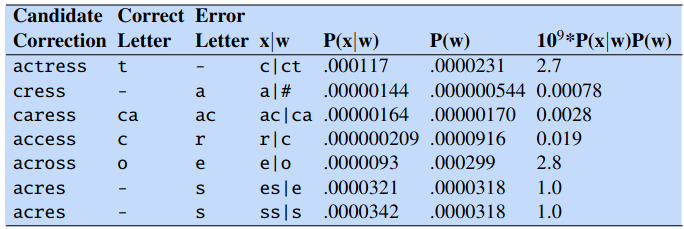

---


*Unfortunately, the algorithm was wrong here; the writer's intention becomes
clear from the context: ... was called a ``stellar and versatile **acress** whose 
combination of sass and glamour has defined her ...''. The surrounding words make it
clear that actress and not across was the intended word.* (Jurafsky and Martin, 2024)

---

Using the *Corpus of Contemporary American English* to compute **bigram** probabilities for the words *actress* and *across* in their context using add-one
smoothing, we get the following probabilities:

\begin{align*}
P(\text{actress}|\text{versatile}) &= .000021 \\
P(\text{across}|\text{versatile})  &= .000021 \\
P(\text{whose}|\text{actress})     &= .0010 \\
P(\text{whose}|\text{across})      &= .000006
\end{align*}

\pause
Multiplying these out gives us the language model estimate for the two candidates in context:
\begin{align*}
P(\text{versatile actress whose}) &= .000021 \times .0010   = 210 \times 10^{-10}\\
P(\text{versatile across whose})  &= .000021 \times .000006 = 1 \times 10^{-10}
\end{align*}

---

[Jurafsky, D., & Martin, J. H. (2024). *Speech and Language Processing*.](https://web.stanford.edu/~jurafsky/slp3/B.pdf)

[Kernighan, M. D. et al. (1990). *A spelling correction program based on a noisy channel model*.](https://aclanthology.org/C90-2036)

[Mays, E. et al. (1991). *Context based spelling correction*.](https://www.sciencedirect.com/science/article/abs/pii/030645739190066U)

---

- Noisy Channel Model
  - Correct (Unix, 1990): Takes inputs from SPELL rejected words and provides candidates. Operations: Insertion, Deletion, Substitution, Reversal. Uses error probabilities.

---

- **Brill-Moore channel model** (2000): String to string edits.
  - Let $\Sigma$ be an alphabet, the model allows all edit operations of the form $\alpha \rightarrow \beta$, where $\alpha,\beta \in \Sigma^\ast$.\pause
  - $P(\alpha \rightarrow \beta)$ is the probability that when users intends to type $\alpha$ and they typed $\beta$ instead.\pause
  - $P(\alpha \rightarrow \beta | PNS)$ probability conditioned by the position on the string
    - P(e | a) does not vary greatly with position.
    - P(ent | ant) is highly dependent upon position.
    - People rarely mistype *antler* as *entler*, but often mistype *reluctant* as *reluctent*.

---

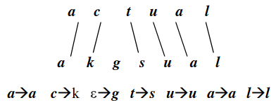{ width=50% }

[Brill, E. and Moore, R. C. (2000). *An Improved Error Model for Noisy Channel Spelling Correction*.](https://doi.org/10.3115/1075218.1075255)

---

- **Aspell** (2000): Combines spelling and phonetic correction.
  - Hashing for Spell Checking: Efficient candidate lookup using hash tables.\pause
  - Metaphone Algorithm: Handles phonetic corrections by matching words that sound similar.\pause
  - Ispell's Near Miss Strategy:
    - Focuses on edit distance 1 to reduce the search space.
    - Early Dictionary Filtering: Prunes invalid candidates during generation.

---

## Example - Handling Homophones in Aspell

   - Misspelled word: `ther`
   - Candidates: `there`, `their`, `they're` 
\pause

1. Metaphone
   - The Metaphone algorithm transforms words into phonetic codes based on pronunciation.
   - Phonetic codes for the candidate words:
     - `there` → `0R`
     - `their` → `0R`
     - `they're` → `0R`
   - Homophones share the same code (`0R`).

---

2. Workflow:
   - Input: Misspelled word `ther`.
   - Step 1: Generate candidates using **edit distance 2 or less**:
     - Candidates: `there`, `their`, `thee`, `thor`, `her`, `the`, `they're`.
   - Step 2: Compute Metaphone codes for all candidates:
     - Candidates phonetically similar to `ther` (`0R`) rank higher: `there`, `their`, `thor`, `they're`.
   - Step 3: Rank and suggest based on:
     - Word frequency, Edit distance, Phonetic Similarity, Error Likelihood.
\pause

3. Limitations:
   - Metaphone matches words by sound but lacks **contextual understanding**.
   - Example:
     - Input: *“I went to ther house.”*
     - Suggestions: `thee`, `their`, `there`, `therm`, `the`, `her`, `Thar`, `Thea`, `Thor`, `Thur`.
     - Aspell cannot infer the correct word (`their`) without considering the sentence's context.

[GNU Aspell](http://aspell.net/)

---

- **Hunspell** (2002): Morphological analyzer with affix rules and phonetic matching.

### Key Features:
- Morphological Analysis:
  - Supports complex languages with rich morphology (e.g., Hungarian, Turkish, Finnish).
  - Handles word roots, prefixes, and suffixes using affix rules.
\pause

- Dictionary System:
  - Two components:
    1. Dictionary File: Contains root forms of words.
    2. Affix File: Defines rules for combining roots with prefixes/suffixes.
\pause

- Levenshtein Distance:
  - Uses *edit distance* to generate and rank candidate corrections.
\pause

- Phonetic Matching:
  - Uses a table-driven phonetic transcription algorithm borrowed from Aspell. It is useful for languages with orthographies that are not based on pronunciation.
\pause

- n-gram similarity:
  - Improve suggestions.

---

- Multilingual Support:
  - Available for 98 languages with extensive dictionaries.
\pause 

### Applications:
- Integrated into tools like LibreOffice, Firefox, and Chrome for multilingual spell checking.\pause
- Supports custom dictionaries for specialized fields (e.g., medical, legal).
\pause

\vspace{2ex}
[Hunspell at GitHub](https://hunspell.github.io/)

---

- **Norvig**'s Algorithm (2007): Uses Damerau-Levenshtein distance to generate candidates.

### Key Features:
- Edit Distance:
  - Generates all possible words within a given edit distance (e.g., 1 or 2) from the misspelled word.
  - Handles insertion, deletion, substitution, and transposition.
\pause

- Dictionary Lookup:
  - Filters candidates by validating them against a word dictionary.
\pause

- Ranking:
  - Ranks valid candidates based on:
    - Word Frequency: More frequent words are prioritized.
    - Likelihood of Errors: Based on the Noisy Channel Model (optional).
\pause

\vspace{2ex}
How to Write a Spelling Corrector: [https://norvig.com/spell-correct.html](https://norvig.com/spell-correct.html)

---

- **QWERTY Weighted Levenshtein Distance**: takes keyboard distance into account.

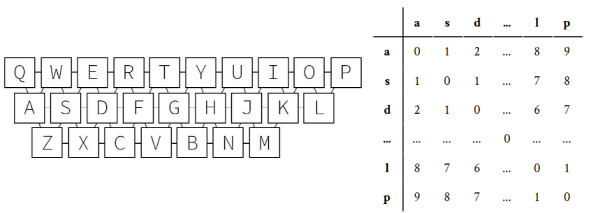{ width=80% }

  - Distance between keys are in [0,9] range. They are multiplied by 2/9.

---

  - Deletion: weighted by the average of the distances to the adjacent characters in the string.
  - Insertion: unchanged, weight 1. 
  - Substitution: weighted according to the distance between the character that is removed and the character that is inserted.
  - Transposition: unchanged, weight 1.

\vspace{2ex}
[Samuelsson, 2017](https://www.diva-portal.org/smash/get/diva2:1116701/FULLTEXT01.pdf)

---

- **Neural-Based Models**: Leverage deep learning for advanced error detection and correction.
  - Utilize deep learning techniques to improve spellchecking:
    - Recurrent Neural Networks (RNNs)
    - Word Embeddings
    - Transformers
  - Contextual Awareness
  - Learning from Data
  - Handling Typos
  
### Examples:
  - Google's Smart Compose
  - Grammarly
  - Microsoft Editor
  - LanguageTool

---

### **Lexical Similarity Metrics**
1. **Levenshtein Distance** (Edit Distance):  
   Minimal number of insertions, deletions, and replacements to transform one word into another.
2. **Jaro Similarity**:  
   Measures similarity based on matching characters and transpositions.
3. **Keyboard Distance**:  
   Considers physical proximity of keys.
4. **Phonetic Matching**:  
   Algorithms like Soundex and Metaphone to identify similar-sounding words.

---

## Domain-Specific Spell Checkers

1. Medical
   - MedSpell: a medical spelling and autocorrect application 
   - OpenMedSpel (open-source)

2. Programming
   - CodeSpell: designed primarily for checking misspelled words in source code

3. Learning
   - Kidspell: A child-oriented, rule-based, phonetic spellchecker

4. Accessibility
   - Real Check: A Spellchecker for Dyslexia

5. Custom Dictionaries
   - Hunspell and Aspell: Add specialized vocabularies

---

## References

\footnotesize
- Shannon, C. E. (1950). *Prediction and Entropy of Printed English*.
- Blair, C. R. (1960). *A program for correcting spelling errors*.
- Damerau, F. J. (1964). *A technique for computer detection and correction of spelling errors*.
- Levenshtein, V. I. (1966). *Binary codes capable of correcting deletions, insertions, and reversals*.
- Burkhard W. and Keller R. (1973). *Some approaches to best-match file searching*.
- Jaro, M. A. (1989). *Advances in Record-Linkage Methodology as Applied to Matching the 1985 Census of Tampa, Florida*.
- Winkler, W. E. (1990). *String Comparator Metrics and Enhanced Decision Rules in the Fellegi-Sunter Model of Record Linkage*.
- Kernighan, M. D. et al. (1990). *A spelling correction program based on a noisy channel model*.
- Mays, E. et al. (1991). *Context based spelling correction*.
- Atkinson, K. (2000). *GNU Aspell*. 
- Németh, L. (2002). *Hunspell*.
- Samuelsson, A. (2017). *Weighting Edit Distance to Improve Spelling Correction in Music Entity Search*.
- Brill, E. and Moore, R. C. (2000). *An Improved Error Model for Noisy Channel Spelling Correction*.
- Jurafsky, D., & Martin, J. H. (2024). *Speech and Language Processing*.

