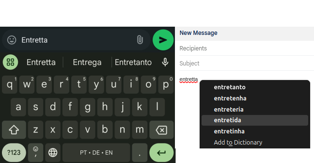
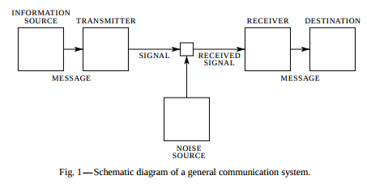
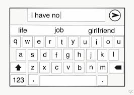
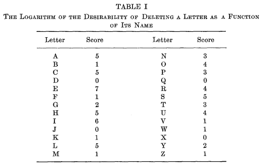
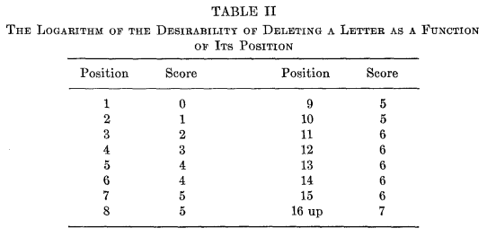
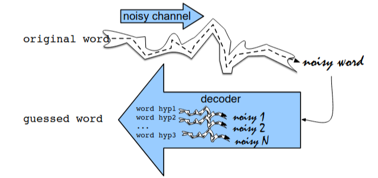
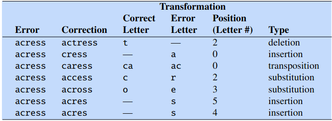
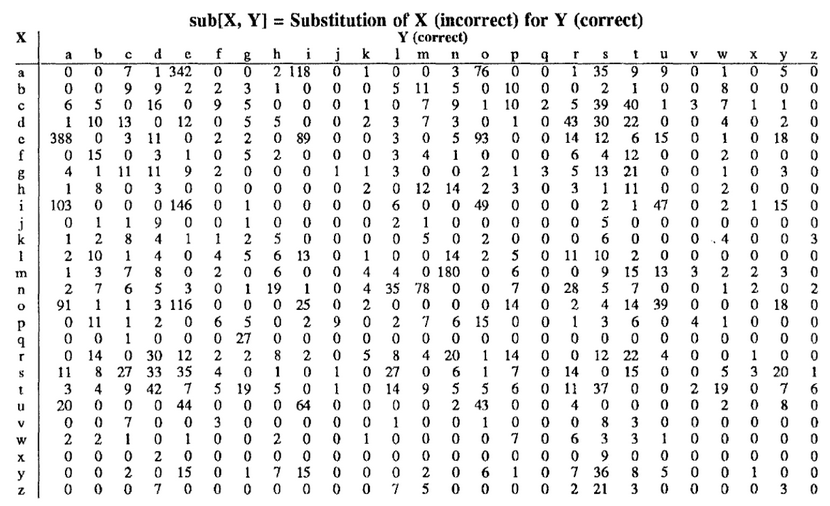
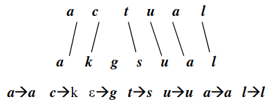
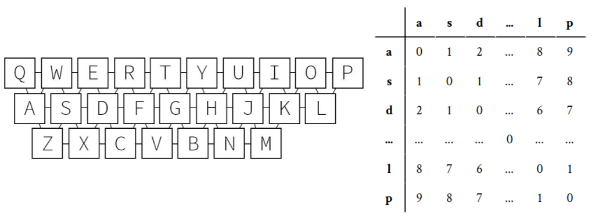

# Correção Ortográfica

A correção ortográfica é uma parte integral da escrita moderna, variando de **mensagens de texto** e
**e-mails** à criação de documentos e **buscas na web**. Apesar de sua onipresença, os
corretores ortográficos modernos não são perfeitos, como evidenciado por cenários de "autocorreção
que deu errado".

---

{ width=80% }

---

## Aplicações da Verificação Ortográfica

- Redação de Texto\pause
- Sistemas Automatizados e de Informação
  - Sistemas de Entrada de Dados
  - Busca e Recuperação de Informação
  - Reconhecimento Óptico de Caracteres (OCR)
  - Chatbots
  - Sistemas de Tradução

---

## Tarefa de Correção Ortográfica Automática

1. detecção de um erro;\pause
2. geração de candidatos a correção;\pause
3. classificação das correções candidatas;\pause
4. realizar a correção automática.

---

## Perspectivas na Correção Ortográfica

### 1. Correção Ortográfica de Não-Palavras
- Detecta e corrige erros onde a **palavra não existe** no dicionário.
  Exemplo:
  - Entrada: `speling`, `asunto`
  - Correção: `spelling`, `assunto`

\pause
### 2. Correção Ortográfica de Palavras Reais
- Detecta e corrige erros onde a **palavra existe** mas está contextualmente errada.
  Exemplo:
  - Entrada: `I no what to do.`, `Este método é mas confiável.`, 
  - Correção: `I know what to do.`, `Este método é mais confiável.`

--- 

# Fontes de Erros na Ortografia

1. Erros Tipográficos:
   - Podem variar com dispositivos de entrada (teclado físico ou virtual, ou sistema de OCR) e condições ambientais.
   - Inserção: `escrevenmdo` → `escrevendo`
   - Deleção: `escrevndo` → `escrevendo`
   - Substituição: `escrevemdo` → `escrevendo`
   - Transposição: `esrcevendo` → `escrevendo`
   - Marcação diacrítica: `a` → `á`
\pause

2. Erros de Homófonos:
   - Homófonos: `their` / `there`, `a` / `há`
   - Quase-homófonos: `accept` / `except`, `sessão` / `cessão`
\pause

3. Erros Gramaticais:
   - `among` / `between`
\pause

4. Erros de Fronteira de Palavras:
   - `maybe` / `may be`, `talvez` / `tal vez`

---

# Algoritmos e Ferramentas Notáveis

- **Soundex** (1918): Algoritmo fonético que mapeia nomes com sons semelhantes.
```
Stephen → S315, Perez  → P620, Juice  → J200, Robert → R163
Steven  → S315, Powers → P620, Juicy  → J200, Rupert → R163
Stefan  → S315, Price  → P620, Juiced → J230, Rubin  → R150
```

---

{ width=80% }

---

- **Shannon (1948)**: A Mathematical Theory of Communication.

{ width=60% }

---

- **Shannon (1950)**: Introduction of n-gram models in text analysis.

{ width=30% }

---

- **Blair (1960)**: Algoritmo inicial para correção de erros ortográficos.
  - Blair introduziu o conceito de teclas similares para agrupar palavras com base na probabilidade de serem confundidas umas com as outras.\pause
  - Abreviação de r letras de uma palavra de n letras
    - A teoria da informação assume que a informação transmitida é inversamente proporcional à sua probabilidade a priori de ocorrência.\pause
    - 1ª proposta: eliminar $n-r$ letras na ordem de sua frequência esperada\pause
    - 2ª proposta: eliminar com base na frequência de sua ocorrência como erros (melhor abordagem)\pause
    - também deve ser dado peso à posição da letra na palavra

{ width=70% }

---

{ width=70% }

---

{ width=70% }

---

- Distância **Damerau-Levenshtein** (1964, 1966): Uma métrica de *string* para medir a distância de edição entre duas sequências. 

{ width=30% }

---

Levenshtein Distance Calculator

[https://phiresky.github.io/levenshtein-demo/](https://phiresky.github.io/levenshtein-demo/)

---

Distância Levenshtein entre duas *strings* $a, b$ (de comprimento $|a|$ e $|b|$ respectivamente) é dada por 

$$
\operatorname{lev}(a, b) = \begin{cases}
  |a| & \text{ if } |b| = 0, \\
  |b| & \text{ if } |a| = 0, \\
  \operatorname{lev}\big(\operatorname{tail}(a),\operatorname{tail}(b)\big) & \text{ if } \operatorname{head}(a)= \operatorname{head}(b), \\
  1 + \min \begin{cases}
          \operatorname{lev}\big(\operatorname{tail}(a), b\big) \quad \text{\footnotesize deletion} \\
          \operatorname{lev}\big(a, \operatorname{tail}(b)\big) \quad \text{\footnotesize insertion} \\
          \operatorname{lev}\big(\operatorname{tail}(a), \operatorname{tail}(b)\big) \quad \text{\footnotesize replacement} \\
       \end{cases} & \text{ otherwise}
\end{cases}
$$

\pause
Distância de Damerau-Levenshtein: também permite a transposição de símbolos adjacentes.

\pause
As operações são caras e dependem da língua: por exemplo, a partir da versão 16.0, o Unicode define um total de 98682 caracteres chineses.

---

- **Árvores BK** (1973): Busca eficiente por correspondências próximas usando a distância de Levenshtein.
  - Um elemento arbitrário $a$ é selecionado como nó raiz, então, conforme novos elementos são adicionados, mova para o nó filho onde a diferença absoluta entre a distância do novo elemento para o pai e a distância do nó filho para o pai é mínima. Para inserir um novo nó, encontre um nó folha ou descubra que nenhuma distância do nó filho corresponde de perto o suficiente.
  - A k-ésima subárvore é construída recursivamente de todos os elementos $b$ tais que $d(a,b)=k$.
  - Ideia de busca: restringir a exploração da árvore a nós que possam apenas melhorar o melhor candidato encontrado até agora (usar a desigualdade triangular).

---

{ width=50% }

---

### Search for $w=\text{'cool'}$

{ width=50% }

\small
1. $d_u=d(w,u)=d(\text{'cool'},\text{'book'})=2$, set $d_{\text{best}} = 2$;
2. $v=\text{'books'}$, $|d_{uv} - d_u| = |1 - 2| = 1 < d_{\text{best}}$, then select $v$;
3. $v=\text{'cake'}$, $|d_{uv} - d_u| = |4 - 2| = 2 \nless d_{\text{best}}$, do not select $v$;
4. $d_u=d(w,u)=d(\text{'cool'},\text{'books'})=3$, $d_u \nless d_{\text{best}}$;
5. $d_u=d(w,u)=d(\text{'cool'},\text{'boo'})=2$, $d_u \nless d_{\text{best}}$;
6. $v=\text{'boon'}$, $|d_{uv} - d_u| = |2 - 1| = 1 < d_{\text{best}}$, then select $v$;
7. $v=\text{'cook'}$, $|d_{uv} - d_u| = |2 - 2| = 0 < d_{\text{best}}$, then select $v$;
8. $d_u=d(w,u)=d(\text{'cool'},\text{'cook'})=1$, $d_u < d_{\text{best}}$, set $d_{\text{best}} = 1$;
9. $d_u=d(w,u)=d(\text{'cool'},\text{'boon'})=2$, $d_u \nless d_{\text{best}}$;
10. 'cook' is returned as the answer with $d_{\text{best}}=1$.

---

- **SPELL** (Unix, 1975)
  - Detecção de erros apenas.\pause
  - Remoção de prefixos e sufixos (reduz a lista para menos de 1/3);
    - `buzzed` → `buzz`, `mapping` → `map`, `possibly` → `possible`, `antisocial` → `social`, `metaphysics` → `physics`.\pause
  - Hashing (descartando 60% dos bits restantes); \newline
    Exemplos de funções de hashing:
    1. Shift-and-Add: $h = ( h << 1) + \text{char} \% m$
    2. Hashing Multiplicativo: $h = (a \cdot h + \text{char}) \% m$ (com a tipicamente 31 ou 33)
    3. Hashing baseado em XOR: $h = h \oplus (\text{char} << k)$\pause
  - As palavras eram representadas por palavras de máquina de 16 bits;\pause
  - Filtro de Bloom;\pause
  - Falsos positivos.

---

- **Similaridade de Jaro** (1989)

\small
A similaridade de Jaro $sim_j$ de duas *strings* dadas $s_1$ e $s_2$ é

$$
sim_j = \left\{
\begin{array}{l l}
  0 & \text{if }m = 0\\
  \frac{1}{3}\left(\frac{m}{|s_1|} + \frac{m}{|s_2|} + \frac{m-t}{m}\right) & \text{otherwise} \end{array} \right.
$$

  - $|s_i|$ é o comprimento da *string* $s_i$;
  - $m$ é o número de ''caracteres correspondentes'' (veja abaixo);
  - $t$ é o número de ''transposições'' (veja abaixo).

\pause
A pontuação de similaridade de Jaro é 0 se as *strings* não corresponderem de forma alguma, e 1 se forem uma correspondência exata. Na primeira etapa, cada caractere de $s_1$ é comparado com todos os seus caracteres correspondentes em $s_2$. Dois caracteres de $s_1$ e $s_2$, respectivamente, são considerados **correspondentes** apenas se forem iguais e não estiverem a mais do que $\left\lfloor\frac{\max(|s_1|,|s_2|)}{2}\right\rfloor-1$ caracteres de distância.
**Transposição** é o número de caracteres correspondentes que não estão na ordem correta dividido por dois.

---

- **Similaridade de Jaro-Winkler** (1990)

  - Introduz a modificação de Winkler.\pause
  - Comprimento do prefixo $\ell$: se duas *strings* compartilham um prefixo comum, é provável que sejam mais semelhantes.\pause
  - Fator de escala $p$: aumenta a pontuação de similaridade de Jaro com base no comprimento do prefixo comum (geralmente definido como 0,1 e não deve exceder 0,25).

$$
sim_w = sim_j + \ell p (1 - sim_j)
$$

\pause
$1-sim_j$: Este componente ajusta a contribuição do termo de similaridade do prefixo em relação à pontuação de similaridade de Jaro base ($sim_j$). Se $sim_j$ já for alto, o impacto do ajuste do prefixo diminui, mas quando $sim_j$ é mais baixo, a similaridade do prefixo pode aumentar significativamente a pontuação final de similaridade.

---

- **Metaphone** (1990), Double Metaphone (2000), Metaphone 3 (2009): Extrai informações fonéticas para melhor correspondência.
  - Conjunto de regras que melhora o algoritmo Soundex.
  - `Smith → SM0, [SM0, XMT]`, `Schmidt → SXMTT, [XMT, SMT]`,
  - `Taylor → TLR, [TLR]`, `Taylor → EFNS, [AFNS]`,
  - `Roberts → RBRTS, [RPRTS]`
  - `spelling → SPLNK, [SPLNK]`, `speling → SPLNK, [SPLNK]`, `speeling → SPLNK, [SPLNK]`, `sprlling → SPRLNK, [SPRLNK]`

--- 

- **Modelo de Canal Ruidoso (Kernighan et al., 1990 e Mays et al., 1991)**: Modelos combinados de prior e verossimilhança.

\small
*No modelo de canal ruidoso, imaginamos que a forma superficial que vemos é na verdade uma forma “distorcida” de uma palavra original que passou por um canal ruidoso. O decodificador passa cada hipótese por um modelo deste canal e escolhe a palavra que melhor corresponde à palavra ruidosa superficial.* (Jurafsky e Martin, 2024)

{ width=55% }

---

Este modelo de canal ruidoso é uma forma de **inferência bayesiana**.

Dentre todas as palavras possíveis no vocabulário $V$, queremos encontrar a palavra $\hat{w}$ tal que $P(w|x)$ seja a mais alta para uma dada *string* observada $x$.

$$
\hat{w} = \argmax_{w \in V} P(w|x)
$$

Usando Bayes: $P(x,w) = P(w|x) P(x) = P(x|w) P(w)$,
$$
\hat{w} = \argmax_{w \in V} \frac{P(x|w) P(w)}{P(x)} = \argmax_{w \in V} \underset{\stackrel{\text{channel model}}{\text{or likelihood}}}{\underbrace{P(x \mid w)}} \underset{\text{prior}}{\underbrace{P(w)}}
$$

$$
\hat{w} = \argmax_{w \in V} \left( \log P(x \mid w) + \log P(w) \right)
$$


---


---

### Example


---



---

{ width=40% }

---

### Modelo de Erro
  - Um modelo perfeito precisaria de todos os tipos de fatores: quem era o digitador, se o digitador era canhoto ou destro, e assim por diante.\pause
  - Podemos obter uma estimativa bastante razoável de $P(x|w)$ apenas observando o **contexto local**: a identidade da letra correta, o erro de ortografia e as letras ao redor.\pause
  - Matrizes de Confusão:
    - `del[x, y]: count(xy typed as x)`
    - `ins[x, y]: count(x typed as xy)`
    - `sub[x, y]: count(x typed as y)`
    - `trans[x, y]: count(xy typed as yx)`

---

{ width=80% }

---

### Estimando o modelo de canal

$$
P(x|w) = 
\begin{cases} 
\frac{\text{del}[x_{i-1}, w_i]}{\text{count}[x_{i-1} w_i]}, & \text{se apagamento} \\
\frac{\text{ins}[x_{i-1}, w_i]}{\text{count}[w_{i-1}]}, & \text{se inserção} \\
\frac{\text{sub}[x_i, w_i]}{\text{count}[w_i]}, & \text{se substituição} \\
\frac{\text{trans}[w_i, w_{i+1}]}{\text{count}[w_i w_{i+1}]}, & \text{se transposição}
\end{cases}
$$

---

![Modelo de canal para *acress*; as probabilidades são tomas das matrizes de confusão de `del[]`, `ins[]`, `sub[]`, e `trans[]`, como mostradas em Kernighan et al. (1990).](example-correction-channel-prob.png)

---

### Final probabilities for each of the potential corrections


---

Infelizmente, o algoritmo estava errado aqui; a intenção do escritor se torna clara a partir do contexto: 
*... was called a ``stellar and versatile **acress** whose combination of sass and glamour has defined her ...''*. 
As palavras ao redor deixam claro que "*actress*" e não "*across*" era a palavra pretendida. (Jurafsky e Martin, 2024)

---

Usando o *Corpus of Contemporary American English* para calcular as probabilidades de **bigramas** para as palavras *actress* e *across* em seu contexto usando suavização de adição única, obtemos as seguintes probabilidades:

\begin{align*}
P(\text{actress}|\text{versatile}) &= .000021 \\
P(\text{across}|\text{versatile})  &= .000021 \\
P(\text{whose}|\text{actress})     &= .0010 \\
P(\text{whose}|\text{across})      &= .000006
\end{align*}

\pause
Multiplicando esses valores, obtemos a estimativa do modelo de linguagem para os dois candidatos em contexto:
\begin{align*}
P(\text{versatile actress whose}) &= .000021 \times .0010   = 210 \times 10^{-10}\\
P(\text{versatile across whose})  &= .000021 \times .000006 = 1 \times 10^{-10}
\end{align*}

---

[Jurafsky, D., & Martin, J. H. (2024). *Speech and Language Processing*.](https://web.stanford.edu/~jurafsky/slp3/B.pdf)

[Kernighan, M. D. et al. (1990). *A spelling correction program based on a noisy channel model*.](https://aclanthology.org/C90-2036)

[Mays, E. et al. (1991). *Context based spelling correction*.](https://www.sciencedirect.com/science/article/abs/pii/030645739190066U)

---

- Modelo de Canal Ruidoso
  - Correct (Unix, 1990): Recebe entradas de palavras rejeitadas pelo SPELL e fornece candidatos. Operações: Inserção, Deleção, Substituição, Reversão. Usa probabilidades de erro.

---

- **Modelo de canal Brill-Moore** (2000): Edições de *string* para *string*.
  - Seja $\Sigma$ um alfabeto, o modelo permite todas as operações de edição da forma $\alpha \rightarrow \beta$, onde $\alpha,\beta \in \Sigma^\ast$.\pause
  - $P(\alpha \rightarrow \beta)$ é a probabilidade de que, quando o usuário pretende digitar $\alpha$, ele digite $\beta$ em vez disso.\pause
  - $P(\alpha \rightarrow \beta | PNS)$ é a probabilidade condicionada pela posição na *string*
    - P(e | a) não varia muito com a posição.
    - P(ent | ant) é altamente dependente da posição.
    - As pessoas raramente digitam *antler* como *entler*, mas frequentemente digitam *reluctant* como *reluctent*.

---

{ width=50% }

[Brill, E. e Moore, R. C. (2000). *An Improved Error Model for Noisy Channel Spelling Correction*.](https://doi.org/10.3115/1075218.1075255)

---

- **Aspell** (2000): Combina correção ortográfica e fonética.
  - Hashing para Verificação Ortográfica: Busca eficiente de candidatos usando tabelas hash.\pause
  - Algoritmo Metaphone: Trata correções fonéticas ao combinar palavras que soam semelhantes.\pause
  - Estratégia de Quase Erro do Ispell:
    - Foca na distância de edição 1 para reduzir o espaço de busca.
    - Filtragem precoce do dicionário: Elimina candidatos inválidos durante a geração.

---

## Exemplo - Tratamento de Homófonos no Aspell

   - Palavra com erro de ortografia: `ther`
   - Candidatos: `there`, `their`, `they're`
\pause

1. Metaphone
   - O algoritmo Metaphone transforma palavras em códigos fonéticos com base na pronúncia.
   - Códigos fonéticos para as palavras candidatas:
     - `there` → `0R`
     - `their` → `0R`
     - `they're` → `0R`
   - Homófonos compartilham o mesmo código (`0R`).

---

2. Fluxo de Trabalho:
   - Entrada: Palavra com erro de ortografia `ther`.
   - Etapa 1: Gerar candidatos usando **distância de edição 2 ou menos**:
     - Candidatos: `there`, `their`, `thee`, `thor`, `her`, `the`, `they're`.
   - Etapa 2: Calcular códigos Metaphone para todos os candidatos:
     - Candidatos foneticamente semelhantes a `ther` (`0R`) têm classificação mais alta: `there`, `their`, `thor`, `they're`.
   - Etapa 3: Classificar e sugerir com base em:
     - Frequência da palavra, Distância de edição, Similaridade fonética, Probabilidade de erro.
\pause

3. Limitações:
   - Metaphone combina palavras pelo som, mas carece de **compreensão contextual**.
   - Exemplo:
     - Entrada: *“Eu fui à ther house.”*
     - Sugestões: `thee`, `their`, `there`, `therm`, `the`, `her`, `Thar`, `Thea`, `Thor`, `Thur`.
     - O Aspell não pode inferir a palavra correta (`their`) sem considerar o contexto da frase.

[GNU Aspell](http://aspell.net/)

---

- **Hunspell** (2002): Analisador morfológico com regras de afixos e correspondência fonética.

\small
- Análise Morfológica:
  - Suporta línguas complexas com rica morfologia (por exemplo, húngaro, turco, finlandês).
  - Trata raízes de palavras, prefixos e sufixos usando regras de afixos.
\pause

- Sistema de Dicionário:
  - Dois componentes:
    1. Arquivo de Dicionário: Contém formas raiz das palavras.
    2. Arquivo de Afixos: Define regras para combinar raízes com prefixos/sufixos.
\pause

- Distância de Levenshtein:
  - Usa *distância de edição* para gerar e classificar correções candidatas.
\pause

- Correspondência Fonética:
  - Usa um algoritmo de transcrição fonética baseado em tabela, emprestado do Aspell. É útil para línguas com ortografias que não são baseadas na pronúncia.
\pause

- Similaridade n-gram:
  - Melhora as sugestões.

---

- Suporte Multilíngue:
  - Disponível para 98 idiomas com dicionários extensivos.
\pause

### Aplicações:
- Integrado em ferramentas como LibreOffice, Firefox e Chrome para verificação ortográfica multilíngue.\pause
- Suporta dicionários personalizados para campos especializados (por exemplo, médico, jurídico).
\pause

\vspace{2ex}
[Hunspell no GitHub](https://hunspell.github.io/)

---

- **Algoritmo de Norvig** (2007): Usa a distância de Damerau-Levenshtein para gerar candidatos.

### Principais Recursos:
- Distância de Edição:
  - Gera todas as palavras possíveis dentro de uma determinada distância de edição (por exemplo, 1 ou 2) a partir da palavra com erro de ortografia.
  - Trata inserção, deleção, substituição e transposição.
\pause

- Busca no Dicionário:
  - Filtra candidatos validando-os contra um dicionário de palavras.
\pause

- Classificação:
  - Classifica candidatos válidos com base em:
    - Frequência da Palavra: Palavras mais frequentes têm prioridade.
    - Probabilidade de Erros: Com base no Modelo de Canal Ruidoso (opcional).
\pause

\vspace{2ex}
How to Write a Spelling Corrector: [https://norvig.com/spell-correct.html](https://norvig.com/spell-correct.html)

---

- **Distância QWERTY de Levenshtein Ponderada**: leva em consideração a distância no teclado

{ width=80% }

  - A distância entre as teclas está no intervalo [0,9]. Elas são multiplicadas por 2/9.

---

  - Deleção: ponderada pela média das distâncias para os caracteres adjacentes na *string*.
  - Inserção: inalterada, peso 1.
  - Substituição: ponderada de acordo com a distância entre o caractere que é removido e o caractere que é inserido.
  - Transposição: inalterada, peso 1.

\vspace{2ex}
[Samuelsson, 2017](https://www.diva-portal.org/smash/get/diva2:1116701/FULLTEXT01.pdf)

---

- **Modelos Baseados em Redes Neurais**: Aproveitam o aprendizado profundo para detecção e correção avançadas de erros.
  - Utilizam técnicas de aprendizado profundo para melhorar a verificação ortográfica:
    - Redes Neurais Recorrentes (RNNs)
    - Embeddings de Palavras
    - Transformers
  - Consciência Contextual
  - Aprendizado a partir de Dados
  - Tratamento de Erros de Digitação

### Exemplos:
  - Smart Compose do Google
  - Grammarly
  - Microsoft Editor
  - LanguageTool

---

## Verificadores Ortográficos Específicos de Domínio

1. Médico
   - MedSpell: um aplicativo de correção ortográfica e autocorreção médica
   - OpenMedSpel (código aberto)

2. Programação
   - CodeSpell: projetado principalmente para verificar palavras com erro de ortografia em código-fonte

3. Aprendizado
   - Kidspell: Um verificador ortográfico orientado para crianças, baseado em regras e fonético

4. Acessibilidade
   - Real Check: Um verificador ortográfico para Dislexia

5. Dicionários Personalizados
   - Hunspell e Aspell: Adicionam vocabulários especializados

---

## Referências

\footnotesize
- Shannon, C. E. (1950). *Prediction and Entropy of Printed English*.
- Blair, C. R. (1960). *A program for correcting spelling errors*.
- Damerau, F. J. (1964). *A technique for computer detection and correction of spelling errors*.
- Levenshtein, V. I. (1966). *Binary codes capable of correcting deletions, insertions, and reversals*.
- Burkhard W. and Keller R. (1973). *Some approaches to best-match file searching*.
- Jaro, M. A. (1989). *Advances in Record-Linkage Methodology as Applied to Matching the 1985 Census of Tampa, Florida*.
- Winkler, W. E. (1990). *String Comparator Metrics and Enhanced Decision Rules in the Fellegi-Sunter Model of Record Linkage*.
- Kernighan, M. D. et al. (1990). *A spelling correction program based on a noisy channel model*.
- Mays, E. et al. (1991). *Context based spelling correction*.
- Atkinson, K. (2000). *GNU Aspell*. 
- Németh, L. (2002). *Hunspell*.
- Samuelsson, A. (2017). *Weighting Edit Distance to Improve Spelling Correction in Music Entity Search*.
- Brill, E. and Moore, R. C. (2000). *An Improved Error Model for Noisy Channel Spelling Correction*.
- Jurafsky, D., and Martin, J. H. (2024). *Speech and Language Processing*.

