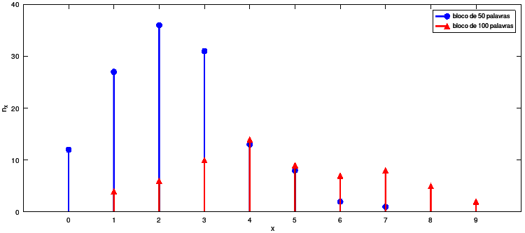
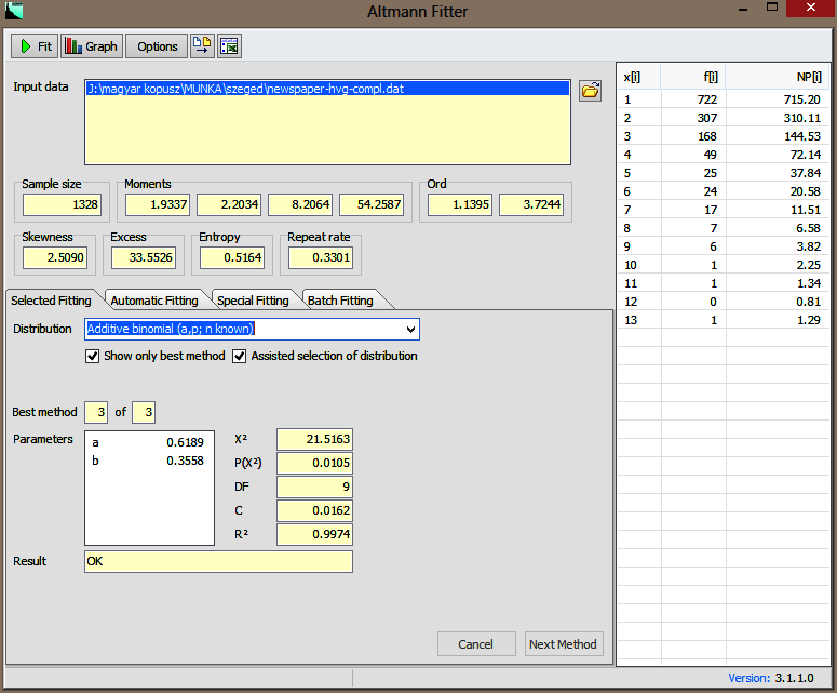

<!-- copile with: pandoc -t beamer main.md --pdf-engine=xelatex --bibliography references.bib -o main.pdf -->
<!-- pandoc -t beamer main.md --pdf-engine=xelatex --bibliography references.bib --table-of-contents --standalone --slide-level=2 --filter pandoc-eqnos -o main.pdf -->
<!-- pandoc -t beamer main.md --pdf-engine=xelatex --bibliography references.bib --standalone --slide-level=2 --filter pandoc-eqnos -o main.pdf -->
<!-- copile with: Rscript -e "rmarkdown::render('main.md', clean=TRUE)" -->
<!-- pdfpc main.pdf -->


# Linguística Quantitativa enquanto ciência

### Leis

* Lei científica

&nbsp;

> Uma lei científica é um princípio básico, generalização ou regra que 
> se mantém universalmente verdadeira sob condições particulares [@mccomas2014].

<!-- A scientific law is a basic principle, generalization, regularity or rule that holds true -->
<!--universally under particular conditions. -->

::: notes
Uma lei, em ciência, é uma hipótese sistematicamente conectada a outras hipóteses em um campo do conhecimento
e, ao mesmo tempo, corroborada por dados empíricos. Uma lei é dita universal quando é valida a todo tempo,
em qualquer lugar e para todos objetos sob seu escopo [@kohler2014laws;@bunge2012scientific].
:::

---

### Exemplos

<!-- 
- Lei da gravidade (física)
- Lei periódica (química)
- Leis de Mendel (biologia)
-->

{width=70%}

::: notes
A **lei da gravidade** prediz a força de atração entre copos com base em suas massas e distância entre eles.
Entretanto, não explica o motivo da existência de tal atração ou busca explicar o motivo pelo qual tal
comportamento é descrito pela equação $F = G\frac{m_1 m_2}{r^2}$.

A **lei periódica** estabelece que certas propriedades físicas e químicas dos elementos serão recorrentes
de maneira sistemática e previsível quando os elementos são ordenados de forma crescente de seus número atômico.
As principais propriedades em que observamos uma tendência devido à lei da periodicidade são: raio atômico,
raio iônico, energia de ionização, eletronegatividade e eletroafinidade. 

As **leis de Mendel** (ou leis da herança) são as três leis a seguir: 
1) lei da dominância (quando pais com traços puros e contrastantes são cruzados, apenas uma forma de traço aparece na próxima geração; assim, os descendentes híbridos exibirão apenas a característica dominante no fenótipo); 
2) lei da segregação (uma única característica associada a um único gene é herdada); e 
3) lei da variação independente (os alelos de dois ou mais genes diferentes são distribuídos para os gametas independentemente um do outro).

:::

---

### Teoria

* Teoria: um sistema de leis
  - teorias axiomáticas
  - teorias empíricas 

::: notes 
Compreendemos ciência como um esforço sistemático de construir e organizar conhecimento na forma de 
explicações e predições testáveis sobre o universo.


Um sistema de leis é chamado de Teoria. A construção de uma teoria é principal objetivo de pesquisas científicas. 

&nbsp;

A filosofia da ciência distingue dois tipos de teorias: 1) as teorias axiomáticas da lógica e matemática
(utiliza um sistema axiomático para construir verdades analíticas); 
2) as teorias empíricas da ciência factual (faz afirmações sobre partes do mundo; a veracidade dependerá da correção interna e correspondência com fatos da realidade; 
teorias empíricas devem também ter um núcleo axiomático).
:::

<!-- https://timharford.com/2022/09/cautionary-tales-a-leap-of-faith-from-the-eiffel-tower/ -->
<!-- - Franz Reichelt - parachute suit from the Eiffel Tower -->
<!-- - Barry Marshall working with Robin Warren discovered the gut could be overrun by Helicobacter pylori bacteria. -->
<!--  The cure, he realized, was readily available: anti­biotics. But mainstream gastroenterologists were dismissive, holding on to the old idea that ulcers were caused by stress.-->
<!--  Barry Marshall ran an experiment on the only human patient he could ethically recruit: himself. He took some H. pylori from the gut of an ailing patient, stirred it into a broth, and drank it. -->
<!--  As the days passed, he developed gastritis, the precursor to an ulcer: He started vomiting, his breath began to stink, and he felt sick and exhausted. Back in the lab, he biopsied his own gut, culturing H. pylori and proving unequivocally that bacteria were the underlying cause of ulcers. -->
<!--  https://www.discovermagazine.com/health/the-doctor-who-drank-infectious-broth-gave-himself-an-ulcer-and-solved-a-medical-mystery -->
<!--- John Hunter - inoculated himself with gonorrheal pus from a patient and also aquired syphilis. -->
<!--  18th century British surgeon John Hunter, in attempting to acquire (for study purposes) gonorrhea, “inoculated himself with gonorrheal pus from a patient” [1, p. 402].  -->
<!--  However, because the source patient was coinfected, the recipient of the inoculation (Hunter, according to Ross) ended up with syphilis, in addition to the intended gonorrhea   -->
<!--  https://academic.oup.com/cid/article/41/1/128/324493 -->
<!--- Max von Pettenkofer - was wrong in his belief that the cholera bacillus could alone cause the disease. -->
<!--  It was Pettenkofer’s central belief that the cholera germ had to transform or “ferment” under these favorable circumstances before it could become contagious and cause an epidemic.  -->
<!--  Isolated from these circumstances, the cholera germ could not, in his view, cause disease.  -->
<!--  Pettenkofer famously demonstrated the strength of this belief in 1892 by drinking a quantity of water infected by pure cultures of the cholera bacillus.  -->
<!--  Though he did end up getting somewhat ill, he did not develop a full-blown case of cholera. -->
<!--  https://curiosity.lib.harvard.edu/contagion/feature/max-von-pettenkofer-1818-1901 -->
<!--- Werner Forssmann - tube ballom to measure pressure in the heart -->
<!--  In 1929 the physician Werner Forssmann saw a picture in a book showing how a tube was inserted into the heart of a horse through a vein.  -->
<!--  A balloon at the other end of the tube showed changes in pressure. Forssmann was convinced that a similar experiment could be carried out on people.  -->
<!--  Despite the fact that his boss forbade him, Forssmann conducted the experiment on himself.  -->
<!--  From the crook of his arm he inserted a thin catheter through a vein into his heart and took an X-ray photo. The experiment paved the way for many types of heart studies. -->
<!--  https://www.nobelprize.org/prizes/medicine/1956/forssmann/facts/ -->
<!--- Department of Physiological Hygiene. Run by a man named Ancel Keys. -->
<!--  Lewis Terman's 1500 gifted children -->
<!--  Termite. Mississsipi. K ration (balanced, vitamin-rich meal). -->
<!--  What happens to people . . . when for months on end you deny them . . . food?  -->
<!--  In Alabama, between the 1930s and the 1970s, the Public Health Service launched the Tuskegee Syphilis Study. Where a group of African American men were tricked into signing up for what they thought was medical treatment–when in fact all the researchers wanted to do was to find out what happened when you let untreated syphilis run its course. -->
<!--  In the early 1960s, the Yale psychologist Stanley Milgram ran his infamous obedience study. Where Milgram deceived otherwise unsuspecting subjects into thinking that they were delivering high-voltage electric shocks to someone they’d never met. -->
<!-- What was the effect of long-term hunger on physical well-being? On psychological health? And what was the best way to bring the undernourished back to health? What was more important: How much you fed someone? Or what you fed someone? -->
<!--  So Keys designs an experiment. He would need 36 subjects for at least a year. The first three months would be the control period. Each research subject would be stabilized at what Keys estimated to be their correct weight. Three full meals a day. Intake matching outtake. Then, after stabilization, would come six months of severe calorie restriction. With the goal that each man lose 25 percent of his ideal weight. Exercise would be mandatory throughout the study: 22 miles a week of walking, up and down the Mississippi, or through downtown Minneapolis. All through the long Minnesota winter and through the following summer. Each participant tested on a regular basis: blood samples, sperm samples. Body fat. Blood volumes. The men would be asked to keep journals and record their thoughts and dreams. -->
<!--  And then—after six months of starvation–three months of recovery. The crucial part. Keys planned to test out different rehabilitation diets, with varying amounts of calories, protein and vitamins. -->
<!-- In 1950, five years after the study ended, Keys published The Biology of Human Starvation. -->
<!-- To this day, that book helps doctors understand everything from famine relief to eating disorders.  -->
<!-- If you’ve ever used the terms “metabolism,” “intermittent fasting,” “calories in and calories out,” then you’re talking about concepts that go back to the Keys experiment. -->

<!-- In Euclid's Geometry, the main axioms/postulates are: 
     -  Given any two distinct points, there is a line that contains them.
     -  Any line segment can be extended to an infinite line.
     -  Given a point and a radius, there is a circle with center in that point and that radius.
     -  All right angles are equal to one another.
     -  If a straight line falling on two straight lines makes the interior angles on the same side less than two right angles, the two straight lines, if produced indefinitely, meet on that side on which are the angles less than the two right angles. (The parallel postulate).
-->


---

### Linguistíca Quantitativa

* Linguística formal - matemática qualitativa (álgebra, teoria de conjuntos e lógica)

```{=latex}
\hfill%
\begin{minipage}[t]{0.735\linewidth}
\begin{footnotesize}
Exemplo para o português brasileiro:
\begin{center}
\phonb{\phonfeat{+silábico \\ +alto \\ -arredondado}
}{∅}{\#}{\phonfeat{+consonantal \\ +contínuo \\ +coronal}\phonfeat{+consonantal}}
\end{center}
A vogal [i] pode ser apagada em início de palavra quando seguida de uma sibilante e outra consoante. Por
exemplo: esperar, estragar, espelho, estante, etc.
\end{footnotesize}
\end{minipage}
```

* Linguística quantitativa (LQ) - propriedades quantitativas (quantidades, probabilidades e tendências)

::: notes
Linguística formal utiliza-se de princípios da matemática qualitativa (álgebra, teoria de conjuntos e lógica) para modelar propriedades estruturais da linguagem.

&nbsp;

A linguística quantitativa (LQ) estuda as diversas propriedades quantitativas, essenciais para a descrição e compreensão dos sistemas linguísticos.
A LQ lida com quantidades, probabilidades e tendências, analisando comprimento, frequência, distância, grau de polissemia, idade, etc.
As propriedades de elementos linguísticos e suas inter-relações são formuladas matematicamente, estabelecendo leis estocásticas (ou seja, 
não capturam casos singulares, mas predizem eventos e condições gerais). A abordagem quantitativa permite uma descrição mais adequada da
realidade, permitindo a distinção em diversos níveis ao invés de uma distinção extrema em apenas dois extremos (sim/não).
:::

---

### Surgimento da linguística quantitativa

* George Kingley Zipf - a lei de Zipf
  - relação entre ordem (rank) e frequência -- princípio de auto-organização e economicidade 
  - “The Psycho-Biology of Language. An Introduction to Dynamic Philology” (1935)
  - “Human Behavior and the Principle of Least Effort” (1949)

::: notes
Embora diversos trabalho abordasse a quantificação de unidades linguísticas, antes mesmo no século XIX,
George Kingley Zipf é considerado o pai da linguística quantitativa por ter sistematicamente investigado
e criado um modelo teórico para explicar suas observações e propor uma formulação matemática. 

&nbsp;

Zipf propôs as ideias de

- princípio do esforço mínimo (esforço mínimo individual e esforço mínimo coletivo)
- forças de unificação e diversificação

Para o falante, o princípio da economia busca uma maior unificação e simplificação (o que dificulta a tarefa do ouvinte).
Para o ouvinte, o princípio da economia busca diversificação (o que simplifica sua tarefa de decodificação da mensagem, mas dificulta a tarefa do falante).

:::


# Leis da Linguística Quantitativa

## Leis da Linguística Quantitativa

- Leis de distribuição
- Leis funcionais
- Leis de desenvolvimento

[@kohler2014laws]

::: notes
- As leis de distribuição fazem predição sobre o número observado de certas características. 
O exemplo mais conhecido é a lei de Zipf-Mandelbrot. Outros exemplos são leis sobre distribuição de comprimento,
leis de polissemia, leis de sinônimos, leis de frequência de estruturas sintáticas, etc.
- As leis funcionais são leis que estabelecem relações entre duas ou mais propriedades.
A lei de Menzerath, que relaciona o tamanho do constituinte com o respectivo construto, é um exemplo
de lei funcional.
- As leis de desenvolvimento descrevem como certas características evoluem ao longo do tempo.
O exemplo mais conhecido é a lei de Piotrowski, que descreve o crescimento ou decaimento de 
de certas unidades ao longo do tempo.
:::


## Lei de Zipf

### Lei de Zipf

@zipf1949 - Ulysses de James Joyce - 260.430 palavras (29.899 palavras diferentes).

Relação entre rank e frequência de ocorrência. 

  $$ r \times f = C $$ {#eq:zipflaw} 

Ao visualizar tal relação em um gráfico log-log, esperamos ver uma reta com inclinação -1.

  \begin{align}
       f &= \frac{C}{r} \\
  \log f &= -\log r + \log C
  \end{align}

<!-- Equations {!@eq:zipflaw} -->

::: notes
Zipf analisou o livro Ulysses de James Joyce. O texto possui 260.430 palavras,
sendo 29.899 palavras diferentes.

- palavras foram consideradas diferentes se diferem-se foneticamente na forma flexionada que ocorrem no texto
  (desta forma, give, gives, gave, given, giving, giver e gift representam sete palavras diferentes e não uma
  única palavras com sete formas diferentes).

- Zipf observou uma correlação entre o número de diferentes palavras e sua frequência de uso, 
  aproximando-se à equação de uma hipérbole equilátera\footnote{Dizemos que uma hipérbole é equilátera se o comprimento do eixo focal é igual ao comprimento do eixo não-focal.} $y=1/x$ (lei de Zipf inversa).
:::

---

![Tabela com alguns exemplos de rank e frequência de ocorrência de palavras em Ulysses [@zipf1949].](zipf-tab2-1-ulysses.png){width=65%}

---

![Distribuição rank-frequência para palavras no inglês. (A) dados de James Joyce; (B) dados de Eldridge (43.989 palavras de jornais, sendo 6.002 palavras diferentes); (C) curva ideal com inclinação igual a 1 [@zipf1949].](zipf-fig2-1-ulysses.png){width=50%}

::: notes
Os degraus ao final representam palavras com baixa frequência de ocorrência. Como apenas é possível observarmos as palavras 
um número inteiro de vezes, o valor da relação dada na equação {!@eq:zipflaw} é arredondado para o inteiro mais próximo.

O último degrau representa 16.432 palavras que ocorreram uma única vez em todo o texto (hápax legómenon). O degrau 
anterior representa 4.776 palavras que ocorreram duas vezes (dis legomenon) e o anterior representa 2.194 palavras que
ocorreram três vezes (tris legomenon).
:::

---

![De Beowulf a T.S. Eliot. Distribuição rank-frequência de palavras em 15 escritores da língua inglesa, do inglês antigo ao atual. Os gráficos estão deslocados na abscissa para melhor visualização [@zipf1949].](zipf-fig3-14.png){width=70%}

---

### Lei de Zipf

A $r$-ésima palavra mais frequente possui frequência de ocorrência $f(r)$ que varia da seguinte forma com $r$:
$$
f \propto \frac{1}{r^{\alpha}}
$$
onde temos $\alpha \approx 1$ [@zipf1935;@zipf1949].


A lei de Zipf pode também ser expressa por
$$
f(r;\alpha,N) = \frac{1}{H_{N,\alpha} \cdot r^{\alpha}} ,
$$
onde $H_{N,\alpha}$ é o N-ésimo número harmônico generalizado e $N$ é o tamanho do vocabulário.

::: notes

Outros trabalhos mostram que o valor do expoente $\alpha$ está entre 0.6 e 1.5 
para o inglês falado [@Bian2016;@Baixeries2013], entre 0.765 e 1.357 para traduções da bíblia em diversas
línguas [@mehri2017].

:::

---

![Gráfico Zipf para tradução da bíblia no coreano, inglês e tailandês [@mehri2017].](mehri-fig2.png){width=60%}

::: notes
Em seu trabalho, @mehri2017 faz o ajuste da distribuição de Zipf para a tradução da bíblia em 100 línguas diferentes.
@mehri2017 enfatiza que estruturas sintáticas distintas levam a expoentes de Zipf diferentes e analisam o comportamento 
do coeficiente de Zipf em diferentes famílias linguísticas.

Inglês e Coreano possuem coeficiente de Zipf próximos, enquanto o tailandês possui coeficiente bem diferente, o que
pode ser explicado pela sua estrutura gramatical distinta. A lei de Zipf não é compatível com dados empíricos de
palavras de tipo raro. @mandelbrot1966information generalizou a lei de Zipf para superar tal limitação.
:::

---

Esta relação de potência é também observada em outros diferentes fenômenos,
tais como: 

- magnitude de terremotos [@suzuki2005]; 
- população de cidades [@gabaix1999]; 
- variações de preços [@mandelbrot1963]; 
- distribuição do passivo total de empresas falidas [@fujiwara2004];
- expressão gênica [@furusawa];
- sistemas dinâmicos caóticos [@nicolis1989]; 
- magnitude de avalanches [@perbak]; 
- tráfegos de dados na Internet [@crovella96];
- requisições de páginas web [@huberman2002];
- número de citações de artigos científicos [@derek1965]; 
- tamanho das famílias linguísticas [@wichmann2005];
- tiragem de livros e discos [@kohli;@cox]; 

e muitos outros.

---

![Distribuição cumulativa dos tempos calmos (entre terremotos) na California [@suzuki2005].](abe-earthquakes.png){width=100%}

---

![Distribuição do tempo entre terremotos (tempo de primeiro retorno e todos) [@perbak;@ito1990earthquakes].](bak-earthquakes.png){width=50%}

---

![Distribuição da magnitude de terremotos. Os pontos representam o número de terremotos $N_c$ com magnitude maior que uma determinada magnitude $m$. A figura (b) apresenta a localização dos terremotos em Nova Madrid (Missouri) nos anos de 1974 a 1983. O tamanho dos pontos representa a magnitude dos terremotos [@perbak].](bak-earthquakes2.png){width=50%}

---

![Distribuição cumulativa $P(x_i)$ das cidades brasileiras com população $x_i$ [@moura2006zipf].](ribeiro-pop-cidades.png){width=60%}

---

![Distribuição cumulativa dos preços de ações negocinadas no KOSDAQ (Korean Securities Dealers Automated Quotations) [@choi2005].](choi-koren-stock.png){width=60%}

---

![Distribuição de avalanches ($s$ representa o tamanho das avalanches) [@perbak].](bak-avalanches.png){width=55%}

---

![Distribuição de lei de potência para o número de a) páginas, b) visitantes, c) links externos e d) links internos de um site (rastreadas pelo infoseek.com e archive.com em 1997) [@huberman2002].](adamic-sites.png){width=60%}

---

![Sites ordenados pelo número de visitantes AOL únicos recebidos em 01/12/1997 [@huberman2002].](adamic-visitors.png){width=50%}

---

![Tamanho das famílias linguísticas, segundo @grimes2000 [@wichmann2005].](wichmann2005_familysize.png){width=80%}

---

### Generalização proposta por Mandelbrot

@mandelbrot1963 propôs um deslocamento para levar em consideração o achatamento observado na região do baixo ranque

$$
f \propto \frac{1}{(r + \beta)^{\alpha}}
$$

em que $\alpha \approx 1$ e $\beta \approx 2.7$ [@zipf1935;@zipf1949;@mandelbrot1963].

<!--
Fitting a Zipf-Mandelbrot Distribution Using Monte Carlo Least Squares
http://web.utk.edu/~scolli46/zipfmandelbrotmc.html
-->

---

### Por que as línguas seguem a lei de Zipf? {.allowframebreaks}


Algumas possíveis explicações:

- processos aleatórios concatenativos [@conrad2004power;@li1992random;@miller1957some] 
- mistura de distribuições exponenciais [@farmer2008power] 
- invariância à escala [@chater1999scale]
- otimização (com restrição) da entropia [@mandelbrot1953]
- otimização da informação de Fisher [@hernando2009zipf]
- invariância das leis de potência sob agregação [@farmer2008power] 
- processos estocásticos multiplicativos [@mitzenmacher2004brief]
- reuso preferencial [@simon1955class;@yule1944statistical]
- descrição simbólica de sistemas complexos de processos estocásticos [@corominas2010universality]
- passeio aleatório em escalas logarítmicas [@kawamura2002universality]
- organização semântica [@guiraud1968semic;@manin2008zipf]
- otimização da comunicação [@cancho2003;@cancho2005decoding;@cancho2005hidden;@mandelbrot1963;@salge2015zipf;@zipf1935;@zipf1949]
- divisão aleatória de elementos em grupos [@baek2011zipf]
- aproximação de primeira e segunda ordem de distribuições comuns (normal, por exemplo) [@baek2011zipf] 
- busca otimizada em memória [@parker1956theory]
- etc.

::: notes
É razoável esperar que as palavras não sejam igualmente distribuídas, entretanto, dado que as palavras
tem frequências distintas, por qual razão seguiriam uma regra matemática particular? Sobretudo, por que 
seguiriam uma regra que não leva em consideração o significado ou função sintática das palavras?
:::

---

### Invariância à escala

![Conceito de invariância à escala. A mesma função é apresentada em diferentes escalas [@chater1999scale].](chater-invariancia-escala.png){width=50%}

::: notes
Para @chater1999scale, o sistema perceptual-motor reflerem e preservam a características de invariância a escala presentes em vários aspectos ambientais.
Isto permite o surgimento de diversas leis da psicologia governando perceção e ação em vários domínios e espécies
(exemplos: lei de Weber-Fechner, lei de Stevens, lei de Fitts e lei de Piéron).
:::

---

### Evitando sinonímia excessiva 

![Lei de Zipf gerada por modelos de especialização e generalização. O parâmetro $\gamma$ determina o quanto duas palavras podem diferir em extensão e ainda competir entre elas [@manin2008zipf].](manin2008-intervals.png){width=60%}

::: notes
@manin2008zipf sugere que a lei de Zipf é resultante da organização hierárquica dos significados de palavras no espaço semântico.
@manin2008zipf parte da proposta de matriz semântica de @guiraud1968semic em que o significado de uma palavra é representado pela superposição
de significados elementares. @manin2008zipf propõe um modelo em que o significado de palavras é associado a intervalos numéricos
e está sujeito ao processo de generalização e especialização, sendo regido por regras simples. @manin2008zipf mostra que este modelo
simples leva à distribuição de Zipf.

Os significados de palavras são associados a subintervalos do intervalo $S=[0,1]$. **Modelo de generalização**: Se
não estiverem congelados, os intervalos vão crescendo paulatinamente por uma quantidade $\delta$. Quando surgir uma
sobreposição de intervalos, um deles será escolhido aleatoriamente e será congelado. **Modelo de especialização**: Se
dois intervalos, $r_i$ e $r_j$, se interceptam e seus comprimentos, $l_i$ e $l_j$ satisfazem $1/\gamma < l_i/l_j < \gamma$, diminui-se o
menor intervalo pelo tamanho da sobreposição (competição entre os significados de palavras).
:::

---

### Maximização da informação mútua 

![Resultado de um modelo computacional onde a probabilidade dos significados é governada por estruturas internas do sistema de comunicação. Função minimizada: $\Omega(\lambda) = - \lambda I(S,R) + (1-\lambda) H(S)$ [@cancho2003;@cancho2007].\label{fig-cancho-1}](cancho-fig1.png){width=70%}

::: notes
As diversas línguas diferem-se muito, mas todos tem em comum o fato de serem utilizadas para a comunicação.
Um sistema de comunicação confiável deve maximizar a transferência de informação. Além disto,
a comunicação falada é um processo cognitivo e, portanto, busca-se economia de energia (para o falante e ouvinte).
@cancho2003 utilizam um modelo em que a comunicação visa à maximização da transferência de informação e 
a minimização do custo energético do uso das palavras (entropia).

@cancho2003;@cancho2007 propõe uma função $\Omega$ que deve ser minimizada pelo sistema de comunicação.
Minimizar esta função será um balanço entre a maximização da transferência de comunicação ($I(S,R)$)\footnote{Informação mútua entre o sinal e o estímulo.} 
e minimizar o custo da comunicação ($H(S)$)\footnote{Entropia associada ao sinal.}. 
A função definida é $\Omega(\lambda) = - \lambda I(S,R)+ (1-\lambda) H(S)$, onde o parâmetro
$\lambda \in [0,1]$ controla o balanço entre a transferência de informação e o custo. Utilizou-se um algoritmo de Monte
Carlo para realizar a minimização e encontrou-se o valor crítico de $\lambda = \lambda^\ast = 1/2 - \epsilon$, onde $\epsilon$ é um valor positivo
pequeno ($\epsilon \approx 0.002$ na figura \ref{fig-cancho-1}). A lei de Zipf ocorre na transição abrupta observada em $I(S,R)$,  com $\lambda \approx 1/2$.
:::


## Significado

### Significado {.allowframebreaks}

No balanço entre forças de unificação e diversificação esperamos encontrar palavras que possuam alguns significados.

- $F_r$: frequência da $r$-ésima palavra mais frequente
- $m_r$: número de significados da $r$-ésima palavras mais frequente
- $f_r$: frequência média de ocorrência dos $m_r$ significados

$$ 
m_r \times f_r = F_r
$$

- forças de unificação: $\uparrow m_r$, $\downarrow f_r$
- forças de diversificação: $\downarrow m_r$,  $\uparrow f_r$

Uma relação hiperbólica entre as forças leva a

$$
m_r = f_r = \sqrt{F_r}
$$

Em um gráfico log-log da distribuição de frequência dos significados das palavras, esperamos observar uma reta com inclinação $-0.5$ [@zipf1945;@zipf1949].

::: notes
A princípio, não sabemos qual é o peso dessas duas forças (unificação e diversificação),
porém, pela relação entre o número de palavras distintas em uma amostra e suas respectivas frequências de ocorrência,
suspeitamos que as forças de unificação e diversificação estabelecem, em geral, uma relação hiperbólica.
Desta forma, resulta-se em $m_r$ e $f_r$ estarem também em uma relação hiperbólica, levado a obtermos $m_r = f_r = \sqrt{F_r}$. 
:::

---

![Distribuição de frequência dos significados das palavras [@zipf1945;@zipf1949].](zipf-fig2-2.png){width=80%}

::: notes
@zipf1949 utilizou os dados de E. L. Thorndike para obter a distribuição de frequência de ocorrência das palavras (corpus de 10 milhões de palavras) 
e o Thorndike-Century Dictionary para obter os $m$ distintos significados de cada palavra. 
:::


## Lei da brevidade

### Lei de abreviação/brevidade de Zipf

"a magnitude das palavras apresenta uma relação inversa ao número de ocorrências" [@zipf1935]

![As 1000 palavras mais frequentes no inglês (COCA corpus) [@kanwal2017].](kanwal-fig1.png){width=65%}

::: notes
@zipf1935 supôs que tal padrão seria resultante da relação de compromisso entre uma comunicação sem erros e um código eficiente (menor esforço).
Como as línguas utilizam-se de um inventário finito de símbolos discretos para formar palavras, o número de palavras possíveis para um dado 
comprimento é limitado. Em palavras curtas, há menos espaço para redundâncias, o que acarreta um menor potencial de distinguibilidade entre elas.
A solução é associar às palavras curtas os significados mais frequentes e às palavras longas os significados menos frequentes, abordagem 
similar ao código de @huffman1952method.
:::

---

![Lei da brevidade para palavras (duração, número de fonemas e número de caracteres) [@Torre2019].\label{fig-brevity}](brevity.png){width=70%}

::: notes 
Para palavras, @Torre2019 considera 3 casos para analisar a lei de brevidade:
(1) tendência das palavras mais frequentes serem constituídas por um menor número de caracteres;
(2) tendência das palavras mais frequentes serem constituídas por um menor número de fonemas;
(3) tendência das palavras mais frequentes serem articuladas pelos falantes em um menor intervalo de tempo.

Os pontos cinza na figura \ref{fig-brevity} apresentam o espalhamento das palavras em relação 
ao tempo mediano de duração (em segundos) e a frequência de ocorrência das palavras. Os pontos azuis
são gerados através de agrupamento logarítmico nas frequências. O gráfico superior à direita apresenta o
mesmo tipo de relação, porém considerando a mediana do número de fonemas e o gráfico inferior à esquerda
utiliza o número de caracteres.

@Torre2019 utilizou o corpus Buckeye contendo fala de conversação de falantes nativos de inglês, 
contendo aproximadamente $8 \times 10^5$ fonemas, $3 \times 10^5$ palavras e $5 \times 10^4$ 
grupos respiratórios\footnote{Grupo respiratório é uma sequência de sons articulados no decorrer de uma única expiração} (breath-groups).
:::


## Lei da polissemia

### Lei da polissemia

![Relação entre frequência e polissemia. A cor verde indica a densidade de pontos (mais escuro, maior densidade). A linha azul é a regressão não-paramétrica. Dados do corpus SemCor [@hernandez2016testing].](polysemy.png){width=40%}

::: notes
SemCor é um corpus criado pelo Universidade de Princeton, composto por 352 textos, sendo estes um subconjunto do corpus Brown para o inglês.

A tendência observada pela regressão não paramétrica não é válida para regiões extremas do gráfico, onde a densidade de pontos é muito pequena.
:::

---

### Leis de polissemia e brevidade de Zipf

Vários trabalhos analisaram as leis de polissemia e brevidade de Zipf
[@zipf1935;@zipf1945;@hernandez2016testing;@ilgen2007investigation;@cancho2018origins;@kanwal2017;@tomaschek2017word;@bentz2016zipf;@piantadosi2011word;@cancho2013compression;@strauss2007word;@sigurd2004word;@teahan2000compression].

::: notes
Estas leis são presumidamente universais por serem verificadas em todas as línguas em que foram testadas até o momento.
Alguns estudos buscam modelar suas origens e traçar mecanismos abstratos ou princípios linguísticos que suportem sua universalidade.
Como exemplo temos o trabalho de @cancho2013compression, em que busca-se argumentar que a compressão é um princípio geral na comunicação animal,
refletindo uma codificação eficiente.
:::


## Lei da Lognormalidade

### Lei da Lognormalidade 

Diversos estudos observam consistentemente uma distribuição lognormal para unidades da fala (fonemas, palavras e grupo respiratório)
[@herdan1958relation;@sayli2002duration;@rosen2005analysis;@gopinath2008modeling;@shaw2019effects;@hernandez2019linguistic;@Torre2019].

<!--
Lognormality law. Previous studies have found consistently lognormal distributions for spoken
phonemes in several languages [25 –28 , 36] and in word and breath groups (BGs) duration
for English [ 4, 37]. In [4] it was confirmed that the time duration of phonemes, words and
breath groups in speech are well described by lognormal distribution for the English language.
Moreover, in [4 ] a general stochastic model was presented to explain and justify such lognormality
at all linguistic levels only assuming that the lowest (phonemic) level follows a lognormal
distribution, hence claiming the universal validity of the lognormal shape and its proposal as a
‘lognormality law’.
% /ms/downloads/library/linguistics/quantitative/fernandez_Linguistic_law_in_speech_the_case_of_catalan_and_spanish.pdf
-->

---

![Distribuição lognormal na duração de fonemas, palavras e grupos respiratórios no inglês [@Torre2019].\label{fig-lognormal}](lognormal.png){width=70%}

::: notes
Dizemos que uma v.a. $X$ possui distribuição lognormal se o logaritmo dela, $Y=\ln(X)$, possui distribuição normal.
O gráfico menor da figura \ref{fig-lognormal}, no canto superior direito, apresenta o escalonamento dos valores
para verificar que de fato seguem uma distribuição normal.
:::


## Lei de Heaps

### Lei de Heaps/Herdan

A lei de Heaps/Herdan descreve o crescimento do vocabulário em um texto.

$$
V(n) = K n^\beta, \quad \beta < 1
$$
$K$ tipicamente está entre 10 e 100, e $\beta$ entre $0.4$ e $0.6$.

---

![Crescimento do vocabulário em 35 livros do projeto Gutenberg [@leoca2013].](heaps.png){width=70%}

---

### Relação entre a lei de Heaps e a lei de Zipf

@vanLeijenhorst2005 mostram que é possível derivar matematicamente a lei de Heaps a partir da lei de Zipf.
Neste caso, teremos $\beta = 1/\alpha$, sendo necessário $\alpha > 1$.

---

![Entropia para uma fonte com distribuição de Zipf. Comparação entre léxico finito e infinito [@mandelbrot1953theorie;@leoca2013glotto].](entropy_zipf.png){width=70%}

---

### Crescimento do vocabulário e das classes de baixa frequência

A lei de potência proposta por Altmann $y = Ax^{-b}$ descreve bem a relação entre crescimento do vocabulário e tamanho das classes.

![Crescimento do vocabulário e das classes de baixa frequência (1 a 15) [@fan2014some].](classsizegrowth.png){width=50%}

<!-- https://glottometrics.iqla.org/wp-content/uploads/2021/06/g28zeit.pdf -->
<!-- there is a linear relationship between vocabulary richness and the sizes of frequency class 1—3 -->


## Lei de Zipf inversa

### Lei de Zipf inversa

@zipf1935 estabelece a lei inversa, relacionando a frequência de ocorrência e o número de palavras para uma dada frequência.

$$
N_f = a f^{-b}
$$

onde $f$ é a frequência de ocorrência e $N_f$ o número de palavras com uma dada frequência de ocorrência $f$.

---

![Relação entre frequência de ocorrência e número de palavras para uma dada frequência [@zipf1935].](zipf-inverse.png){width=80%}

---

![Gráfico de Zipf e gráfico inverso para o texto Ulysses [@leoca2013].](zipf-inverse-2.png){width=80%}

 

## Hapax Legomena

### Hapax Legomena

O número de hapax legomena algumas vezes é utilizado como uma medida de riqueza de vocabulário.


O número de hapax legomena (HL) e o tamanho do vocabulário (V) apresentam uma relação linear

$$
HL = aV - b
$$

---

![Dependência entre o número de hapax legomena (HL) e o tamanho do vocabulário (V) [@popescu2008].](altmann-hapaxlegomena.png){width=60%}

---

![Relação entre o tamanho do vocabulário e o tamanho das classes de baixa frequência (1, 2 e 3). Para esta análise, o British National Corpus foi dividido em 1.000 pedaços de aproximadamente 100.000 palavras. [@fan2014some].](fan2014-richness.png){width=100%}

---

A razão entre o tamanho do vocabulário e o número de hapaxes foi objeto de estudo de diversos linguistas
[@baayen1996effects;@tweedie1998variable;@baayen2001word;@kornai2002many;@fengxiang2010asymptotic].


## Lei de Menzerath

### Lei de Menzerath-Altmann

@menzerath1954 observou a existência de uma relação inversa entre o tamanho de um construto e o tamanho de seus constituintes.

![Frequencia de tipo das palavras alemãs em relação ao número de sílabas ($z$) e o número de sons ($n$) [@menzerath1954].](menzerath-fig471.png){width=70%}

---

![Relação entre o comprimento das palavras e a duração de seus constituintes. Foram analisadas 10.086 palavras do inglês, com dados obtidos de dicionários online [@araujo2014menzerath].](leolca-menzerath.png){width=80%}

---

![Lei de Menzerath-Altmann. Relação entre o tamnho de grupo respiratório (número de palavas) versus tamanho médio das palavras (duração, número de fonemas, número de caracteres) [@Torre2019].](menzerath_bg.png){width=70%}

---

@altmann1980 observou que o conceito de \textit{tamanho} poderia referir-se também à complexidade e número de elementos utilizados na composição.
@altmann1980 propôs o modelo matemático

$$
\frac{y'}{y} = \frac{b}{x} + c 
$$

para o qual a solução é 

$$
y = a x^b e^{cx}
$$

---

Para @kohler1989menzerathsche, a lei de Menzerath-Altmann é uma manifestação característica de sistemas complexos.

Outros estudos analizam a lei de Menzerath-Altmann em textos [@hrebicek1995;@andres2010;@araujo2020;@gtorre2021], 
fala [@HernndezFernndez2019;@Torre2019], genoma [@ferrer2014menzerath], música [@boroda1991],
comunicação gestual de chipanzés [@heesen2019], etc.


## Lei de Piotrowski
### Lei de Piotrowski-Altmann 

As línguas mudam pela interação entre formas antigas e novas. 

- Mudanças qualitativas: mudanças em entidades individuais, mudanças sonoras.
- Mudanças em volume: crescimento/decaimento lexical.

O influxo de novos elementos em uma língua, ao longo do tempo, é descrito por 
$$
p(t) = \frac{c}{1 + ae^{-bt}}
$$

[@altmann1983piotrowski;@altmann1983law;@best2016bibliography;@stachowski2020]

@Best2016 reúne uma extensa lista de publicações sobre a lei de Piotrowski.


<!-- 
linguistic phenomena which proceed in the “slow-fast-slow” fashion, i.e. drawing a sigmoid on a graph 

They include the replacement of an old morphological form with a new one, lexical borrowing between languages, the growth of a child’s vocabulary, and many others. 
-->

---

![Substituição de -{t} por -{st} na 2a pessoa do singular do presente do indicativo no verbo alemão 'wollen' (*wilt* → *willst*) [@best2006quantitative].](best_german_wollen.png){width=100%}

<!-- http://lql.uni-trier.de/index.php/Change_in_language --> 

---

![Variantes da lei Piotrowski-Altmann [@stachowski2020].](stachowski2020-fig1.png){width=70%}


::: notes

A variante da **mudança completa** é a mais básica, descrevendo a substituição completa de uma forma por outra.
Exemplo: desaparecimento do sufixo -ov do plural genitivo dos nomes de unidades nos textos técnicos russos entre 1880 e 1920.
A **mudança parcial** descreve mudanças que devem ser descritas pelo volume ao invés de percentual.
Por exemplo: empréstimos de outras línguas no alemão.
A variante de **mudança reversível** descreve uma mudança que se inicia, tem um pico e reverte-se.
Por exemplo: epêntese do -e em verbos fortes no alemão.

<!--
The complete change variant is the original and most basic one. It describes a
complete replacement of one form with another, e.g. the disappearance of the GEN.PL suffix -ov
from the names of units in Russian technical texts between 1880 and 1920.

The partial change variant describes a change whose volume it is more
reasonable to count in units than as a percentage, e.g. the number of borrowings
from various languages in German (Körner 2004).

The reversible change variant describes a change which begins, peaks, and
reverses as if cancelled mid-course, such as the epithesis of -e with strong verbs in
German (Imsiepen 1983).
-->

> Starke Verben haben in der 1. Person Singular Präteritum Indikativ keine Endung -e:
> ich ging (gehen), sah (sehen), kam (kommen), nahm (nehmen), fand (finden), half (helfen), blieb (bleiben), ...
> Die Ausnahme ist werden: ich wurde (veraltet: ward)
>
> Die e-Epithese bei den starken Verben ist ein Sprachwandelprozeß, der sich nicht durchgesetzt hat. Im Verlauf des 17. Jahrhunderts erlangte sie ihre größte Beliebtheit, war jedoch nie obligatorisch. Man findet also auch in ihrer Hochzeit bei ein und demselben Autor Formen ohne -e neben solchen mit -e. Die Formen mit -e sind immer seltener als die ohne.
([https://german.stackexchange.com/questions/48263/die-form-fande-als-1-person-singular-pr%c3%a4teritum-indikativ-e-epithese](https://german.stackexchange.com/questions/48263/die-form-fande-als-1-person-singular-pr%c3%a4teritum-indikativ-e-epithese))
:::


## Lei de Frumkina

### Lei de Frumkina

A lei de Frumkina (lei dos blocos de texto) descreve a frequência de ocorrência de certas unidades linguísticas em blocos de texto.
A distribuição hipergeométrica negativa é um bom modelo para descrever a ocorrência [@altmann1982towards;@best2005sprachliche;@textblockgesetz2021].

---

![Ocorrências de 'a' no capítulo 1 de *Die Bäder von Lucca* (Heinrich Heine) com blocos de tamanho 50 e 100. $x$: número de ocorrências da letra 'a' nos blocos de texto; $n_x$: número observado de blocos de texto com $x$ ocorrências de 'a'; $NP_x$: número de blocos de texto com $x$ ocorrências de 'a', calculado de acordo com a distribuição hipergeométrica negativa [@best2005sprachliche].](frumkina-a-tabelle.png){width=60%}

---

{width=80%}


<!-- 
nx50 = [12 27 36 31 13 8 2 1];
nx100 = [4 6 10 14 9 7 8 5 2];
stem([0:7],nx50,'b','linewidth',2,'filled');
hold on;
stem([1:9],nx100,'r^','linewidth',2,'filled');
legend('bloco de 50 palavras','bloco de 100 palavras');
xlim([-1 10]); set(gca,'xtick',[0:9]);
xlabel('x'); ylabel('n_x');
-->


## Lei de Martin

### Lei de Martin

A lei de Martin diz respeito à estruturação hierárquica do léxico.

&nbsp;

Exemplo:

Sessel(1) – Sitzmöbel(2) – Möbel(3) – Einrichtungsgegenstand(4) – Gegenstand(5) 

(Poltrona - móveis de assento - móveis - item de decoração - objeto)

::: notes

A posição que uma palavra ocupa na cadeia lexical diz respeito a quantas definições são ligadas a ela, indo do termo mais 
específico ao mais geral, formando uma hierarquia de significados cada vez mais abrangentes.
O número de definições diminui com o aumento da generalidade.

:::

---

![A distribuição de Poisson mista é um bom modelo para os dados de @bagheri2002 [@martinschesgesetz2021]](martins.png){width=80%}

<!--
Lei de Martin: esta lei diz respeito a cadeias lexicais que são obtidas procurando a definição de uma palavra em um dicionário, depois procurando a definição da definição recém-obtida, etc. Finalmente, todas essas definições formam uma hierarquia de significados cada vez mais gerais. de modo que o número de definições diminui com o aumento da generalidade. Dentre os níveis desse tipo de hierarquia, existem várias leis relacionadas a essa relação.


https://de.wikipedia.org/wiki/Martinsches_Gesetz

ob = [1482 1110 642 334 160 74 23 7 2];
x = [1:9];
stem(x,ob,'k','linewidth',2,'filled'); xlim([0 10]);
set(gca,'xtick',[1:9]);
xlabel('rank'); ylabel('observações');

-->


# Softwares

### Altmann-Fitter

{width=50%}

::: notes

O Altmann Fitter é um software interativo para ajuste de distribuições de probabilidade discretas
a dados de frequência. O algoritmo utilizado é baseado no Nelder-Mead Simplex.
Mais de 200 distribuições estão definidas e implementadas no software. 
Os procedimentos matemáticos são automatizados. O software iterativamente
busca o melhor ajuste, buscando a distribuição que melhor explique os dados observados. 

<!--
The Altmann Fitter is an interactive programme for the iterative fitting of
univariate discrete probability distributions to frequency data. Its algorithm
is based on the Nelder-Mead Simplex method with modifications and re-
finements
-->
:::

---

{width=70%}

---

{width=70%}

---

### R 

Pacotes

languageR
:   Analyzing Linguistic Data: A Practical Introduction to Statistics
:   Autores: R. H. Baayen, Elnaz Shafaei-Bajestan
:   [https://cran.r-project.org/web/packages/languageR/](https://cran.r-project.org/web/packages/languageR/)


zipfR
:   Statistical Models for Word Frequency Distributions
:   Autores: Stefan Evert, Marco Baroni
:   [https://cran.r-project.org/web/packages/zipfR/](https://cran.r-project.org/web/packages/zipfR/)


fitdistrplus
:   Help to Fit of a Parametric Distribution to Non-Censored or Censored Data 
:   Autores: Marie-Laure Delignette-Muller, Christophe Dutang, Regis Pouillot, Jean-Baptiste Denis, Aurelie Siberchicot 
:   [https://cran.r-project.org/web/packages/fitdistrplus/](https://cran.r-project.org/web/packages/fitdistrplus/)


---

### Zipf R

{width=70%}


# Teoria

### Construção de uma teoria

Abordagens:

1. linguística sinergética [@kohler1986linguistischen;@kohler1987system;@kohler2005]
2. teoria unificada [@altmann2005]

::: notes
\scriptsize

Segundo a filosofia da ciência, a pesquisa científica ocorre em três níveis: observação, descrição e explicação.
O nível mais alto, explicação, não é possível sem o estabelecimento de leis.
Vimos alguns exemplos que ilustram o que é e o que faz a linguística quantitativa, uma área de estudo ainda incipiente, 
almejando a construção de uma teoria que seja capaz de descrever e explicar a diversidade da comunicação humana.
As leis da linguística quantitativa são observadas na comunicação escrita, na comunicação oral, 
em certos aspectos da comunicação animal e, algumas vezes, também em outros fenômenos da natureza.
Algumas delas podem ser ligadas à emergência em sistemas complexos, aspectos associados à sistemas de comunicação,
ou aspectos cognitivos e psicológicos que devem ser explorados.

1. A proposta sinergética busca integrar leis e hipóteses em um modelo complexo para descrever o fenômeno linguístico.
Utilizam para tanto um axioma central: as línguas são sistemas auto-organizativos. Estabelece também alguns requisitos
que devem ser seguidos por um sistema semiótico: ser possível realizar codificação e decodificação com eficiência,
economia de memória, minimização de esforço, dentre outros.
2. A teoria unificada busca integrar as leis e hipóteses a partir de equações diferenciais gerais (ou equações de diferenças, no caso discreto),
assim como dois pressupostos gerais: 1) a dinâmica de uma variável linguística $y$ será modelada matematicamente em termos 
de sua mudança relativa $(dy/y)$; 2) uma outra variável $x$ que tenha efeito sobre $y$ deverá ser considerada da mesma forma em temos de sua mudança relativa $(dx/x)$.

[@bunge2012scientific;@kohler2014laws]

:::


<!--
Later, Zipf’s model was conceptually and mathematically improved and enhanced by Benoît Mandelbrot (1953, 1959, 1961a, 1961b), the world-wide celebrated originator of fractal geometry.

Benoit Mandelbrot, who derived the law from the assumption that languages optimize their lexicons with respect to code-production efort in the long run.

Laws in QL
- the first kind takes the form of probability distributions (zipfs law, for examples)

- the second kind of law is called the functional type, because these laws link two (or more) properties. An illustrative example
of this kind is Menzerath’s Law (also called Menzerath-Altmann Law), which relates the size of linguistic constituents to the size
of the corresponding construct. hus, the (mean) length of the syllables of a word depends on the number of syllables the
word consists of; the (mean) length of the clauses in a sentence depends on the length of the sentence (measured in terms of the
number of clauses it consists of).

A special variant of a functional law is the developmental one. Here, a property is related to time. he best-known example is
the Piotrowski Law, which represents the development (increase and/or decrease) of the portion of new units or forms over time.

-->


# Referências {.allowframebreaks} 
