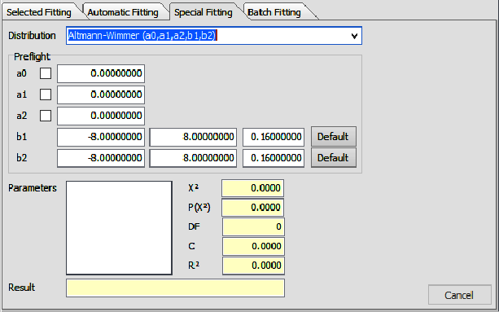

<!-- copile with: pandoc -t beamer main.md --pdf-engine=xelatex --bibliography references.bib -o main.pdf 
 pandoc -t beamer main.md --pdf-engine=xelatex --bibliography references.bib --table-of-contents --standalone --slide-level=2 --filter pandoc-eqnos -o main.pdf 
 pandoc -t beamer main.md --pdf-engine=xelatex --bibliography references.bib --standalone --slide-level=2 --filter pandoc-eqnos -o main.pdf 
 copile with: Rscript -e "rmarkdown::render('main.md', clean=TRUE)"
 pdfpc main.pdf
 -->

# Linguística Quantitativa enquanto ciência

## Leis

* Lei científica

* Teoria: um sistema de leis
  - teorias axiomáticas
  - teorias empíricas 

::: notes 
Uma lei, em ciência, é uma hipótese sistematicamente conectada a outras hipóteses em um campo do conhecimento
e, ao mesmo tempo, corroborada por dados empíricos. Uma lei é dita universal quando é valida a todo tempo,
em qualquer lugar e para todos objetos sob seu escopo.

Compreendemos ciência como um esforço sistemático de construir e organizar conhecimento na forma de 
explicações e predições testáveis sobre o universo.

Um sistema de leis é chamado de Teoria. A construção de uma teoria é principal objetivo de pesquisas científicas. 

&nbsp;

A filosofia da ciência distingue dois tipos de teorias: 1) as teorias axiomáticas da lógica e matemática
(utiliza um sistema axiomático para construir verdades analíticas); 
2) as teorias empíricas da ciência factual (faz afirmações sobre partes do mundo; a veracidade dependerá da correção interna e correspondência com fatos da realidade; 
teorias empíricas devem também ter um núcleo axiomático).
:::

---

## Linguistíca Quantitativa

* Linguística formal - matemática qualitativa (álgebra, teoria de conjuntos e lógica)

* Linguística quantitativa (LQ) - propriedades quantitativas (quantidades, probabilidades e tendências)

::: notes
Linguística formal utiliza-se de princípios da matemática qualitativa (álgebra, teoria de conjuntos e lógica) para modelar propriedades estruturais da linguagem.

&nbsp;

A linguística quantitativa (LQ) estuda as diversas propriedades quantitativas, essenciais para a descrição e compreensão dos sistemas linguísticos.
A LQ lida com quantidades, probabilidades e tendências, analisando comprimento, frequência, distância, grau de polissemia, idade, etc.
As propriedades de elementos linguísticos e suas inter-relações são formuladas matematicamente, estabelecendo leis estocásticas (ou seja, 
não capturam casos singulares, mas predizem eventos e condições gerais). A abordagem quantitativa permite uma descrição mais adequada da
realidade, permitindo a distinção em diversos níveis ao invés de uma distinção extrema em apenas dois extremos (sim/não).
:::

---

## Surgimento da linguística quantitativa

* George Kingley Zipf - a lei de Zipf
  - relação entre ordem (rank) e frequência -- princípio de auto-organização e economicidade 
  - “The Psycho-Biology of Language. An Introduction to Dynamic Philology” (1935)
  - “Human Behavior and the Principle of Least Effort” (1949)

::: notes
Embora diversos trabalho abordasse a quantificação de unidades linguísticas, antes mesmo no século XIX,
George Kingley Zipf é considerado o pai da linguística quantitativa por ter sistematicamente investigado
e criado um modelo teórico para explicar suas observações e propor uma formulação matemática. 

&nbsp;

Zipf propôs as ideias de 
- princípio do esforço mínimo (esforço mínimo individual e esforço mínimo coletivo)
- forças de unificação e diversificação
Para o falante, o princípio da economia busca uma maior unificação e simplificação (o que dificulta a tarefa do ouvinte).
Para o ouvinte, o princípio da economia busca diversificação (o que simplifica sua tarefa de decodificação da mensagem, mas dificulta a tarefa do falante).
:::

---

# Leis da Linguística Quantitativa

## Lei de Zipf

@zipf1949 - Ulysses de James Joyce - 260.430 palavras (29.899 palavras diferentes).

Relação entre rank e frequência de ocorrência. 

  $$ r \times f = C $$ {#eq:zipflaw} 

Ao visualizar tal relação em um gráfico log-log, esperamos ver uma reta com inclinação -1.

  \begin{align}
       f &= \frac{C}{r} \\
  \log f &= -\log r + \log C
  \end{align}

<!-- Equations {!@eq:zipflaw} -->

::: notes
Zipf analisou o livro Ulysses de James Joyce. O texto possui 260.430 palavras,
sendo 29.899 palavras diferentes.

- palavras foram consideradas diferentes se diferem-se foneticamente na forma flexionada que ocorrem no texto
  (desta forma, give, gives, gave, given, giving, giver e gift representam sete palavras diferentes e não uma
  única palavras com sete formas diferentes).

- Zipf observou uma correlação entre o número de diferentes palavras e sua frequência de uso, 
  aproximando-se à equação de uma hipérbole equilátera (Dizemos que uma hipérbole é equilátera se o comprimento do eixo focal é igual ao comprimento do eixo não-focal).
:::

---

![Tabela com alguns exemplos de rank e frequência de ocorrência de palavras em Ulysses [@zipf1949].](zipf-tab2-1-ulysses.png){width=65%}

---

![Distribuição rank-frequência para palavras no inglês. (A) dados de James Joyce; (B) dados de Eldridge (43.989 palavras de jornais, sendo 6.002 palavras diferentes); (C) curva ideal com inclinação igual a 1 [@zipf1949].](zipf-fig2-1-ulysses.png){width=50%}

::: notes
Os degraus ao final representam palavras com baixa frequência de ocorrência. Como apenas é possível observarmos as palavras 
um numero inteiro de vez, o valor da relação dada na equação {!@eq:zipflaw} é arredondado para o inteiro mais próximo.

O último degrau representa 16.432 palavras que ocorreram uma única vez em todo o texto (hápax legómenon). O degrau 
anterior representa 4.776 palavras que ocorreram duas vezes (dis legomenon) e o anterior representa 2.194 palavras que
ocorreram três vezes (tris legomenon).
:::

---

{width=50%}

---

## Lei de Zipf

A $r$-ésima palavra mais frequente possui frequência de ocorrência $f(r)$ que varia da seguinte forma com $r$:
$$
f \propto \frac{1}{r^{\alpha}}
$$
onde temos $\alpha \approx 1$ [@zipf1935;@zipf1949].

::: notes

Outros trabalhos mostram que o valor do expoente $\alpha$ está entre 0.6 e 1.5 
para o inglês falado [@Bian2016;@Baixeries2013], entre 0.765 e 1.357 para traduções da bíblia em diversas
línguas [@mehri2017].

:::

---

![Gráfico Zipf para tradução da bíblia no coreano, inglês e tailandês [@mehri2017].](mehri-fig2.png){width=60%}

::: notes
Em seu trabalho, @mehri2017 faz o ajuste da distribuição de Zipf para a tradução da bíblia em 100 línguas diferentes.
@mehri2017 enfatiza que estruturas sintáticas distintas levam a expoentes de Zipf diferentes e analisam o comportamento 
do coeficiente de Zipf em diferentes famílias linguísticas.
:::

---

Esta relação de potência é também observada em outros diferentes fenômenos,
tais como: 

- magnitude de terremotos [@suzuki2005]; 
- população de cidades [@gabaix1999]; 
- variações de preços [@mandelbrot1963]; 
- distribuição do passivo total de empresas falidas [@fujiwara2004];
- expressão gênica [@furusawa];
- sistemas dinâmicos caóticos [@nicolis1989]; 
- magnitude de avalanches [@perbak]; 
- tráfegos de dados na Internet [@crovella96];
- requisições de páginas web [@huberman2002];
- número de citações de artigos científicos [@derek1965]; 
- tamanho das famílias linguísticas [@wichmann2005];
- tiragem de livros e discos [@kohli;@cox]; 

e muitos outros.

---

![Tamanho das famílias linguísticas, segundo @grimes2000 [@wichmann2005].](wichmann2005_familysize.png){width=80%}

---

## Generalização proposta por Mandelbrot

@mandelbrot1963 propôs um deslocamento no rank

$$
f \propto \frac{1}{(r + \beta)^{\alpha}}
$$

em que $\alpha \approx 1$ e $\beta \approx 2.7$ [@zipf1935;@zipf1949;@mandelbrot1963].

<!--
Fitting a Zipf-Mandelbrot Distribution Using Monte Carlo Least Squares
http://web.utk.edu/~scolli46/zipfmandelbrotmc.html
-->

---

## Por que as línguas seguem a lei de Zipf? {.allowframebreaks}

Algumas possíveis explicações:

- processos aleatórios concatenativos [@conrad2004power;@li1992random;@miller1957some] 
- mistura de distribuições exponenciais [@farmer2008power] 
- invariância à escala [@chater1999scale]
- otimização (com restrição) da entropia [@mandelbrot1953]
- otimização da informação de Fisher [@hernando2009zipf]
- invariância das leis de potência sob agregação [@farmer2008power] 
- processos estocásticos multiplicativos [@mitzenmacher2004brief]
- reuso preferencial [@simon1955class;@yule1944statistical]
- descrição simbólica de sistemas complexos de processos estocásticos [@corominas2010universality]
- passeio aleatório em escalas logarítmicas [@kawamura2002universality]
- organização semântica [@guiraud1968semic;@manin2008zipf]
- otimização da comunicação [@cancho2003;@cancho2005decoding;@cancho2005hidden;@mandelbrot1963;@salge2015zipf;@zipf1935;@zipf1949]
- divisão aleatória de elementos em grupos [@baek2011zipf]
- aproximação de primeira e segunda ordem de distribuições comuns (normal, por exemplo) [@baek2011zipf] 
- busca otimizada em memória [@parker1956theory]
- etc.

::: notes
É razoável esperar que as palavras não sejam igualmente distribuídas, entretanto, dado que as palavras
tem frequências distintas, por qual razão seguiriam uma regra matemática particular? Sobretudo, por que 
seguiriam uma regra que não leva em consideração o significado ou função sintática das palavras?
:::

---

## Maximização da informação mútua 

![Resultado de um modelo computacional onde a probabilidade dos significados é governada por estruturas internas do sistema de comunicação [@cancho2003;@cancho2007]](cancho-fig1.png){width=70%}

::: notes
As diversas línguas diferem-se muito, mas todos tem em comum o fato de serem utilizadas para a comunicação.
Um sistema de comunicação confiável deve maximizar a transferência de informação. Além disto,
a comunicação falada é um processo cognitivo e, portanto, busca-se economia de energia (para o falante e ouvinte).
A maximização da transferência de informação e minimização do custo energético do uso das palavras.
:::

--- 

## Significado

No balanço entre forças de unificação e diversificação esperamos encontrar palavras que possuam alguns significados.

- $F_r$: frequência da $r$-ésima palavra mais frequente
- $m_r$: número de significados da $r$-ésima palavras mais frequente
- $f_r$: frequência média de ocorrência dos $m_r$ significados

$$ 
m_r \times f_r = F_r
$$

- forças de unificação: $\uparrow m_1$, $\downarrow f_1$
- forças de diversificação: $\downarrow m_1$,  $\uparrow f_1$

$$
m_r = f_r = \sqrt{F_r}
$$

Em um gráfico log-log da distribuição de frequência dos significados das palavras, esperamos observar uma reta com inclinação $-0.5$ [@zipf1945;@zipf1949].

::: notes
A princípio, não sabemos qual é o peso dessas duas forças (unificação e diversificação),
porém, pela relação entre o número de palavras distintas em uma amostra e suas respectivas frequências de ocorrência,
suspeitamos que as forças de unificação e diversificação estabelecem, em geral, uma relação hiperbólica.
Desta forma, resulta-se em $m_r$ e $f_r$ estarem também em uma relação hiperbólica, levado a obtermos $m_r = f_r = \sqrt{F_r}$. 
:::

---

![Distribuição de frequência dos significados das palavras [@zipf1945;@zipf1949].](zipf-fig2-2.png){width=80%}

::: notes
@zipf1949 utilizou os dados de E. L. Thorndike para obter a distribuição de frequência de ocorrência das palavras (corpus de 10 milhões de palavras) 
e o Thorndike-Century Dictionary para obter os $m$ distintos significados de cada palavra. 
:::

---

## Lei de abreviação/brevidade de Zipf

"a magnitude das palavras apresenta uma relação inversa ao número de ocorrências" [@zipf1935]

![As 1000 palavras mais frequentes no inglês (COCA corpus) [@kanwal2017].](kanwal-fig1.png){width=65%}

::: notes
@zipf1935 supôs que tal padrão seria resultante da relação de compromisso entre uma comunicação sem erros e um código eficiente (menor esforço).
Como as línguas utilizam-se de um inventário finito de símbolos discretos para formar palavras, o número de palavras possíveis para um dado 
comprimento é limitado. Em palavras curtas, há menos espaço para redundâncias, o que acarreta um menor potencial de distinguibilidade entre elas.
A solução é associar às palavras curtas os significados mais frequentes e às palavras longas os significados menos frequentes, abordagem 
similar ao código de @huffman1952method.
:::

---

![Lei da brevidade para palavras (duração, número de fonemas e número de caracteres) [@Torre2019].\label{fig-brevity}](brevity.png){width=70%}

::: notes 
\begin{footnotesize}
Para palavras, @Torre2019 considera 3 casos para analisar a lei de brevidade:
(1) tendência das palavras mais frequentes serem constituídas por um menor número de caracteres;
(2) tendência das palavras mais frequentes serem constituídas por um menor número de fonemas;
(3) tendência das palavras mais frequentes serem articuladas pelos falandes em um menor intervalo de tempo.

Os pontos cinza na figura \ref{fig-brevity} apresentam o espalhamento das palavras em relação 
ao tempo mediano de duração (em segundos) e a frequência de ocorrência das palavras. Os pontos azuis
são gerados através de agrupamento logarítmico nas frequências. O gráfico superior à direita apresenta o
mesmo tipo de relação, porém considerando a mediana do número de fonemas e o gráfico inferior à esquerda
utiliza o numero de caracteres.

@Torre2019 utilizou o corpus Buckeye contendo fala de conversação de falantes nativos de inglês, 
contendo aproximadamente $8 \times 10^5$ fonemas, $3 \times 10^5$ palavras e $5 \times 10^4$ 
grupos respiratórios\footnote{Grupo respiratório é uma sequência de sons articulados no decorrer de uma única expiração} (breath-groups).
\end{footnotesize}
:::

---

## Leis de polissemia e brevidade de Zipf

Vários trabalhos analisaram as leis de polissemia e brevidade de Zipf
[@zipf1935;@hernandez2016testing;@ilgen2007investigation;@cancho2018origins;@kanwal2017;@tomaschek2017word;@bentz2016zipf;@piantadosi2011word;@cancho2013compression;@strauss2007word;@sigurd2004word;@teahan2000compression].

---

## Lei da Lognormalidade 

Diversos estudos observam consistentemente uma distribuição lognormal para unidades fala (fonemas, palavras e grupo respitarório)
[@herdan1958relation;@sayli2002duration;@rosen2005analysis;@gopinath2008modeling;@shaw2019effects;@hernandez2019linguistic;@Torre2019].

<!--
Lognormality law. Previous studies have found consistently lognormal distributions for spoken
phonemes in several languages [25 –28 , 36] and in word and breath groups (BGs) duration
for English [ 4, 37]. In [4] it was confirmed that the time duration of phonemes, words and
breath groups in speech are well described by lognormal distribution for the English language.
Moreover, in [4 ] a general stochastic model was presented to explain and justify such lognormality
at all linguistic levels only assuming that the lowest (phonemic) level follows a lognormal
distribution, hence claiming the universal validity of the lognormal shape and its proposal as a
‘lognormality law’.
% /ms/downloads/library/linguistics/quantitative/fernandez_Linguistic_law_in_speech_the_case_of_catalan_and_spanish.pdf
-->

---

![Distribuição lognormal na duração de fonemas, palavras e grupos respiratórios no inglês [@Torre2019].\label{fig-lognormal}](lognormal.png){width=70%}

::: notes
Dizemos uma v.a. $X$ possui distribuição lognormal se o logaritmo dela, $Y=\ln(X)$, possuir distribuição normal.
O gráfico menor da figura \ref{fig-lognormal}, no canto superior direito, apresenta o escalonamento dos valores
para verificar que de fato seguem uma distribuição normal.
:::

---

## Lei de Heaps/Herdan

A lei de Heaps/Herdan descreve o crescimento do vocabulário em um texto.

$$
V(n) = K n^\beta, \quad \beta < 1
$$
$K$ tipicamente está entre 10 e 100, e $\beta$ entre $0.4$ e $0.6$.

---

![Crescimento do vocabulário em 35 livros do projeto Gutenberg [@leoca2013].](heaps.png){width=70%}

---

@vanLeijenhorst2005 mostra que é possível derivar matematicamente a lei de Heaps a partir da lei de Zipf.
Nesta caso, teremos $\beta = 1/\alpha$, sendo necessário $\alpha > 1$.

---

![Entropia para uma fonte com distribuição de Zipf. Comparação entre léxico finito e infinito [@mandelbrot1953theorie;@leoca2013glotto].](entropy_zipf.png){width=70%}

---

## Crescimento do vocabulário e das classes de baixa frequência

A lei de potência proposta por Altmann $y = Ax^{-b}$ descreve bem a relação entre crescimento do vocabulário e tamanho das classes.

![Crescimento do vocabulário e das classes de baixa frequência (1 a 15) [@fan2014some].](classsizegrowth.png){width=50%}

<!-- https://glottometrics.iqla.org/wp-content/uploads/2021/06/g28zeit.pdf -->
<!-- there is a linear relationship between vocabulary richness and the sizes of frequency class 1—3 -->

---

## Lei de Zipf inversa

@zipf1935 estabelece a lei inversa, relacionando a frequência de ocorrência e o número de palavras para uma dada frequência.

$$
N_f = a f^{-b}
$$

onde $f$ é a frequência de ocorrência e $N_f$ o número de palavras com uma dada frequência de ocorrência $f$.

---

![Relação entre frequência de ocorrência e número de palavras para uma dada frequência [@zipf1935].](zipf-inverse.png){width=80%}

---

![Gráfico de Zipf e gráfico inverso para o texto Ulysses [@leoca2013].](zipf-inverse-2.png){width=80%}

--- 

## Hapax Legomena

O número de hapax legomena algumas vezes é utilizado como uma medida de riqueza de vocabulário.

O número de hapax legomena (HL) e o tamanho do vocabulário (V) apresentam uma relação linear

$$
HL = aV - b
$$

---

![Dependência entre o número de hapax legomena (HL) e o tamanho do vocabulário (V) [@popescu2008].](altmann-hapaxlegomena.png){width=60%}

---

![Relação entre o tamanho do vocabulário e o tamanho das classes de baixa frequência (1, 2 e 3). Para esta análise, o British National Corpus foi dividido em 1.000 pedaços de aproximadamente 100.000 palavras. [@fan2014some].](fan2014-richness.png){width=100%}

---

A razão entre o tamanho do vocabulário e o número de hapaxes foi objeto de estudo de diversos linguistas
[@baayen1996effects;@tweedie1998variable;@baayen2001word;@kornai2002many;@fengxiang2010asymptotic].

---

## Lei de Menzerath-Altmann

@menzerath1954 observou a existência de uma relação inversa entre o tamanho de um construto e o tamanho de seus constituintes.

![Frequencia de tipo das palavras alemãs em relação ao número de sílabas ($z$) e o número de sons ($n$) [@menzerath1954].](menzerath-fig471.png){width=70%}

---

![Relação entre o comprimento das palavras e a duração de seus constituintes. Foram analisadas 10.086 palavras do inglês, com dados obtidos de dicionários online [@araujo2014menzerath].](leolca-menzerath.png){width=80%}

---

![Lei de Menzerath-Altmann. Relação entre o tamnho de grupo respiratório (número de palavas) versus tamanho médio das palavras (duração, número de fonemas, número de caracteres) [@Torre2019].](menzerath_bg.png){width=70%}

---

@altmann1980 observou que o conceito de \textit{tamanho} poderia referir-se também à complexidade e numero de elementos utilizados na composição.
@altmann1980 propôs o modelo matemático

$$
\frac{y'}{y} = \frac{b}{x} + c 
$$

para o qual a solução é 

$$
y = a x^b e^{cx}
$$

---

Para @kohler1989menzerathsche, a lei de Menzerath-Altmann é uma manifestação característica de sistemas complexos.

Outros estudos analizam a lei de Menzerath-Altmann em textos [@hrebicek1995;@andres2010;@araujo2020;@gtorre2021], 
fala [@HernndezFernndez2019;Torre2019], genoma [@ferrer2014menzerath], música [@boroda1991],
comunicação gestual de chipanzés [@heesen2019], etc.

--- 

## Lei de Piotrowski-Altmann 

As línguas mudam pela interação entre formas antigas e novas. 

Mudanças qualitativas: mudanças em entidades individuais, mudanças sonoras.
Mudanças em volume: crescimento/decaimento lexical.

O influxo de novos elementos em uma língua, ao longo do tempo, é descrito por 
$$
p(t) = \frac{c}{1 + ae^{-bt}}
$$

[@altmann1983piotrowski;@altmann1983law;@best2016bibliography;@stachowski2020]

@Best2016 reune uma extensa lista de publicações sobre a lei de Piotrowski.

<!-- 
linguistic phenomena which proceed in the “slow-fast-slow” fashion, i.e. drawing a sigmoid on a graph 

They include the replacement of an old morphological form with a new one, lexical borrowing between languages, the growth of a child’s vocabulary, and many others. 
-->

---

![Substituição de -{t} por -{st} na 2a pessoa do singular do presente do indicativo no verbo alemão 'wollen' (*wilt* → *willst*) [@best2006quantitative].](best_german_wollen.png){width=100%}

<!-- http://lql.uni-trier.de/index.php/Change_in_language --> 

---

![Variantes da lei Piotrowski-Altmann [@stachowski2020].](stachowski2020-fig1.png){width=70%}

::: notes

A variante da mudança completa é a mais básica, descrevendo a substituição completa de uma forma por outra.
Exemplo: desaparecimento do sufixo -ov do plural genitivo dos nomes de unidades nos textos técnicos russos entre 1880 e 1920.

A mudança parcial descreve mudanças que devem ser descritas pelo volume ao invés de percentual.
Por exemplo: empréstimos de outras línguas no alemão.

A variante de mudança reversível descreve uma mudança que se inicia, tem um pico e reverte-se.
Por exemplo: epêntese do -e em verbos fortes no alemão.

<!--
The complete change variant is the original and most basic one. It describes a
complete replacement of one form with another, e.g. the disappearance of the GEN.PL suffix -ov
from the names of units in Russian technical texts between 1880 and 1920.

The partial change variant describes a change whose volume it is more
reasonable to count in units than as a percentage, e.g. the number of borrowings
from various languages in German (Körner 2004).

The reversible change variant describes a change which begins, peaks, and
reverses as if cancelled mid-course, such as the epithesis of -e with strong verbs in
German (Imsiepen 1983).
-->
:::

::: notes
Starke Verben haben in der 1. Person Singular Präteritum Indikativ keine Endung -e:
ich ging (gehen), sah (sehen), kam (kommen), nahm (nehmen), fand (finden), half (helfen), blieb (bleiben), ...
Die Ausnahme ist werden: ich wurde (veraltet: ward)

Die e-Epithese bei den starken Verben ist ein Sprachwandelprozeß, der sich nicht durchgesetzt hat. Im Verlauf des 17. Jahrhunderts erlangte sie ihre größte Beliebtheit, war jedoch nie obligatorisch. Man findet also auch in ihrer Hochzeit bei ein und demselben Autor Formen ohne -e neben solchen mit -e. Die Formen mit -e sind immer seltener als die ohne.

[https://german.stackexchange.com/questions/48263/die-form-fande-als-1-person-singular-pr%c3%a4teritum-indikativ-e-epithese](https://german.stackexchange.com/questions/48263/die-form-fande-als-1-person-singular-pr%c3%a4teritum-indikativ-e-epithese)
:::

---

## Lei de Frumkina

A lei de Frumkina (lei dos blocos de texto) descreve a frequência de ocorrência de certas unidades linguísticas em blocos de texto.
A distribuição hipergeométrica negativa é um bom modelo para descrever a ocorrência [@altmann1982towards;@best2005sprachliche;@textblockgesetz2021].

---

![Ocorrências de "a" no capítulo 1 de *Die Bäder von Lucca* (Heinrich Heine) com blocos de tamanho 50 e 100 [@best2005sprachliche].](frumkina-a.png){width=70%}

---

## Lei de Martin

A lei de Martin diz respeito à estruturação hierárquica do léxico.

&nbsp;

Exemplo:

Sessel(1) – Sitzmöbel(2) – Möbel(3) – Einrichtungsgegenstand(4) – Gegenstand(5) 

(Poltrona - móveis de assento - móveis - item de decoração - objeto)

::: notes

A posição que uma palavra ocupa na cadeia lexical diz respeito a quantas definições são ligadas a ela, indo do termo mais 
específico ao mais geral, formando uma hierarquia de significados cada vez mais gerais.
O número de definições diminui com o aumento da generalidade.

:::

---

![A distribuição de Poisson mista é um bom modelo para os dados de @bagheri2002 [@martinschesgesetz2021]](martins.png){width=70%}

<!--
Lei de Martin: esta lei diz respeito a cadeias lexicais que são obtidas procurando a definição de uma palavra em um dicionário, depois procurando a definição da definição recém-obtida, etc. Finalmente, todas essas definições formam uma hierarquia de significados cada vez mais gerais. de modo que o número de definições diminui com o aumento da generalidade. Dentre os níveis desse tipo de hierarquia, existem várias leis relacionadas a essa relação.

https://de.wikipedia.org/wiki/Martinsches_Gesetz

ob = [1482 1110 642 334 160 74 23 7 2];
x = [1:9];
stem(x,ob,'k'); xlim([0 10]);
set(gca,'xtick',[1:9]);
xlabel('rank'); ylabel('observações');

-->

---

# Softwares

## Altmann-Fitter

{width=50%}

::: notes

O Altmann Fitter é um software interativo para ajuste de distribuições de probabilidade discretas
a dados de frequência. O algoritmo utilizado é baseado no Nelder-Mead Simplex.
Mais de 200 distribuições estão definidas e implementadas no software. 
Os procedimentos matemáticos são automatizados. O software iterativamente
busca melhor o ajuste, buscando a distribuição que melhor se explique os dados observados. 

<!--
The Altmann Fitter is an interactive programme for the iterative fitting of
univariate discrete probability distributions to frequency data. Its algorithm
is based on the Nelder-Mead Simplex method with modifications and re-
finements
-->
:::

---

{width=70%}

---

{width=70%}

---

## R 

Pacotes

languageR
:   Analyzing Linguistic Data: A Practical Introduction to Statistics
:   Autores: R. H. Baayen, Elnaz Shafaei-Bajestan
:   [https://cran.r-project.org/web/packages/languageR/](https://cran.r-project.org/web/packages/languageR/)

zipfR
:   Statistical Models for Word Frequency Distributions
:   Autores: Stefan Evert, Marco Baroni
:   [https://cran.r-project.org/web/packages/zipfR/](https://cran.r-project.org/web/packages/zipfR/)

fitdistrplus
:   Help to Fit of a Parametric Distribution to Non-Censored or Censored Data 
:   Autores: Marie-Laure Delignette-Muller, Christophe Dutang, Regis Pouillot, Jean-Baptiste Denis, Aurelie Siberchicot 
:   [https://cran.r-project.org/web/packages/fitdistrplus/](https://cran.r-project.org/web/packages/fitdistrplus/)

---

# Teoria

## Construção de uma teoria

Abordagens:

1. linguística sinergética 
2. teoria unificada 

::: notes

As leis da linguística quantitativa são observadas na comunicação escrita, na comunicação oral, 
em certos aspectos da comunicação animal e, algumas vezes, também em outros fenômenos da natureza.
Certas podem ser ligadas à emergência em sistemas complexos, aspectos associados à sistemas de comunicação,
ou aspectos cognitivos e psicológicos que devem ser explorados.

1. A proposta sinergética busca integrar as leis e hipóteses em um modelo complexo para descrever o fenômeno linguístico.
Utilizam para tanto um axioma central: as línguas são sistemas auto-organizativos. Estabelece também alguns requisitos
que devem ser seguidos por um sistema semiótico: ser possível realizar codificação e decodificação com eficiência,
economia de memória, minimização de esforço, dentre outros.
2. A teoria unificada busca integrar as leis e hipóteses a partir de equações diferenciais gerais (ou equações de diferenças, no caso discreto),
assim como dois pressupostos gerais: 1) a dinâmica de uma variável linguística $y$ será modelada matematicamente em termos 
de sua mudança relativa $(dy/y)$; 2) uma outra variável $x$ que tenha efeito sobre $y$ deverá ser considerada da mesma forma em temos de sua mudança relativa $(dx/x)$.

:::

---

<!--
Later, Zipf’s model was conceptually and mathematically improved and enhanced by Benoît Mandelbrot (1953, 1959, 1961a, 1961b), the world-wide celebrated originator of fractal geometry.

Benoit Mandelbrot, who derived the law from the assumption that languages optimize their lexicons with respect to code-production efort in the long run.

Laws in QL
- the first kind takes the form of probability distributions (zipfs law, for examples)

- the second kind of law is called the functional type, because these laws link two (or more) properties. An illustrative example
of this kind is Menzerath’s Law (also called Menzerath-Altmann Law), which relates the size of linguistic constituents to the size
of the corresponding construct. hus, the (mean) length of the syllables of a word depends on the number of syllables the
word consists of; the (mean) length of the clauses in a sentence depends on the length of the sentence (measured in terms of the
number of clauses it consists of).

A special variant of a functional law is the developmental one. Here, a property is related to time. he best-known example is
the Piotrowski Law, which represents the development (increase and/or decrease) of the portion of new units or forms over time.

-->

# References {.allowframebreaks} 
