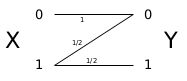

```{r data generation, echo = FALSE, results = "hide"}
include_supplement("canal-z.png",
  dir = "/home/leoca/ee/ufsj/lectures/ti/exams/canal/", recursive = TRUE)
```

Question
========  

Considere o canal Z com entrada e saída binária e probabilidades de transição dadas pela matriz
$$
Q =
\begin{pmatrix}
1 & 0 \\
\frac{1}{2} & \frac{1}{2} 
\end{pmatrix} 
\quad \quad x,y \in \{0,1\} .
$$

Determine a capacidade deste canal e a distribuição maximizadora na entrada.

Answerlist
---------------
* $C=$
* $Pr(X=0)=$
* $Pr(X=1)=$


Solution
========

\


$$
I(X;Y) = H(Y) - H(Y|X)
$$

$$
H(Y) = H\left( \Pr(Y=1) \right) = H\left( \frac{1}{2} Pr(X=1) \right) = H\left(\frac{p}{2}\right)
$$

Teremos assim:
$$
\begin{align}
I(X;Y) &= H(Y) - H(Y|X) = H\left(\frac{p}{2}\right) - p \\
       &= - \frac{p}{2} \log \frac{p}{2} - \left(1 - \frac{p}{2}\right) \log \left(1 - \frac{p}{2}\right) - p 
\end{align}
$$

Queremos $\frac{\partial I}{\partial p} = 0$, ou seja,
$$
\begin{align}
\frac{\partial I}{\partial p} 
        &= - \frac{1}{2} \log \frac{p}{2} - \frac{p}{2} \frac{2}{p} \frac{1}{2} + \frac{1}{2} \log \left( 1 - \frac{p}{2} \right) - \left( 1- \frac{p}{2} \right) \frac{1}{1 - \frac{p}{2}} \left(-\frac{1}{2}\right) - 1 \\
        &= \frac{1}{2} \log \frac{1 - \frac{p}{2}}{\frac{p}{2}} - 1
\end{align}
$$

Fazendo $\frac{\partial I}{\partial p} = 0$, teremos
$$
\begin{align}
\frac{1}{2} \log \frac{1 - \frac{p}{2}}{\frac{p}{2}} - 1 &= 0 \\
\log \frac{1 - \frac{p}{2}}{\frac{p}{2}} &= 2 \\
\frac{1 - \frac{p}{2}}{\frac{p}{2}} &= 4 \\
1 - \frac{p}{2} &= 2 p \\
p &= \frac{2}{5}  
\end{align}
$$

Teremos então 
$$
\begin{align}
C &= \max_p I(X;Y) = H\left(\frac{1}{5}\right) - \frac{2}{5} \\
 &= \frac{1}{5} \log 5 -\frac{4}{5} \log \frac{4}{5} - \frac{2}{5} = \frac{1}{5} \log 5 + \frac{4}{5} \log 5 -\frac{4}{5} \times 2 - \frac{2}{5} \\
 &= \log 5 - 2
\end{align}
$$

A distribuição que maximiza a informação mútua é $\left( \frac{3}{5} , \frac{2}{5}\right)$.


Answerlist
----------
* $C = \log 5 - 2 = 0.3219281$
* $Pr(X=0) = \frac{3}{5} = 0.6$
* $Pr(X=1) = \frac{2}{5} = 0.4$


Meta-information
================
extype: cloze
exclozetype: num|num|num
exsolution: 0.3219281|0.6|0.4
exname: canal-z
extol: 0.01
expoints: 2|1|1
