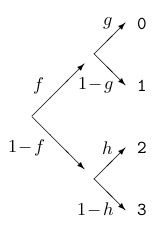

<!-- David MacKay - Exercise 2.28 - pg.38 -->
```{r data generation, echo = FALSE, results = "hide"}
include_supplement("jogo2moedas.png",
  dir = "/home/leoca/ee/ufsj/lectures/ti/exams/entropia/", recursive = TRUE)
```
Question
========
Uma variável aleatória $x \in \{0,1,2,3\}$ é selecionada 
através de um lançamento de moeda não honeta com tendência (bias) $f$
para determinar o resultado em $\{0,1\}$ ou $\{2,3\}$;
então um lançamento de uma segunda moeda com tendência $g$
ou uma terceita moeda com tendência $h$, respectivamente.
A figura abaixo ilustra o processo.

\


Determine a entropia de $X$.

Answerlist
---------------
* $H(X) = H(f) + fH(g) + (1-f)H(h)$
* $H(X) = -fgh \log fgh$
* $H(X) = -f\log f -g\log g -h\log h$
* $H(X) = fH(f) + gH(g) + hH(h)$
* $H(X) = -fg\log fg -(1-f)h\log(1-f)h$
* $H(X) = 1$
* $H(X) = 2$
* $H(X) = \frac{1}{2}$
* $H(X) = \frac{1}{3} \left( H(f) + H(g) + H(h)\right)$
* $H(X) = \frac{1}{2} H(f) + f H(g) + g H(h)$


Solution
========

Utilizando a capacidade de decomposição da entropia em duas escolhas sucessivas, podemos 
fácilmente escrever:
$$
H(X) = H(f) + fH(g) + (1-f)H(h)
$$

Answerlist
----------
* True.
* False.
* False.
* False.
* False.
* False.
* False.
* False.
* False.
* False.

Meta-information
================
extype: schoice
exsolution: 1000000000
exname: decomposicao da entropia
exshuffle: 5
 
