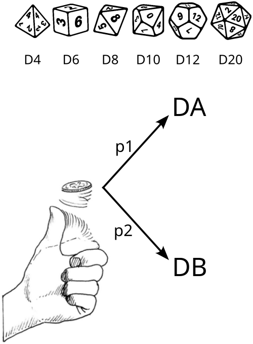

```{r, echo=FALSE, results="hide"}
include_supplement("dice.png", dir = "/home/leoca/ee/ufsj/lectures/ti/exams/entropia/", recursive = TRUE)

#set.seed(123)  # Para tornar os resultados reproduzíveis (opcional)
D <- sample(c(4, 6, 8, 10, 12, 20), 2, replace = FALSE)
DA <- D[1]
DB <- D[2]

p1 <- sample(c(1/16, 1/8, 1/4, 1/2), 1)
p2 <- 1 - p1

H1 <- -p1*log2(p1) -p2*log2(p2)
HA <- log2(DA)
HB <- log2(DB)

H <- p1*HA + p2*HB
```

Question
========

\


Considere um jogo composto por um jogo de moeda seguido por um jogo de dados.
A entropia associada ao jogo da moeda é denominada $H_1$, sendo $p_1 = `r p1`$.
Dependendo do resultado do jogo da moeda (cara ou coroa), iremos realizar o
lançamento do dado $DA$ (um dado com `r DA` lados, D`r DA`) ou do dado $DB$ (um
dado com `r DB` lados, D`r DB`). A incerteza associada ao lance dos dados é
denominada $H_A$ e $H_B$, respectivamente. A incerteza total do jogo
(associada ao jogo da moeda seguido do jogo de dado) será denominada $H$.
Suponha que os dados são honestos.

Answerlist
---------------
* Calcule $H_1$.
* Calcule $H_A$.
* Calcule $H_B$.
* Calcule $H$.


Solution
========
**Cálculo de $H_1$**

Como $p_1 = `r p1`$, teremos
$$
H_1 = -p_1 log(p_1) - (1-p_1) log (1-p_1) = `r H1`.
$$


**Cálculo de $H_A$**

Como o dado é honesto e possui `r DA` lados,
$$
H_A = log `r DA` = `r HA`
$$

**Cálculo de $H_B$**

Como o dado é honesto e possui `r DB` lados,
$$
H_B = log `r DB` = `r HB`
$$

**Cálculo de $H$**

A entropia total $H$ é a ponderação entre $H_A$ e $H_B$ pelos pesos $p_1$ e
$p_2$, relativos ao lance da moeda. Desta forma, teremos
$$
H = p_1 H_A + p_2 H_B = `r H`
$$

Answerlist
----------
* $H_1 = `r round(H1, 2)`$ bits
* $H_A = `r round(HA, 2)`$ bits
* $H_B = `r round(HB, 2)`$ bits
* $H = `r round(H, 2)`$ bits

Meta-information
================
extype: cloze
exclozetype: num|num|num|num|num
exsolution: `r fmt(H1)`|`r fmt(HA)`|`r fmt(HB)`|`r fmt(H)`
exname: entropia-dados
extol: 0.01
expoints: 1|1|1|2

