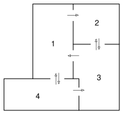

```{r data generation, echo = FALSE, results = "hide"}
include_supplement("catwalk.png",
  dir = "/home/leoca/ee/ufsj/lectures/ti/exams/markov/", recursive = TRUE)

# use the same graphics type (pdf, svg, png) as the current xweave() call
typ <- match_exams_device()
## tikz automaton code with two placeholders
cadeiamarkov <- "
\\begin{tikzpicture}[->, >=stealth, auto, semithick, node distance=3cm]
\\node[state]    (1)               {$1$};
\\node[state]    (2)[right of=1]   {$2$};
\\node[state]    (4)[below of=1]   {$4$};
\\node[state]    (3)[below of=2]   {$3$};
\\path
(1) edge[loop left]        node{$1/3$}  (1)
(1) edge[bend left,above]  node{$1/3$}  (2)
(1) edge[bend left, right]  node{$1/3$}  (4)
(2) edge[loop right]       node{$1/2$}  (2)
(2) edge[bend left,right]  node{$1/2$}  (3)
(3) edge[bend left,left]   node{$1/2$}  (2)
(3) edge[above]      node{$1/2$}  (1)
(4) edge[loop below]       node{$1/3$}  (4)
(4) edge[bend left, left]  node{$1/3$}  (1)
(4) edge[bend right, below] node{$1/3$}  (3)
;
\\end{tikzpicture}
"

probs <- c(6/25, 2/5, 6/25, 3/25)
txentropy <- (9/25)*log2(3)+16/25
sol <- c(probs, txentropy)
lab <- seq.int(length(probs))
type <- rep(list("num"), length(sol))
points <- c(rep(1, length(probs)), length(probs))

```


Question
========
A figura abaixo apresenta a planta de uma casa. Algumas portas são
de duplo-sentido, enquanto outras possuem sentido único, o que pode 
ser verificado na representação através das setas.
Um gato caminha aleatoriamente pela casa. Quando o gato está em um cômodo, ele pode permanecer neste
cômodo ou utilizar alguma porta para trocar de cômodo. Suponha que, a cada instante, o gato escolha 
entre as alternativas com igual probabilidade. Como existe um cachorro no quarto 3, o gato
não permanece neste quarto, deixando-o imediatamente no próximo instante após ingressar neste quarto.
Determine a distribuição de estado estacionários e a taxa de entropia da caminhada do gato na casa.
\



```{r questionlist, echo = FALSE, results = "asis"}
answerlist(c(paste("$\\mu_{", lab, "}=$", sep = ""), "$H(\\mathcal{X})=$"), markup = "markdown")
```

Solution
========
Podemos considerar os quartos como estados em uma cadeia de Markov. Desta forma, 
a matriz de transição é dada por
$$
P = \begin{pmatrix} 
\frac{1}{3} & \frac{1}{3} & 0 & \frac{1}{3} \\
0 & \frac{1}{2} & \frac{1}{2} & 0 \\
\frac{1}{2} & \frac{1}{2} & 0 & 0 \\
\frac{1}{3} & 0 & \frac{1}{3} & \frac{1}{3} 
\end{pmatrix} .
$$

A cadeia de Markov é ilustrada a seguir:
\
```{r, echo = FALSE, results = "asis"}
include_tikz(cadeiamarkov, name = "cadeiamarkov", format = typ, markup = "markdown",
  library = c("automata", "positioning"),
  width = "5cm")
```

A distribuição de estado estacionário é tal que $\mathbf{\mu}^T P = \mathbf{\mu}^T$, com $\sum_i \mu_i = 1$.

$$
\begin{align}
\mathbf{\mu}^T P &= \mathbf{\mu}^T \\
\mathbf{\mu}^T (P-I) &= 0 \\
\mathbf{\mu}^T Q &= 0 
\end{align}
$$

Teremos aqui 
$$
Q = \begin{pmatrix} 
-\frac{2}{3} & \frac{1}{3} & 0 & \frac{1}{3} \\
0 & -\frac{1}{2} & \frac{1}{2} & 0 \\
\frac{1}{2} & \frac{1}{2} & -1 & 0 \\
\frac{1}{3} & 0 & \frac{1}{3} & -\frac{2}{3} 
\end{pmatrix} .
$$

Note que, no sistema de equações acima, podemos incorporar a condição $\sum_i \mu_i = 1$ bastando
para tanto substituir uma das colunas da matriz $Q$ por uma coluna com uns e substituir
um dos zeros no vetor de zeros do lado direito da equação por um na posição respectiva.
Podemos, por exemplo, escolher a última coluna de $Q$ e assim teremos uma matriz 

$$
\tilde{Q} =
\begin{pmatrix} 
-\frac{2}{3} & \frac{1}{3} & 0 & 1 \\
0 & -\frac{1}{2} & \frac{1}{2} & 1 \\
\frac{1}{2} & \frac{1}{2} & -1 & 1 \\
\frac{1}{3} & 0 & \frac{1}{3} & 1
\end{pmatrix} ,
$$

e o novo sistema de equações será
$$
\mathbf{\mu}^T \tilde{Q} = (0, 0, 0, 1) ,
$$
e a solução poderá ser obtida pós-multiplicando pela matriz inversa de $\tilde{Q}$,
$$
\mathbf{\mu}^T = (0, 0, 0, 1) \tilde{Q}^{-1} .
$$

Calculando a inversa, encontramos
$$
\tilde{Q}^{-1} =
\begin{pmatrix} 
-\frac{21}{25} & -\frac{2}{5} & \frac{4}{25} & \frac{27}{25} \\
\frac{3}{5} & -2 & -\frac{2}{5} & \frac{9}{5} \\
\frac{3}{25} & -\frac{4}{5} & -\frac{22}{25} & \frac{39}{25} \\
\frac{6}{25} & \frac{2}{5} & \frac{6}{25} & \frac{3}{25}
\end{pmatrix} ,
$$
e assim,
$$
\mathbf{\mu}^T = (\frac{6}{25}, \frac{2}{5}, \frac{6}{25}, \frac{3}{25}) .
$$

Para resolver o sistema, faremos
$$
\begin{align}
\mathbf{\mu}^T \tilde{Q} &= \begin{pmatrix} 0 & 0 & 0 & 1  \end{pmatrix} \\
\left( \mathbf{\mu}^T \tilde{Q} \right)^T &= \begin{pmatrix} 0 & 0 & 0 & 1  \end{pmatrix}^T \\
\tilde{Q}^T \mathbf{\mu}  &= \begin{pmatrix} 0 \\ 0 \\ 0 \\ 1  \end{pmatrix} .
\end{align}
$$

Iremos aplicar as operações elementares à matriz $\tilde{Q}^T$ aumentada para solucionar o sistema.
Poderemos concluir que:
$$
\begin{align}
\mu_4 &=& \frac{3}{25} \\
\mu_3 &=& 2 \mu_4 = \frac{6}{25} \\
\mu_2 &=& \frac{3}{2} \mu_3 + \frac{1}{3} \mu_4 = \frac{2}{5} \\
\mu_1 &=& \frac{3}{4} \mu_3 + \frac{1}{2} \mu_4 = \frac{6}{25} .
\end{align}
$$

e assim
$$
\mathbf{\mu}^T = (\frac{6}{25}, \frac{2}{5}, \frac{6}{25}, \frac{3}{25}) .
$$


```{r solutionlist, echo = FALSE, results = "asis"}
answerlist(c(paste("$\\mu_{", lab, "}= ", format(probs), "$", sep = ""), paste("$H(\\mathcal{X})=", format(txentropy),"$", sep = "")), markup = "markdown")
```


Meta-information
================
extype: cloze
exsolution: `r paste(sol, collapse = "|")`
exclozetype: `r paste(type, collapse = "|")`
expoints: `r paste(points, collapse = "|")`
exname: catwalk
extol: 0.01


